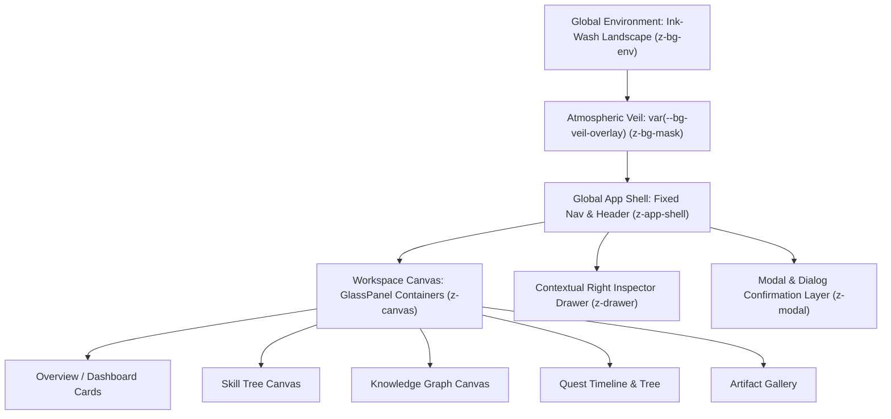

# Global Visual Direction & Aesthetic Philosophy

> **Document**: `01_GLOBAL_VISUAL_DIRECTION.md`  
> **Status**: DESIGN FREEZE CANDIDATE (ROUND 3 FINAL REVIEW)  
> **Milestone**: Global Visual Design Freeze  
> **Dependencies**: Stage 0–6 (FROZEN), Stage 7A/7B (FROZEN)  
> **Related Documents**: `02_DESIGN_TOKENS.md`, `03_GLOBAL_APP_SHELL.md`, `04_SHARED_COMPONENT_SYSTEM.md`, `05_ENTITY_VISUAL_LANGUAGE.md`

---

## 1. Aesthetic Identity & Design Pillars

The visual design of **AI Personal Growth RPG** represents a deliberate, harmonious fusion of three distinct worlds:

```
┌─────────────────────────────────────────────────────────────────────────┐
│                           AESTHETIC TRIAD                               │
│                                                                         │
│   东方修真 / 成长哲思          现代 AI 交互架构            克制沉浸的 RPG 仪表盘   │
│   (Eastern Growth Mindset)     (Modern AI Workspaces)    (Calm RPG Dashboard)   │
│                                                                         │
│   • 水墨气韵与天地留白           • 半透明玻璃层级体系        • 严谨的数值与层级递进    │
│   • 远山云雾与虚实相生           • 精确的信息密度与折叠      • 明确的能力实证与边界    │
│   • 古雅内敛的暗金微光           • 响应式抽屉与沉浸画布      • 零博彩/零浮夸庆祝       │
└─────────────────────────────────────────────────────────────────────────┘
```

### Core Design Pillars:
1. **Calm Immersion (静水流深)**: The UI feels like a tranquil scholar's sanctuary or cultivation pavilion. It invites deep reflection, focus, and sustained learning without sensory noise or synthetic urgency.
2. **Structural Clarity (格物致知)**: Information hierarchy is razor-sharp. Visual styling never obscures semantic data, epistemic certainty metrics, or relational linkages.
3. **Restrained Luminescence (光华内敛)**: Ancient Gold accents exist strictly within their frozen whitelist (Player Level, XP milestones, Skill Mastery on M0–M10, primary affirmative actions, and the keyboard focus ring)—never as decorative confetti or claims of epistemic truth.
4. **Atmospheric Depth (虚实相生)**: Translucent glass layers create a sense of depth, floating above a subtle, low-contrast ink-wash environmental background protected by an atmospheric veil.

---

## 2. Anti-Patterns & Prohibited Visual Styles

To preserve visual integrity across all sub-stages, the following visual anti-patterns are strictly prohibited:

| Prohibited Anti-Pattern | Why It Is Forbidden | Approved Alternative |
| :--- | :--- | :--- |
| **Traditional Costume Drama (影楼仙侠风)** | Overly ornate tassels, dragons, paper lanterns, and heavy brocade textures distract from modern AI productivity. | Modernized minimalist brushwork strokes, subtle paper-grain noise, and clean calligraphy-inspired structural geometry. |
| **Gacha Game Casino UI (二次元抽卡/页游风)** | Flashing gold borders, oversized gem counters, pulsing chest popups, and fake streak banners induce dopamine manipulation. | Clean numeric typography, structured progress meters, and serene milestone confirmation dialogs with full audit traceability. |
| **Neon Cyberpunk / Sci-Fi Clutter (荧光赛博风)** | Over-saturated cyan/magenta neon glows, scanlines, and circuit-board traces violate the Eastern ink-wash aesthetic. | Warm charcoal, muted slate ink, antique amber gold, and soft neutral edge highlights. |
| **Generic SaaS Purple Dashboard (通用紫色SaaS)** | Standard generic gradients (purple-to-blue) erase the distinct cultural and intellectual identity of the product. | Custom ink-wash atmospheric palette with multi-layered neutral tones and antique gold accents. |
| **Uncalibrated Glassmorphism (全屏无序磨砂)** | Applying uniform heavy blur and high transparency everywhere causes text illegibility, contrast failure, and visual fatigue. | Rigorous 4-layer surface opacity scale (`var(--surface-ground)`, `var(--surface-base)`, `var(--surface-raised)`, `var(--surface-overlay)`) with tokenized backdrop blur. |
| **AI Fantasy Clutter (AI概念图堆砌)** | Using dense, high-contrast AI fantasy illustrations behind text makes UI unreadable and cheapens the interface. | Carefully graded, low-contrast atmospheric landscape silhouettes placed strictly behind `var(--bg-veil-overlay)`. |

---

## 3. Visual Baseline Specification

### 3.1 Background & Environment
- **Aesthetic**: Atmospheric Chinese landscape with subtle mountains, mist, bamboo silhouettes, and distant flying cranes/birds.
- **Layering**: Environmental background is fixed at `var(--z-bg-env)`, veiled behind an atmospheric tint mask governed strictly by token `var(--bg-veil-overlay)`.
- **Readability Invariant**: Content legibility always supersedes background artwork. Contrast must be evaluated on composited surfaces under worst-case background conditions.

### 3.2 Surfaces & Glass Panels
- **Translucency Hierarchy (Numeric definitions frozen in `02_DESIGN_TOKENS.md`)**:
  - **Canvas/Workspace Ground**: Deepest layer (`var(--surface-ground)` with `var(--glass-blur-md)`).
  - **Standard Card/Section**: Elevated surface (`var(--surface-base)` with `var(--glass-blur-lg)`).
  - **Interactive Drawer / Inspector**: Raised contextual layer (`var(--surface-raised)` with `var(--glass-blur-xl)`).
  - **Modal / Dialog Overlay**: Highest focus surface (`var(--surface-overlay)` with `var(--glass-blur-2xl)`).
- **Border Treatment**: Neutral border (`var(--border-subtle)` to `var(--border-default)`) with a delicate top-edge highlight (`var(--border-highlight-top)`).

### 3.3 Color Strategy
- **Base Environment**: Warm charcoal (`var(--bg-deep-void)`), Ink deep slate (`var(--bg-ink-wash)`).
- **Primary Progression Accent (Ancient Gold / 墨金体系)**:
  - Strictly reserved for: Player Level, XP milestones, Skill Mastery (M0–M10 scale), primary affirmative actions, and global focus ring.
  - Base: `var(--gold-400)`, Muted: `var(--gold-500)`, Accent: `var(--gold-300)`.
  - Ambient Glow: `var(--glow-gold-subtle)`.
  - Gold is NEVER used for generic card hover borders, generic tabs, or navigation active indicators, nor does it denote epistemic truth.
- **Neutral Typography**:
  - `var(--text-primary)`: High-contrast body & headings.
  - `var(--text-secondary)`: Secondary context & labels.
  - `var(--text-muted)`: Subdued metadata.
- **Domain Semantic Accents** (Strictly functional, never decorative):
  - **Activity**: Copper Ochre (`var(--entity-activity-text)`).
  - **Skill**: Ancient Gold (`var(--entity-skill-text)`).
  - **Knowledge**: Emerald Celadon Jade (`var(--entity-knowledge-text)`).
  - **Quest**: Azure Horizon (`var(--entity-quest-text)`).
  - **Artifact**: Amethyst Scholar Silk (`var(--entity-artifact-text)`).
  - **Evidence**: Coral Vermilion Seal (`var(--entity-evidence-text)`).

### 3.4 Typography & Proportions
- **Headings & RPG Titling**: Song-serif or elegant serif font family (`var(--font-serif)`) with generous tracking (`var(--tracking-wide)`) evoking traditional woodblock print elegance, paired with robust system fallbacks.
- **Body & Data Content**: Clean, highly readable system sans-serif (`var(--font-sans)`).
- **Numeric & Metric Display**: Tabular monospace numbers (`var(--font-mono)`, `font-variant-numeric: tabular-nums`) with semi-bold weights for XP values, Level badges, Mastery ratings (M0–M10), and Confidence metrics ($0.00 - 1.00$).

---

## 4. Architectural Summary


