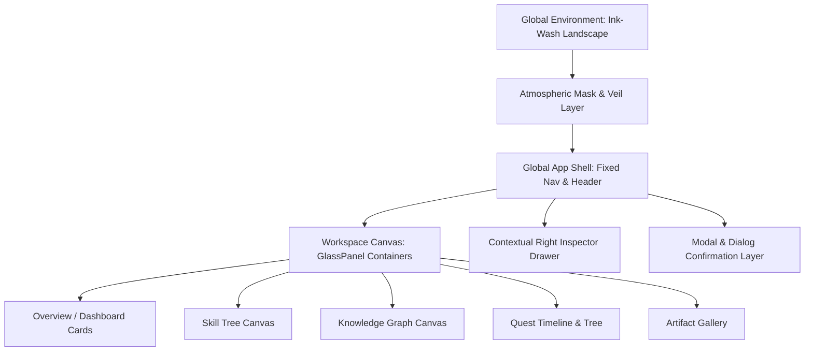

# Global Visual Direction & Aesthetic Philosophy

> **Document**: `01_GLOBAL_VISUAL_DIRECTION.md`  
> **Status**: DESIGN FREEZE CANDIDATE  
> **Milestone**: Global Visual Design Freeze  
> **Dependencies**: Stage 0–6 (FROZEN), Stage 7A/7B (FROZEN)  
> **Related Documents**: `02_DESIGN_TOKENS.md`, `03_GLOBAL_APP_SHELL.md`, `04_SHARED_COMPONENT_SYSTEM.md`, `05_ENTITY_VISUAL_LANGUAGE.md`

---

## 1. Aesthetic Identity & Design Pillars

The visual design of **AI Personal Growth RPG** represents a deliberate, harmonious fusion of three distinct worlds:

```
┌─────────────────────────────────────────────────────────────────────────┐
│                           AESTHETIC TRIAD                               │
│                                                                         │
│   东方修真 / 成长哲思          现代 AI 交互架构            克制沉浸的 RPG 仪表盘   │
│   (Eastern Growth Mindset)     (Modern AI Workspaces)    (Calm RPG Dashboard)   │
│                                                                         │
│   • 水墨气韵与天地留白           • 半透明玻璃层级体系        • 严谨的数值与层级递进    │
│   • 远山云雾与虚实相生           • 精确的信息密度与折叠      • 明确的能力实证与边界    │
│   • 古雅内敛的暗金微光           • 响应式抽屉与沉浸画布      • 零博彩/零浮夸庆祝       │
└─────────────────────────────────────────────────────────────────────────┘
```

### Core Design Pillars:
1. **Calm Immersion (静水流深)**: The UI feels like a tranquil scholar's sanctuary or cultivation pavilion. It invites deep reflection, focus, and sustained learning without noise or synthetic urgency.
2. **Structural Clarity (格物致知)**: Information hierarchy is razor-sharp. Visual styling never obscures semantic data, certainty metrics, or relational linkages.
3. **Restrained Luminescence (光华内敛)**: Glows, gold highlights, and animations exist strictly to denote milestone achievement, focus elevation, and verified truth—never as decorative confetti.
4. **Atmospheric Depth (虚实相生)**: Translucent glass layers create a sense of three-dimensional depth, floating gracefully over a subtle, low-contrast ink-wash environmental background.

---

## 2. Anti-Patterns & Prohibited Visual Styles

To preserve visual integrity across all future sub-stages, the following visual anti-patterns are strictly prohibited:

| Prohibited Anti-Pattern | Why It Is Forbidden | Approved Alternative |
| :--- | :--- | :--- |
| **Traditional Costume Drama (影楼仙侠风)** | Overly ornate tassels, dragons, paper lanterns, and heavy dragon-robe textures distract from modern AI productivity. | Modernized minimalist brushwork strokes, subtle paper-grain noise, and clean calligraphy-inspired structural geometry. |
| **Gacha Game Casino UI (二次元抽卡/页游风)** | Flashing gold borders, oversized gem counters, pulsing chest popups, and fake streak banners induce dopamine manipulation. | Clean numeric typography, structured progress meters, and serene milestone confirmation dialogs with full audit traceability. |
| **Neon Cyberpunk / Sci-Fi Clutter (荧光赛博风)** | Over-saturated cyan/magenta neon glows, scanlines, and circuit-board traces violate the Eastern ink-wash aesthetic. | Warm charcoal, muted slate ink, antique amber gold, and soft warm-white edge highlights. |
| **Generic SaaS Purple Dashboard (通用紫色SaaS)** | Standard generic gradients (purple-to-blue) erase the distinct cultural and intellectual identity of the product. | Custom ink-wash atmospheric palette with multi-layered neutral tones and antique gold accents. |
| **Uncalibrated Glassmorphism (全屏无序磨砂)** | Applying uniform heavy blur and high transparency everywhere causes text illegibility, contrast failure, and visual fatigue. | Rigorous 4-layer surface opacity scale (`surface-ground`, `surface-base`, `surface-raised`, `surface-overlay`) with controlled backdrop blur. |
| **AI Fantasy Clutter (AI概念图堆砌)** | Using dense, high-contrast AI fantasy illustrations behind text makes UI unreadable and cheapens the interface. | Carefully graded, low-contrast, heavily desaturated atmospheric landscape silhouettes placed strictly behind glass panels. |

---

## 3. Visual Baseline Specification

### 3.1 Background & Environment
- **Aesthetic**: Atmospheric Chinese landscape with subtle mountains, mist, bamboo silhouettes, and distant flying cranes/birds.
- **Contrast & Luminance**: Extremely subdued luminance (black-point weighted) so text contrast ratios exceed WCAG AAA (7:1) across all readable zones.
- **Layering**: Environmental background is fixed (`z-0`), veiled behind an atmospheric tint mask (`rgba(10, 12, 16, 0.85)`), ensuring foreground content cards always float cleanly above the environment.

### 3.2 Surfaces & Glass Panels
- **Translucency Hierarchy**:
  - **Canvas/Workspace Ground**: Deepest layer, subtle ink tint (`rgba(14, 17, 23, 0.75)` with `backdrop-blur-md`).
  - **Standard Card/Section**: Elevated surface (`rgba(22, 27, 34, 0.82)` with `backdrop-blur-lg`).
  - **Interactive Drawer / Inspector**: Raised contextual layer (`rgba(28, 34, 44, 0.92)` with `backdrop-blur-xl`).
  - **Modal / Dialog Overlay**: Highest focus surface (`rgba(33, 40, 52, 0.96)` with `backdrop-blur-2xl`).
- **Border Treatment**: 1px crisp subtle border (`rgba(218, 165, 32, 0.12)` to `rgba(255, 255, 255, 0.08)`) with a delicate top-edge highlight (`rgba(255, 255, 255, 0.05)`).

### 3.3 Color Strategy
- **Base Environment**: Warm charcoal (`#0d1117`), Ink deep slate (`#161b22`), Muted dark navy (`#1c2128`).
- **Primary Accent (Ancient Gold / 墨金与古金)**:
  - Base: `#d4af37` / `#c5a059` (Muted antique gold)
  - Glow: `rgba(212, 175, 55, 0.15)` (Restrained ambient halo)
  - High Achievement / Breakthrough: `#e5c158`
- **Neutral Typography**:
  - `text-primary`: Warm off-white (`#f0f6fc` / 95% opacity)
  - `text-secondary`: Bamboo mist gray (`#8b949e` / 75% opacity)
  - `text-muted`: Subdued charcoal gray (`#6e7681` / 50% opacity)
- **Domain Semantic Accents** (Strictly functional, never decorative):
  - Skill / Capability: Antique Gold / Amber (`#d4af37`)
  - Knowledge / Concept: Emerald Celadon Jade (`#3fb950` / `#2ea043`)
  - Quest / Mission: Azure Horizon (`#58a6ff` / `#388bfd`)
  - Artifact / Work Product: Amethyst Scholar Silk (`#bc8cff` / `#a371f7`)
  - Evidence / Grounding: Coral Vermilion Seal (`#f85149` / `#da3633`)

### 3.4 Typography & Proportions
- **Headings & RPG Titling**: Elegant serif-influenced or modern clean display font with generous tracking (`letter-spacing: 0.05em`) evoking traditional woodblock print elegance.
- **Body & Data Content**: Clean, highly readable system sans-serif (`Inter`, `-apple-system`, `BlinkMacSystemFont`, `Segoe UI`, `PingFang SC`, `Microsoft YaHei`).
- **Numeric & Metric Display**: Tabular numbers (`font-variant-numeric: tabular-nums`) with semi-bold weights for XP values, Level badges, Mastery ratings, and Confidence scores.

---

## 4. Architectural Summary


