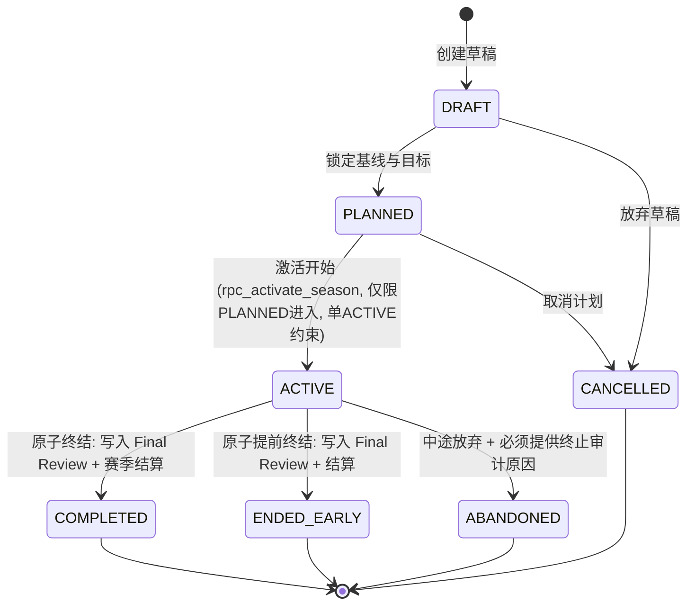
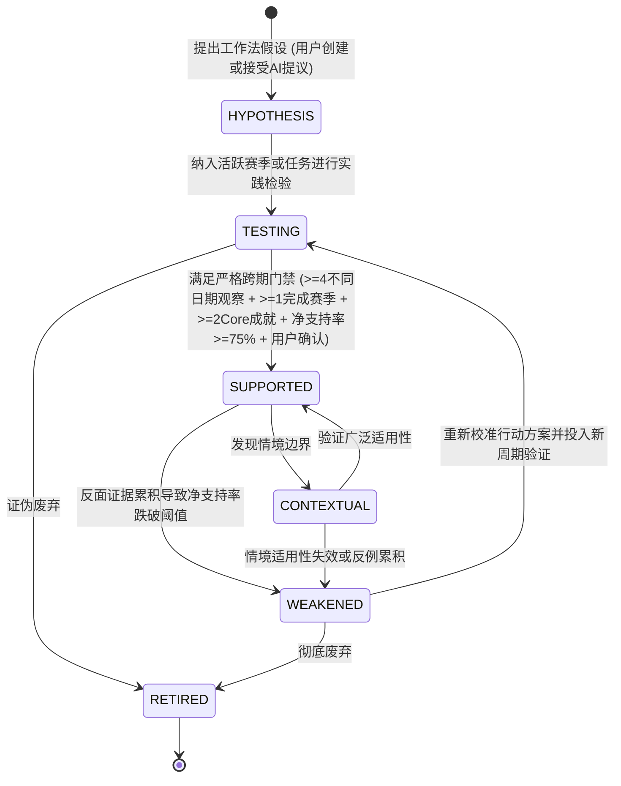

# Phase 8 — Outer Loop Domain Model Architecture

> **状态**: PHASE 8A ARCHITECTURE FREEZE (R1 Corrective Edition)  
> **定位**: 外部成长闭环领域模型全景定义  
> **上位控制规范**: `docs/DesignSystem/PHASE8A_OUTER_GROWTH_LOOP_ARCHITECTURE_FREEZE_CONTROLLING.md`  

---

# 1. 领域模型总览与分层哲学

Outer Growth Loop（外部闭环）承接 Core Growth System（成长内核）生成的确定性事实，通过**时间化、反思化、方法化、激励化与荣誉化**五大维度，为用户的现实成长提供长程操作系统。

```
┌─────────────────────────────────────────────────────────────────────────────────┐
│                           外环领域模型分层视图                                  │
│                                                                                 │
│  [激励与荣誉]  RewardAccount ──> RewardTransaction (只增事件) ──> Wish / Redemptions │
│                Milestones (真实成长与客观核验荣誉)                             │
│                                                                                 │
│  [认知与方法]  Strategies (6状态个人方法库) <── StrategySupports (跨时间证据集)  │
│                JournalEntries (主观日记分类与7维状态标量上下文)                 │
│                                                                                 │
│  [组织与周期]  Seasons (14~84天周期，单活跃约束) ──> SeasonQuestLink (N:N 解耦) │
│                SeasonReviews (终审不可变版本化复盘)                             │
└───────────────────────────────────────┬─────────────────────────────────────────┘
                                        │ 只读引用 / 映射推导 (严禁反向污染)
                                        ▼
┌─────────────────────────────────────────────────────────────────────────────────┐
│                     内核领域模型 (Frozen Core Entities)                         │
│                                                                                 │
│  Quests (树状任务: quest_size, is_boss, is_main_quest, status: lowercase)      │
│  Activities (现实行为事实: id, quest_id, created_at)                           │
│  Growth Engine (XP Transactions 只增流水, Mastery M0~M10 评定, Artifacts 档案)   │
└─────────────────────────────────────────────────────────────────────────────────┘
```

---

# 2. 实体分类与权威边界 (Entity Classification)

依据控制规范，Phase 8 架构严格区分**持久化领域实体**、**明确派生视图**与**明确拒绝实体**。

### 2.1 周期域 (Seasons & Reviews)
- **Season (成长赛季)**：宏观成长章节的时间与情境容器（推荐28天，允许14~84天）。具有独立生命周期，**同一用户全局至多存在 1 个 `ACTIVE` 赛季**。
- **SeasonQuestLink (赛季任务关联)**：Season 与 Quest 的 $N:N$ 关联中间实体，具有角色标注 (`role: MAIN | FOCUS`)。单个赛季至多拥有 1 个 `MAIN` Quest。
- **SeasonReview (赛季复盘)**：在赛季周期内或结束时生成的结构化、用户确认的复盘分析记录（分为 `WEEKLY`, `FINAL`, `AD_HOC`）。草稿态在 `OuterLoopProposal`，持久化记录终身只读版本化。

### 2.2 反思与状态域 (Journal & State)
- **JournalEntry (主观日记与状态记录)**：用户主观感受、摩擦力反思与精力记录的统一持久化实体。携带 7 维主观状态标量（精力、专注度、压力、阻力、恢复度、心境效价、自我信心）。
- **硬性边界**：`JournalEntry != Verified Evidence`。主观日记永远不能直接提升 Mastery，不作为底层技能升级凭据。

### 2.3 方法论域 (Personal Playbook)
- **Strategy (策略假说与行动法)**：回答“在何种情境下，采取何种个人行动方案对我有成效”。拥有 6 状态严谨生命周期 (`HYPOTHESIS`, `TESTING`, `SUPPORTED`, `CONTEXTUAL`, `WEAKENED`, `RETIRED`)。
- **StrategySupport (策略支持与反例记录)**：对策略在实践中产生的支持事件与反例事实的只增记录，绑定来源引用与评估版本，数据库级防重。

### 2.4 激励域 (Reward Economy)
- **RewardAccount (奖励账户)**：用户奖励积分可用与冻结余额的高速汇总视图（强依赖只增流水严格维护平账）。
- **RewardTransaction (奖励事件账本)**：物理隔离的**单账户只增事件流水账本 (Single-Account Append-Only Event Ledger)**。仅包含 `EARN`, `CORRECTION`, `RESERVE`, `UNRESERVE`, `REDEEM`, `REFUND` 6 大事件类型，支持确定性 `foldRewardLedger` 余额折叠。
- **Wish (心愿单)**：用户设定的现实世界犒劳目标。至多拥有 1 个 `PRIMARY` 活跃心愿。
- **RewardRedemption (兑现凭证)**：心愿正式兑现后的物理收据。

### 2.5 荣誉域 (Milestones)
- **Milestone (里程碑)**：记录用户达成重大技术、产物或人生质变的永久荣誉节点（分为 `CORE_VERIFIED` 与 `USER_CONFIRMED_REAL_WORLD`）。
- **硬性边界**：自主认证的现实里程碑不自动成为奖励铸币水龙头，必须经由独立/确定性策略核验方可铸币。若包装底层 Core 事件，必须锚定 Core 原始来源防重复铸币。

### 2.6 治理与提议基础设施 (Governance Infrastructure)
- **OuterLoopProposal (外环统一提议信封)**：AI 介入外环各项事务的唯一规范数据载体，强制遵循“提议 -> 预览 -> 用户确认/编辑/拒绝 -> 确定性提交”流水线。
- **OuterLoopAuditEvent (外环审计日志)**：对所有状态跃迁、异常回滚与敏感操作的只增审计流水。

---

# 3. 实体关系图谱 (Cross-Entity Relationship Graph)

```mermaid
classDiagram
    class Quest {
        <<Core Entity (Frozen)>>
        +UUID id
        +string title
        +string status "locked | available | active | paused | completed | failed | archived"
        +string quest_size "micro | minor | standard | major | epic | main"
        +boolean is_main_quest
        +boolean is_boss
    }
    class Activity {
        <<Core Entity (Frozen)>>
        +UUID id
        +UUID quest_id
        +timestamptz created_at
    }
    class Season {
        +UUID id
        +string title
        +integer target_duration_days
        +date planned_start_date
        +date planned_end_date
        +timestamptz started_at
        +timestamptz ended_at
        +string status "DRAFT | PLANNED | ACTIVE | COMPLETED | ENDED_EARLY | ABANDONED | CANCELLED"
    }
    class SeasonQuestLink {
        +UUID season_id
        +UUID quest_id
        +string role "MAIN | FOCUS"
    }
    class SeasonReview {
        +UUID id
        +UUID season_id
        +string review_type "WEEKLY | FINAL | AD_HOC"
        +jsonb objective_summary
        +text qualitative_reflection
        +integer version
        +UUID superseded_by_id
    }
    class JournalEntry {
        +UUID id
        +UUID user_id
        +string entry_type
        +text content_markdown
        +integer energy
        +integer focus
        +integer stress
        +integer resistance
        +integer recovery
        +integer mood_valence
        +integer self_confidence
        +timestamptz logged_at
    }
    class Strategy {
        +UUID id
        +string title
        +text context_trigger
        +text action_protocol
        +text expected_outcome
        +string lifecycle_status "HYPOTHESIS | TESTING | SUPPORTED | CONTEXTUAL | WEAKENED | RETIRED"
        +string confidence_level "LOW | MODERATE | HIGH | VERY_HIGH"
        +integer version
    }
    class StrategySupport {
        +UUID id
        +UUID strategy_id
        +string observation_type "SUPPORT | COUNTER_EVIDENCE"
        +string source_class
        +UUID source_id "UUID NOT NULL"
        +string evaluator_version
    }
    class RewardAccount {
        +UUID user_id
        +integer lifetime_earned
        +integer net_earned
        +integer lifetime_redeemed
        +integer current_reserved
        +integer current_available
        +integer correction_deficit
    }
    class RewardTransaction {
        +UUID id
        +UUID user_id
        +string event_kind "EARN | CORRECTION | RESERVE | UNRESERVE | REDEEM | REFUND"
        +integer amount
        +string canonical_source_type
        +string canonical_source_id "UUID or deterministic composite identity"
        +string policy_version
        +string request_idempotency_key
        +UUID correction_for_id "Nullable FK to prior transaction (at most one per EARN)"
        +UUID refund_for_redemption_id "Nullable FK to prior redemption (at most one per REDEEM)"
    }
    class Wish {
        +UUID id
        +string title
        +integer credit_cost
        +string status "IDEA | ACTIVE | PRIMARY | RESERVED | REDEEMED | ARCHIVED | CANCELLED"
    }
    class RewardRedemption {
        +UUID id
        +UUID wish_id
        +UUID transaction_id
        +integer credits_spent
    }
    class Milestone {
        +UUID id
        +string milestone_key
        +string recognition_class "CORE_VERIFIED | USER_CONFIRMED_REAL_WORLD"
        +string status "ACTIVE | REVOKED | CORRECTED"
    }

    Season "1" -- "0..*" SeasonQuestLink : links
    Quest "1" -- "0..*" SeasonQuestLink : mapped
    Season "1" -- "0..*" SeasonReview : produces
    Season "0..1" -- "0..*" JournalEntry : contextualizes
    Activity "0..*" ..> "1" Quest : linked_in_core
    Season "0..*" ..> "0..*" Activity : derived_activity_set
    Strategy "1" -- "0..*" StrategySupport : backed_by
    SeasonReview "0..1" ..> "0..*" StrategySupport : references
    RewardAccount "1" -- "0..*" RewardTransaction : ledger
    Wish "1" -- "0..*" RewardRedemption : redeems
    RewardTransaction "1" -- "0..1" RewardRedemption : settles
    Milestone "0..1" ..> "0..1" RewardTransaction : eligible_earn_source
```



---

# 4. 核心实体生命周期状态机 (Lifecycle State Machines)

### 4.1 Season 生命周期

- **硬性约束**：
  - `rpc_activate_season` 严禁允许 `DRAFT -> ACTIVE`，必须先流转为 `PLANNED` 并设定明确成功标准。
  - **0..1 MAIN 关系**：Season 允许关联 0 或 1 个 MAIN Quest，关联 MAIN Quest 不是激活的前置必选条件。
  - **原子终结事务**：`ACTIVE -> COMPLETED` / `ENDED_EARLY` 在 `rpc_conclude_season` 事务内原子写入不可变 `FINAL` `SeasonReview` 并更新状态，杜绝先终结后复盘或先复盘后终结的循环竞态。
  - `ACTIVE -> ABANDONED` 必须提供不可为空的 `p_abandonment_reason` 写入审计日志，不要求 `FINAL` 复盘。
  - 一旦进入 `ACTIVE`，严禁通过常规产品 API 硬删除，必须流转至终止态并留痕。
  - 同一用户任意时刻至多只能拥有 1 个 `ACTIVE` 状态的 Season。

### 4.2 Strategy 6状态生命周期

- **硬性约束**：
  - AI 绝无权限将 Strategy 直接置为 `SUPPORTED`；置信度为纯确定性推导值 (`LOW`, `MODERATE`, `HIGH`, `VERY_HIGH`)。
  - 晋升为 `SUPPORTED` 要求置信度至少达到 `HIGH`，由 `rpc_evaluate_strategy_status` 确定性算定后，必须经由用户显式确认操作完成状态变更。

### 4.3 Wish 唯一规范生命周期

```mermaid
stateDiagram-v2
    [*] --> IDEA : 录入心愿想法
    IDEA --> ACTIVE : 纳入候选心愿池
    ACTIVE --> PRIMARY : 设为主目标心愿 (同用户至多1个 PRIMARY)
    PRIMARY --> RESERVED : 积分充足且用户确认，发起预扣 (RESERVE)
    RESERVED --> REDEEMED : 现实中兑现犒赏，账本核销 (REDEEM)
    RESERVED --> PRIMARY : 显式解冻取消预扣 (UNRESERVE)
    IDEA --> ARCHIVED : 归档丢弃
    ACTIVE --> ARCHIVED : 归档丢弃
    PRIMARY --> ARCHIVED : 归档丢弃
    IDEA --> CANCELLED : 显式取消
    ACTIVE --> CANCELLED : 显式取消
    PRIMARY --> CANCELLED : 显式取消
    REDEEMED --> [*]
```

- **硬性约束**：
  - 彻底废止 `BACKLOG` 与 `REDEEMABLE` 词汇；Cooldown 不是生命周期状态，仅作为元数据字段 `cooldown_until`。
  - **`REDEEMED` 严格为终态**：退款 (`rpc_refund_wish_redemption`) 仅在 `reward_transactions` 账本追加只增 `REFUND` 事件还原可用额度，`reward_redemptions` 物理凭据保持不可变，**Wish 实体严格保持 `REDEEMED` 终态**，绝不回退至 `ACTIVE`，维护历史审计真实性。

### 4.4 SeasonReview 提议与不可变版本化模型
- **提议信封分流**：AI GM 生成的复盘草稿存放在 `OuterLoopProposal` (`status = 'PROPOSED'`)，在客户端提供交互式 Diff 与编辑预览。
- **持久化记录即终态**：用户确认后，原子写入 `SeasonReview` 实体。持久化复盘记录自写入起即为不可变 (`immutable`)，不设内部 DRAFT 状态。
- **幂等与并发控制**：持久化提交携带客户端 `commit_key UUID NOT NULL` (`UNIQUE (user_id, commit_key)`)。版本递增在父级 Season 行锁 (`FOR UPDATE`) 保护下串行安全计算。
- **版本更迭溯源**：若后续对已终审复盘做事实补正，不就地修改历史，而是创建新版 `SeasonReview`，通过 `version` 与 `superseded_by_id` 形成单向版本溯源链。
