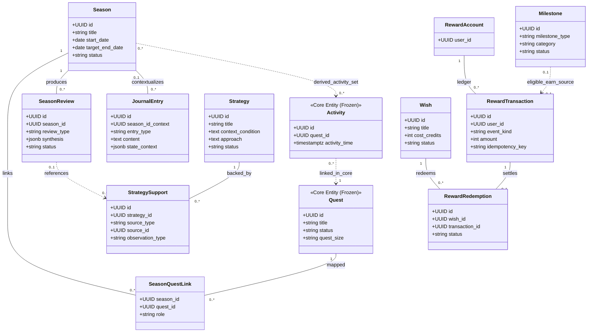
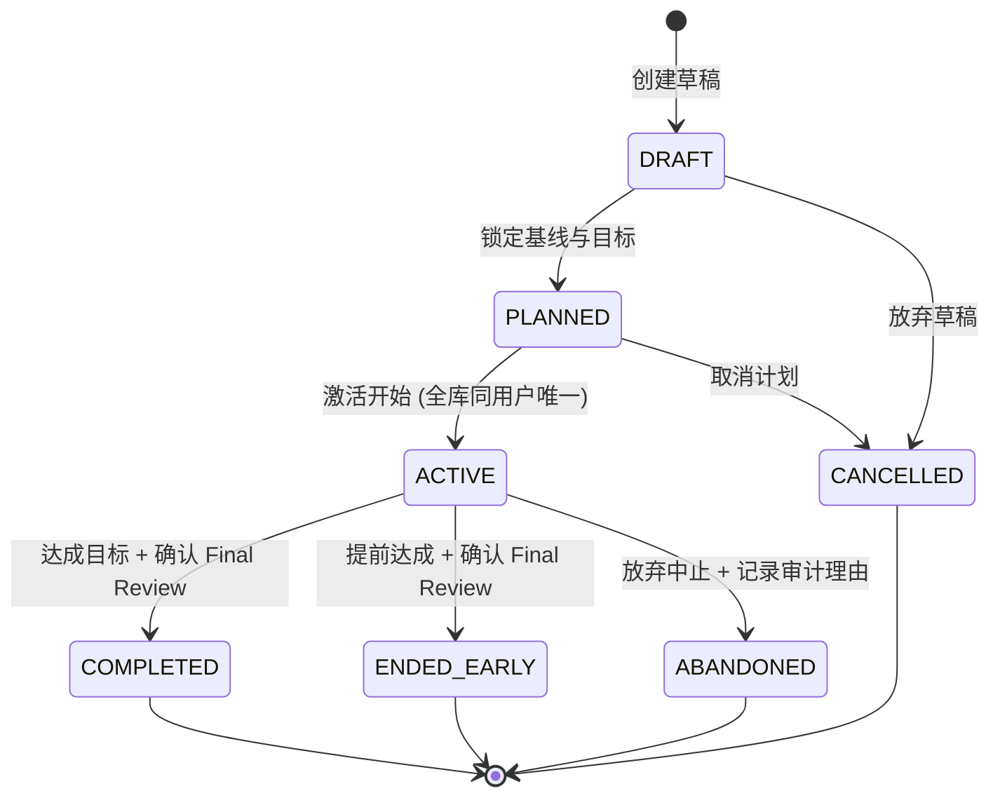
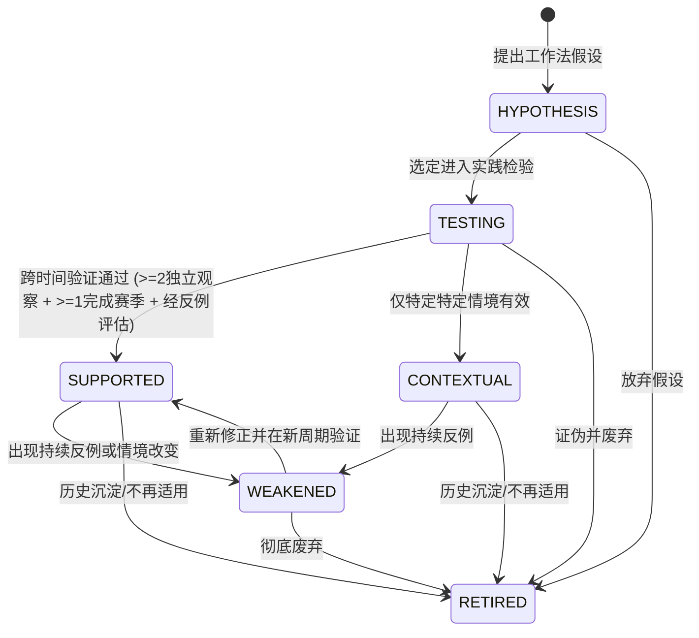
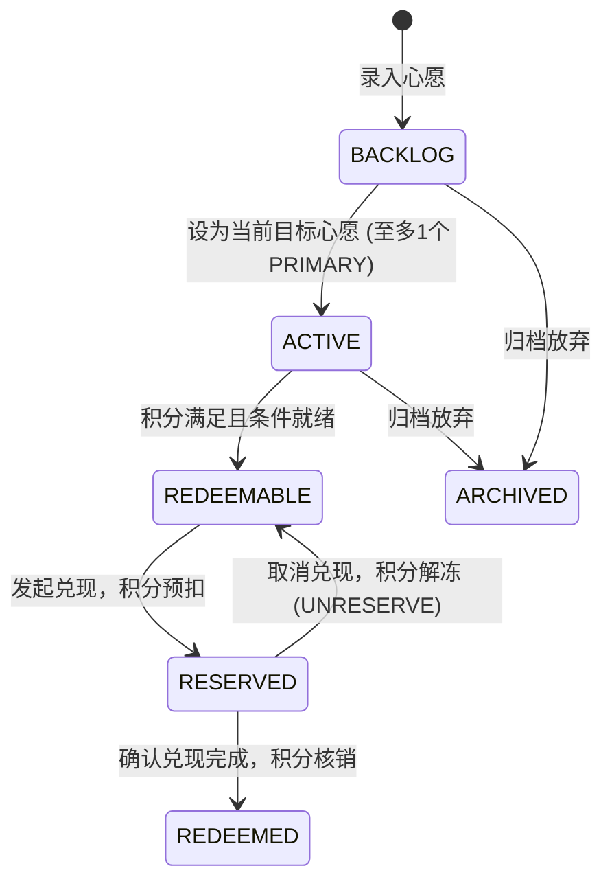

# AI Personal Growth RPG — Phase 8 Outer Loop Domain Model

> **文档版本**: 1.0 (Phase 8A Architecture Freeze)  
> **文档定位**: 外部闭环领域模型核心定义、实体分类、关系图谱与生命周期状态机  
> **上位控制规范**: `docs/DesignSystem/PHASE8A_OUTER_GROWTH_LOOP_ARCHITECTURE_FREEZE_CONTROLLING.md`  

---

# 1. 实体分级与分类架构 (Entity Classification)

为了防止概念过度膨胀并捍卫 Growth Core 的唯一权威，Phase 8 将所有涉及的概念严格分为三类：**持久化领域对象**、**派生与只读计算视图**、以及**明确拒绝收录的对象**。

```
┌─────────────────────────────────────────────────────────────────────────────────┐
│                           1. 持久化领域对象 (Persistent)                         │
│  - Seasons (成长赛季)                - SeasonQuestLinks (关联目标)              │
│  - SeasonReviews (结构化复盘)        - JournalEntries (主观日记与状态)           │
│  - Strategies (策略假说)             - StrategySupports (跨时间证据支撑)        │
│  - RewardAccounts (奖励账户)         - RewardTransactions (奖励流水账本)         │
│  - Wishes (愿望清单)                 - RewardRedemptions (兑现记录)             │
│  - Milestones (里程碑成就)           - OuterLoopProposals (统一提议信封)        │
│  - OuterLoopAuditEvents (审计日志)                                             │
│  [8G可选]: FocusSessions (专注记录), GrowthProtocols/ProtocolVersions (执行模板) │
├─────────────────────────────────────────────────────────────────────────────────┤
│                           2. 派生只读视图 (Derived Views)                        │
│  - Season Progress (赛季进度推导)    - Season Activity Set (赛季活动集映射)     │
│  - Strategy Confidence (确定性置信度)- Available / Reserved Reward Balance     │
│  - Past Self Comparison (过去自我对比)- State Trend Summaries (状态趋势分析)     │
│  - Milestone Candidates (待核验成就) - Next Best Action (行动建议)              │
├─────────────────────────────────────────────────────────────────────────────────┤
│                           3. 明确拒绝实体 (Explicitly Rejected)                 │
│  - Goal (严禁重复立项，Quest 独占)    - PastSelf 表 (纯只读对比，不建实体表)      │
│  - Streak (禁止强制连击打卡概念)      - XP Wallet / Coin (XP 严禁货币化)         │
│  - CharacterStatFromMood (状态非能力)- JournalEvidence (严禁日记隐式升级掌握度) │
│  - Marketplace / SocialLeaderboard (严肃自驱，严禁社交攀比与交易市场)             │
└─────────────────────────────────────────────────────────────────────────────────┘
```

---

# 2. 领域实体详述 (Persistent Domain Records)

### 2.1 赛季与规划域 (Season & Planning)
- **Season (成长赛季)**：用户在有限时间周期（14~84天，推荐28天）内的聚焦成长容器。定义核心目标、基线契约、预期成果与复盘总结。
- **SeasonQuestLink (赛季任务关联)**：Season 与 Quest 之间的多对多（N:N）关联。定义角色为 `MAIN`（主线任务，每个赛季至多 0..1 个）或 `FOCUS`（焦点任务，0..N 个）。
- **SeasonReview (赛季复盘)**：在赛季周期内或结束时生成的结构化、用户确认的复盘分析记录（分为 `WEEKLY`, `FINAL`, `AD_HOC`）。

### 2.2 反思与状态域 (Journal & State Context)
- **JournalEntry (主观日记与身心状态)**：记录用户在成长过程中的主观感受、摩擦力、心流阻碍与决策反思。内嵌 7 维状态标量（能量、专注、压力、阻力、恢复度、心境效价、自我效能感），作为上下文解释变量。

### 2.3 方法论域 (Personal Playbook & Strategy)
- **Strategy (策略假说)**：提炼“在何种情境下，采用何种具体行为/范式能够稳定达成正向成长”的假设与个人工作法。
- **StrategySupport (策略支撑溯源)**：记录每一次对特定策略产生正向验证或反向证伪的跨时间观察记录。

### 2.4 激励与兑现域 (Reward Economy & Wishes)
- **RewardAccount (奖励账户)**：记录用户现实心愿积分的唯一账户实体。
- **RewardTransaction (奖励流水账本)**：采用只增不可篡改（Append-Only）的严格对账流水，记录积分的产生 (`EARN`)、校正 (`CORRECTION`)、预扣 (`RESERVE`)、解冻 (`UNRESERVE`)、兑换 (`REDEEM`) 与返还 (`REFUND`)。
- **Wish (心愿)**：用户现实中渴望兑现的真实正反馈（如旅行、大餐、心仪数码产品等）。
- **RewardRedemption (兑现结算)**：记录心愿被积分实际兑付的终审确认。

### 2.5 荣誉域 (Milestones)
- **Milestone (里程碑)**：记录用户达成重大技术、产物或人生质变的永久荣誉节点（分为 `CORE_VERIFIED` 与 `USER_CONFIRMED_REAL_WORLD`）。

### 2.6 审计与提议基础设施 (Governance Infrastructure)
- **OuterLoopProposal (外环统一提议信封)**：AI 介入外环各项事务的唯一规范数据载体，强制遵循“提议 -> 预览 -> 用户确认/编辑/拒绝 -> 确定性提交”流水线。
- **OuterLoopAuditEvent (外环审计日志)**：对所有状态跃迁、异常回滚与敏感操作的只增审计流水。

---

# 3. 实体关系图谱 (Cross-Entity Relationship Graph)



---

# 4. 核心实体生命周期状态机 (Lifecycle State Machines)

### 4.1 Season 生命周期

- **硬性约束**：
  - 一旦进入 `ACTIVE`，严禁通过常规 API 硬删除，必须流转至终止态并留痕。
  - 同一用户任意时刻至多只能拥有 1 个 `ACTIVE` 状态的 Season。

### 4.2 Strategy 生命周期

- **硬性约束**：AI 绝无权限将 Strategy 直接置为 `SUPPORTED`；置信度为纯确定性推导值。

### 4.3 Wish 生命周期


### 4.4 SeasonReview 生命周期
- `DRAFT` (草稿生成) → `CONFIRMED` (用户确认终审，只读固化) → `SUPERSEDED` (若后续修正，保留原件并生成新版本指向上版)。
