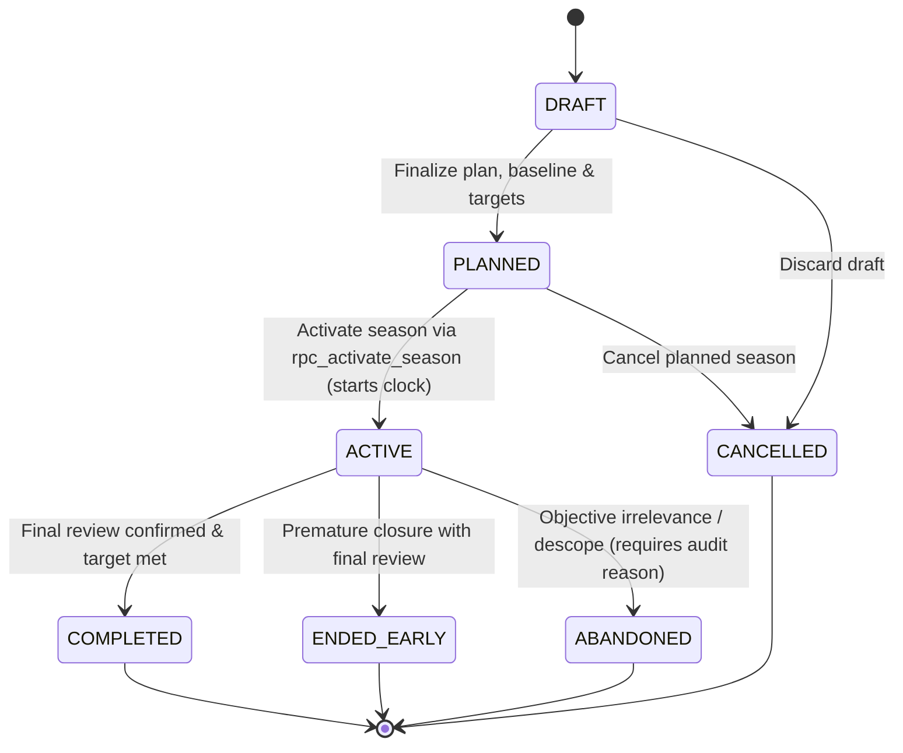
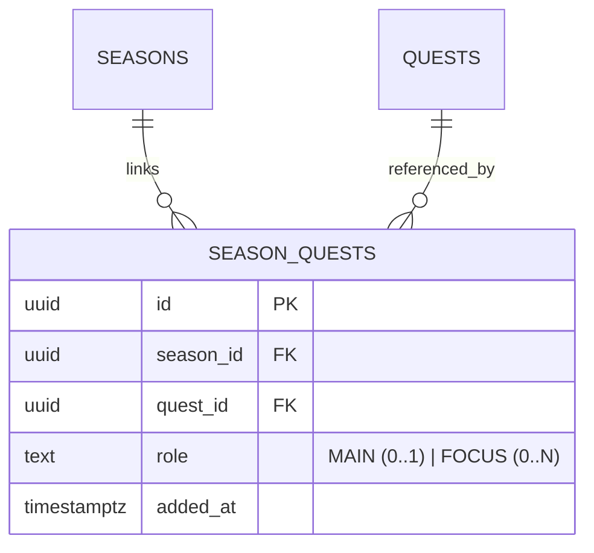

# Phase 8 — Season and Review Specification

## 1. Executive Summary & Purpose

A **Season** is a finite macro-cycle container that provides temporal context, focus, and qualitative synthesis around a user's authentic personal growth. It is designed to overcome "infinite grind fatigue" by organizing development into deliberate, bounded chapters (typically 28 days) with explicit baselines, core hypotheses, focused quests, and structured milestone criteria.

A **Review** is a separate, structured domain record that synthesizes achievements, setbacks, behavioral patterns, and qualitative reflections over a specific period (weekly or season-end).

### Core Boundaries
- **A Season is NOT a Goal Hierarchy**: The Quest system (`quests`) remains the sole hierarchical goal domain (main, epic, major, standard, minor, micro). Seasons overlay temporal focus onto Quests.
- **A Season is NOT an XP Generator**: Seasons do not calculate or issue XP. Growth Core continues to handle all XP mutations deterministically through Activities and Evidence.
- **A Season is NOT a Streak**: Daily check-ins or calendar continuity are neither required nor sufficient for Season success.
- **Review is NOT Journal**: Journal entries capture raw, spontaneous subjective reflection. Reviews are structured, user-confirmed synthesis documents that aggregate objective Growth Core truth and subjective context.

---

## 2. Season Architecture & Lifecycle

### 2.1 Duration Rules
To avoid both micro-management triviality and unbounded goal drifting, Season durations are strictly bounded:
- **Recommended Default Duration**: 28 calendar days (4 weeks).
- **Minimum Duration**: 14 calendar days (2 weeks). Shorter initiatives belong within standard Quests or Activities.
- **Maximum Duration**: 84 calendar days (12 weeks / 1 quarter). Longer commitments must be broken down into sequentially chained Seasons.

### 2.2 Concurrency & Single Active Invariant (Rule: SINGLE_ACTIVE_SEASON, Harness: O013)
- A user may draft or plan future seasons (`DRAFT`, `PLANNED`).
- **At most ONE Season may be `ACTIVE` per user at any given time.**
- This constraint is strictly enforced at the database level using a partial unique index on `(user_id)` where `status = 'ACTIVE'`.
- Activating a new Season while an active one exists requires explicitly completing, ending early, or abandoning the current active Season via an atomic RPC.

### 2.3 Season Lifecycle State Machine

#### Lifecycle State Definitions:
1. **`DRAFT`**: Work-in-progress season planning. Editable without constraint. May be pruned if never activated.
2. **`PLANNED`**: Fully specified season with start date and linked quests, awaiting activation.
3. **`ACTIVE`**: The currently running season. Clock is ticking. The user is actively executing against this context.
   - **Transition Gate**: Direct activation from `DRAFT -> ACTIVE` is strictly prohibited. Seasons must transition `DRAFT -> PLANNED -> ACTIVE`.
4. **`COMPLETED`**: Terminal success state. Achieved when the duration concludes and the user confirms the final structured review evaluating success criteria.
5. **`ENDED_EARLY`**: Terminal state where the user concludes the season before the scheduled end date, preserving all achievements and conducting a final review.
6. **`ABANDONED`**: Terminal state where life circumstances, major priority shifts, or goal irrelevance led the user to stop the season. Requires post-mortem reflection and mandatory `abandonment_reason` in the audit event.
7. **`CANCELLED`**: Planned or draft season was discarded before ever becoming active.

#### Deletion & Archival Rules (Rule: TERMINAL_SEASON_HISTORY_PRESERVED, Harness: O022):
- **Fixed FK Delete Behavior**: Dependent child tables (`season_quests`, `season_reviews`, etc.) specify `ON DELETE RESTRICT` to protect historical relational integrity.
- **Product Deletion Invariant**: Any Season that has ever reached `ACTIVE` status **can never be hard-deleted** through product APIs. Its historical existence, reviews, and linked contexts are permanently preserved for longitudinal growth analysis.
- Only unactivated `DRAFT` or `PLANNED` seasons that have zero dependent child records may be pruned.

---

## 3. Season-to-Quest Relationship ($N:N$) (Rule: SEASON_QUEST_N_TO_N, Harness: O014, O015)

The relationship between Seasons and Quests is decoupled and many-to-many ($N:N$), mediated by the `season_quests` link table.

### 3.1 Linkage Roles
1. **`MAIN` Quest (0..1 per Season)**:
   - The singular primary thematic quest defining the season's core focus.
   - Enforced by a partial unique index: `UNIQUE (season_id) WHERE role = 'MAIN'`.
2. **`FOCUS` Quests (0..N per Season)**:
   - High-priority supporting quests aligned with the season's objectives.

### 3.2 Decoupled Lifecycle Rules (Rule: SEASON_DECOUPLED_LIFECYCLE, Harness: O015)
- **Season Completion Does NOT Auto-Complete Quests (O015)**: When a Season concludes, linked Quests remain in their current state. An ongoing Epic Quest may span across multiple successive Seasons.
- **Quest Completion Does NOT Auto-Complete Seasons**: Completing a Season's `MAIN` Quest does not prematurely terminate the Season; the user continues the chapter or chooses to conduct an early final review.
- **Cross-Season Reuse**: A long-term Epic Quest can be linked as `FOCUS` in Season 1, `MAIN` in Season 2, and `FOCUS` in Season 3.

---

## 4. Activity Relationship as a Derived Read Model

To preserve the frozen integrity of Phase 1–7 Growth Core tables, **no `season_id` foreign key is added to the `activities` table**.

### 4.1 Canonical Derived Activity Set
The activities belonging to a Season are computed dynamically as a **derived read model** using the following deterministic criteria:
$$\text{SeasonActivities}(S) = \left\{ a \in \text{Activities} \;\middle|\; a.\text{user\_id} = S.\text{user\_id} \land a.\text{quest\_id} \in \text{LinkedQuests}(S) \land a.\text{created\_at} \in [S.\text{started\_at}, S.\text{ended\_at}] \right\}$$

### 4.2 Handling of Unlinked Activities
- Activities completed outside linked Season Quests (e.g., routine side quests or spontaneous logs) are not automatically attributed to the Season.
- During a Structured Review, a user or AI GM may explicitly cite an external Activity as contextual evidence, but this creates a reference in the Review record, not a schema modification on the Activity.

---

## 5. Structured Review Architecture (Rule: REVIEW_AUTHORITY_BOUNDARY, Harness: O016)

A **Review** is a formal, retrospective synthesis record created at predetermined intervals to assess progress, capture qualitative learnings, and calibrate ongoing strategy.

### 5.1 Review Types
1. **`WEEKLY`**: Regular checkpoint conducted every 7 days during an active season. Assesses short-term momentum, identifies blockers, and adjusts tactical focus.
2. **`FINAL`**: Mandatory comprehensive retrospective conducted at Season closure (`COMPLETED` or `ENDED_EARLY`). Evaluates season success criteria, synthesizes strategy insights, and determines milestone eligibility.
3. **`AD_HOC`**: Mid-cycle reflective intervention triggered by major breakthroughs, critical failures, or significant life pivots.

### 5.2 Review Structure and Schema Elements
A Review document contains structured sections validated against a strict schema:
- **Time Window**: `[period_start, period_end]`.
- **Target Context**: `season_id` (mandatory for `FINAL`, optional for standalone reviews).
- **Objective Growth Summary (Read Model)**:
  - Total activities completed.
  - XP accumulated across relevant skill trees (for visibility, not re-computed).
  - Quests progressed or finished.
  - Artifacts produced.
- **Subjective Context Evaluation**:
  - Aggregated journal mood/energy trends over the period.
  - Qualitative answers to structured prompts:
    - *What went well and why?*
    - *What frictions or failure patterns emerged?*
    - *What strategy hypotheses were tested?*
- **Synthesis & Calibration**:
  - Evaluation of initial Season success criteria (Exceeded, Met, Partially Met, Missed).
  - Recommended tactical adjustments for the next cycle.

### 5.3 Review Authority & Versioning Boundary (Rule: REVIEW_AUTHORITY_BOUNDARY, Harness: O016)
- **Draft Reviews Live in AI Proposals**: Drafting, iteration, and previews are handled via `OuterLoopProposal` (`status = 'PROPOSED'`).
- **Persistent Reviews are Finalized**: Once confirmed by the user, the review is inserted into `season_reviews`. Persistent review records do not maintain an internal `DRAFT` state; they are immutable upon creation.
- **Immutable Versioning**: Any subsequent corrections or amendments generate a new superseding review row with an incremented `version` and `superseded_by_id` pointer.
- **Review Does NOT Create Growth Truth**: A Review cannot award XP, cannot directly promote Skills or Mastery, and cannot create verified evidence.
- **Review is an Upstream Source for Strategy & Milestones**: A finalized review serves as an auditable source reference for proposing new Personal Playbook strategies or validating real-world milestone achievements.

---

## 6. AI Game Master Contract for Seasons & Reviews

The AI GM acts as an executive strategist and inquisitive biographer throughout the season lifecycle.

### 6.1 Season Planning & Scoping (`SEASON_PLAN`)
- The AI GM interviews the user regarding desired macro-outcomes.
- Validates that proposed scope fits within the 14–84 day window.
- Suggests 1 `MAIN` Quest and 1–3 `FOCUS` Quests based on recent capability growth.
- Generates a structured `OuterLoopProposal` containing the complete season blueprint.

### 6.2 Review Synthesis (`REVIEW_SUMMARY`)
- The AI GM ingests deterministic activity logs, quest completions, and journal entries from the period.
- Produces a coherent narrative draft highlighting patterns the user might overlook (e.g., "Productivity was high on days following high recovery scores").
- Prompts the user with targeted Socratic questions on identified failure points.
- **Preview & Confirmation**: The user reviews the draft, edits any interpretations, and confirms finalization. The LLM never directly commits a finalized review to the database.

---

## 7. Verification & Deterministic Test Scenarios

The Season and Review architecture must pass the following test specifications:

- **O006_SEASON_END_DOES_NOT_REWRITE_GROWTH**: Concluding or abandoning a Season leaves all historical XP, skill mastery, and activity logs completely unmodified.
- **O013_ONLY_ONE_ACTIVE_SEASON_PER_USER**: Attempting to insert or activate a second Season while one is `ACTIVE` fails closed with a constraint violation error.
- **O014_SEASON_QUEST_IS_N_TO_N**: Multiple Quests link to one Season; a single Quest links across multiple sequential Seasons. At most one `MAIN` Quest allowed per Season.
- **O015_SEASON_DOES_NOT_COMPLETE_QUEST**: Transitioning a Season to `COMPLETED` does not alter the status of any linked in-progress Quests.
- **O016_REVIEW_DOES_NOT_CREATE_GROWTH_TRUTH**: Finalizing a Review record produces zero changes in `xp_transactions`, `user_skills`, or `evidence`.
- **O022_TERMINAL_SEASON_HISTORY_NOT_HARD_DELETED**: API calls attempting `DELETE /api/seasons/:id` on an `ACTIVE` or `COMPLETED` Season return HTTP 403 / 409 and fail closed.
