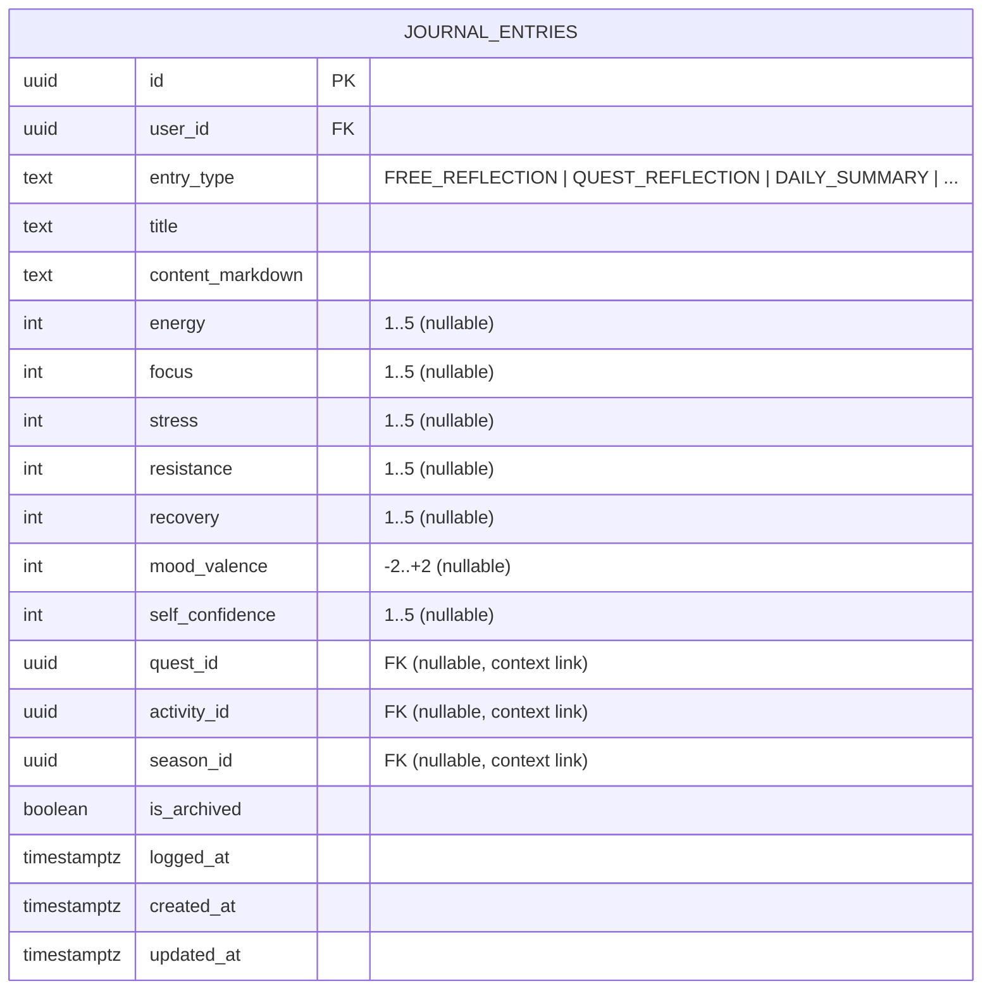

# Phase 8 — Journal and State Context Specification

## 1. Core Purpose & Conceptual Framing

The **Journal** captures the subjective, internal dimension of personal development. 

While the Growth Core (Phases 1–7) records objective execution facts ("What demonstrably occurred, what artifacts were produced, what evidence was verified"), the Journal answers:
> *"How did I experience this process? What internal frictions, emotional states, energy dynamics, and insights arose during execution?"*

### Foundational Invariants
- **Subjective Context, Not Objective Truth (O7)**: Journal entries represent personal reflections and self-reported phenomenological states. They are not Verified Evidence and cannot silently upgrade Mastery or Skill levels.
- **Temporary State is Not Permanent Capability (O11)**: Internal states (e.g., low energy, high stress, negative mood) fluctuate hourly and daily. They are contextual variables, never deductions or additions to permanent skill proficiency.
- **Strict Privacy by Default**: Journal entries are strictly confidential to the individual user. No public feeds, social leaderboards, or cross-user visibility exist in this architecture.

---

## 2. Persistence Model & Unified Entity Architecture

To prevent entity fragmentation and unnecessary schema complexity, Phase 8 unifies qualitative reflections and quantitative subjective states into a single canonical table: **`journal_entries`**.

A separate, standalone "State" table is explicitly rejected for initial Phase 8. State ratings are stored as optional structured attributes directly on the journal entry.



---

## 3. Canonical Entry Taxonomy

The `entry_type` discriminator allows users to capture reflections across diverse life moments while maintaining structured queryability:

| Entry Type | Primary Purpose | Typical Context Links |
| :--- | :--- | :--- |
| **`FREE_REFLECTION`** | Open-ended, unconstrained personal writing. | Optional Season link |
| **`QUEST_REFLECTION`** | Retrospective on an in-progress or completed Quest. | Mandatory `quest_id` |
| **`DAILY_SUMMARY`** | End-of-day checkpoint capturing state and brief recap. | Season link if active |
| **`WEEKLY_REFLECTION`** | Personal qualitative commentary accompanying a Weekly Review. | Season link, Review link |
| **`SEASON_REFLECTION`** | Broad retrospective on personal evolution across a Season. | Mandatory `season_id` |
| **`STATE_LOG`** | Rapid numeric check-in of subjective state scalars without long text. | Optional Quest/Activity |
| **`DECISION_NOTE`** | Recording rationale for a major personal or career pivot. | Optional Quest/Season |
| **`FAILURE_POSTMORTEM`** | In-depth analysis of a breakdown, procrastination bout, or dropped goal. | Mandatory Quest or Season |
| **`INSIGHT`** | Spontaneous realization or breakthrough mental model. | Tagged for Strategy extraction |

---

## 4. Subjective State Scalars (O11)

Subjective state scalars provide quantitative context on the user's physiological and psychological readiness.

### 4.1 Field Definitions & Standard Ranges

| Field Name | Range | Semantics | Clarification / Invariant |
| :--- | :---: | :--- | :--- |
| **`energy`** | 1 .. 5 | Physical vitality and endurance (1=Exhausted, 5=Peak). | Context only; does not throttle system XP caps. |
| **`focus`** | 1 .. 5 | Mental clarity and attentional depth (1=Scattered, 5=Deep Flow). | Context only; does not alter activity XP multiplier. |
| **`stress`** | 1 .. 5 | Perceived psychological or environmental pressure (1=Calm, 5=Overwhelmed). | Context only; does not impose punitive game debuffs. |
| **`resistance`** | 1 .. 5 | Internal friction or procrastination urge (1=Frictionless, 5=Severe Paralysis). | Context only; tracking overcoming resistance yields learning value. |
| **`recovery`** | 1 .. 5 | Sleep quality and autonomic nervous system restoration (1=Poor, 5=Restored). | Context only; informs AI GM pacing recommendations. |
| **`mood_valence`** | -2 .. +2 | Affective valence (-2=Very Negative, 0=Neutral, +2=Very Positive). | Context only; no "Mood stats" or character penalties. |
| **`self_confidence`** | 1 .. 5 | Subjective self-efficacy regarding current challenges (1=Doubt, 5=High Belief). | **Subjective feeling only; NEVER Skill or Mastery Confidence.** |

### 4.2 Decoupling from Growth Truth
Under no circumstances may state scalars:
1. Automatically deduct XP or level down a Skill.
2. Artificially inflate XP grants through "high mood bonus" multipliers.
3. Automatically satisfy an Evidence requirement for Mastery level-up.
4. Modify character attributes or stats in the Growth Engine.

---

## 5. Strict Evidence Boundary & Conversion Prohibition (O7)

A cornerstone architectural invariant of the RPG system is the absolute separation between **Self-Reported Experience** and **Verified Evidence**:

```text
JournalEntry != Verified Evidence
```

### 5.1 Prohibition of Implicit Conversion
- A user writing *"I mastered distributed systems consensus algorithms today in my journal"* does **not** create Evidence.
- An AI GM reading a journal entry cannot parse text claims and insert rows into the `evidence` table.
- Direct journal-to-evidence automated pipelines are **strictly prohibited** in Phase 8.

### 5.2 The Legitimate Path from Reflection to Evidence
If an insight captured in a Journal entry represents genuine intellectual or practical output:
1. The user must formalize the output into a durable **Artifact** (e.g., code repository, design document, research synthesis, published essay).
2. The user submits the Artifact through the standard Growth Core verification pipeline (`submit_evidence`).
3. The deterministic Growth Engine evaluates the artifact against skill rubrics.
4. The Journal entry remains what it always was: subjective context.

---

## 6. AI Game Master Pattern Mining & Insight Proposals

The AI GM may read historical `journal_entries` within an active Season to detect longitudinal patterns, emotional cycles, and hidden correlations.

### 6.1 Permitted AI Analysis Capabilities
- **Correlative Observations**: e.g., *"Across the last 14 days, your recorded `resistance` was highest on days where `recovery` was ≤ 2. However, when you initiated Quests before 10 AM, completion rate was 85% despite high resistance."*
- **Strategy Candidate Hypotheses**: e.g., Proposing a `STRATEGY_HYPOTHESIS` for the Personal Playbook: *"Early Morning Momentum: Initiating core deep work before opening communication channels reduces task friction."*
- **Socratic Prompts**: Asking thoughtful questions during structured reviews based on recurring themes in failure postmortems.

### 6.2 The Proposal Envelope Boundary (O8)
Any AI-generated insight, pattern observation, or playbook hypothesis must be emitted as an **`OuterLoopProposal`**:
- The AI GM **never** directly writes to the user's Personal Playbook (`strategies`).
- The AI GM **never** rewrites or edits the user's journal content.
- The proposal is displayed to the user as an actionable preview.
- The user may **Accept**, **Edit**, or **Dismiss** the proposal.

---

## 7. Archival, Deletion, and Privacy Guarantees

1. **User Ownership & Soft Deletion**:
   - Users may update or soft-delete (`is_archived = true`) their journal entries at any time.
   - If a journal entry is referenced by a finalized `SeasonReview` or a `StrategySupport` record, the entry cannot be hard-deleted from the database; it is marked archived to prevent broken foreign key references in finalized historical audits.
2. **Strict Encryption & RLS**:
   - Database table `journal_entries` enforces RLS: `user_id = auth.uid()`.
   - Journal content is inaccessible to other tenants under all circumstances.
   - LLM prompts transmitting journal excerpts must operate within ephemeral stateless inference contexts and must never be stored for model training.

---

## 8. Verification & Deterministic Test Scenarios

- **O007_JOURNAL_NOT_EVIDENCE_BY_DEFAULT**: Inserting a journal entry with extensive claims and high confidence ratings produces zero rows in `evidence` and does not alter `user_skills.mastery_level`.
- **O011_TEMPORARY_STATE_NOT_CAPABILITY**: Updating `journal_entries` with minimum ratings (`energy = 1`, `mood_valence = -2`, `stress = 5`) produces zero changes in any skill level, XP ledger, or quest status.
- **O018_CROSS_TENANT_JOURNAL_ISOLATION**: Authenticated User A attempting to query, update, or link User B's `journal_entry_id` receives an HTTP 404 / empty set via fail-closed RLS.
- **O021_JOURNAL_AI_PROPOSAL_CONFIRMATION**: AI GM detecting a pattern in journal logs creates an `OuterLoopProposal` with `status = 'PROPOSED'`. No row is inserted into `strategies` until user confirmation RPC executes.
