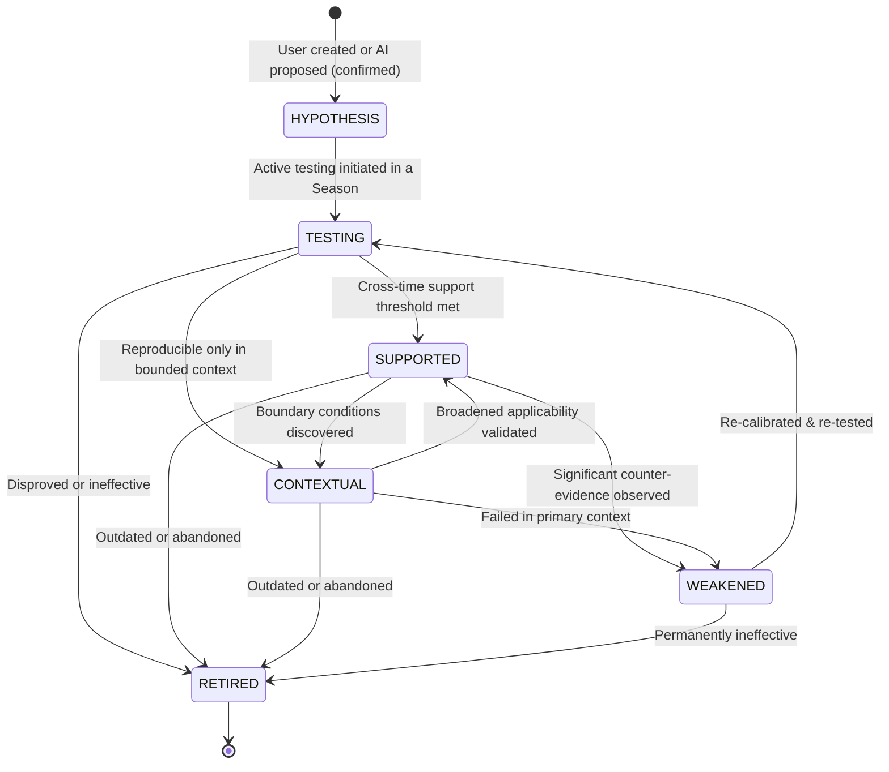
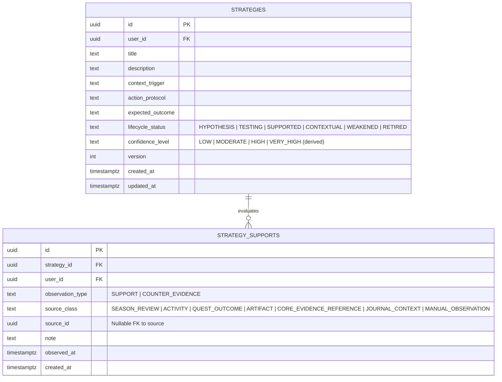

# Phase 8 — Strategy & Personal Playbook Specification

## 1. Executive Summary & Conceptual Distinction

The **Personal Playbook** is a living repository of empirical, self-validated operational heuristics. 

While the Growth Core records **Knowledge** ("What conceptual facts do I understand?") and **Skills** ("What procedural abilities can I execute?"), a **Strategy** answers:
> *"In what specific context, what personal behavioral approach, working environment, or protocol reliably produces effective outcomes for me?"*

### Conceptual Clarifications
- **A Strategy is NOT a Skill**: A Skill represents verified technical or cognitive competency (e.g., "PostgreSQL Query Optimization"). A Strategy is a meta-cognitive workflow heuristic (e.g., "Timeboxing database schema spikes to 90-minute blocks before writing migrations reduces rework").
- **A Strategy is NOT an Artifact**: An Artifact is a tangible, durable work product.
- **A Strategy is NOT a Journal Entry**: A Journal entry captures ephemeral feelings. A Strategy is an empirical hypothesis undergoing rigorous longitudinal testing.
- **A Strategy is NOT an AI Hallucination (O8)**: AI may propose hypotheses, but strategies are grounded exclusively in user-confirmed empirical execution.

---

## 2. Strategy Lifecycle State Machine

A Strategy progresses through an evidence-backed empirical lifecycle. Progression is governed by deterministic threshold rules and user confirmation.



### 2.1 Lifecycle State Definitions

1. **`HYPOTHESIS`**:
   - An articulated operating theory formulated by the user or proposed by the AI GM and accepted by the user.
   - Example: *"Listening to binaural brown noise during coding blocks eliminates task switching."*
2. **`TESTING`**:
   - Strategy is actively tagged and evaluated during ongoing Quests, Activities, and Seasons.
   - Observations of success and failure are logged as support/counter-evidence records.
3. **`SUPPORTED`**:
   - High-confidence, empirically validated personal operating principle.
   - Requires meeting strict multi-observation and cross-time criteria (Section 3).
4. **`CONTEXTUAL`**:
   - Empirically validated, but strictly confined to specific situational boundaries (e.g., *"Effective only for creative writing tasks, counter-productive for algorithmic problem solving"*).
5. **`WEAKENED`**:
   - A previously supported strategy that has recently encountered significant counter-evidence, failure logs, or diminished effectiveness. Prompts user review.
6. **`RETIRED`**:
   - A strategy formally retired because it is no longer effective, obsolete, or superseded by a superior method. Preserved historically; never erased.

---

## 3. Strict Multi-Observation Support Requirements (O6)

A foundational rule of the Growth RPG is: **"One observation is an anecdote; two is a pattern; cross-time replication is empirical evidence."**

### 3.1 Minimum Invariants for Promotion to `SUPPORTED`
To transition from `HYPOTHESIS` or `TESTING` to `SUPPORTED`, the deterministic engine strictly requires all of the following:

1. **Explicit User Acceptance**: The user must explicitly confirm the strategy formulation and intent.
2. **Temporal Separation (Cross-Time)**: At least **two temporally distinct** positive support observations logged across different days or weeks (cannot be earned in a single day).
3. **Completed Season Context**: At least **one completed Season** (`status = 'COMPLETED'`) in which the strategy was actively deployed.
4. **Growth Core Event Linkage**: At least **two underlying Growth Core achievements** (verified Activities, completed Quests, or durable Artifacts) directly linked as supporting evidence.
5. **Deterministic Counter-Evidence Evaluation**: The ratio of supporting observations to counter-evidence observations must satisfy the deterministic confidence threshold (no unresolved blocking failures).
6. **Prohibition of AI Auto-Promotion (O8)**: The AI GM can never autonomously mark a strategy as `SUPPORTED`. The promotion must be computed deterministically and confirmed by the user.

---

## 4. Deterministic Derived Confidence Rubric (O17)

Strategy confidence is **never a user-editable arbitrary percentage**. It is a **deterministic, derived assessment** computed by the system based on logged support provenance records, temporal span, and counter-evidence ratios.

### 4.1 Ordinal Confidence Levels

```text
LOW  ──►  MODERATE  ──►  HIGH  ──►  VERY_HIGH
```

| Confidence Level | Minimum Supporting Observations | Minimum Completed Seasons | Growth Core Evidence Links | Net Success Ratio ($\frac{\text{Supports}}{\text{Supports} + \text{Counters}}$) |
| :---: | :---: | :---: | :---: | :---: |
| **`LOW`** | 1 observation | 0 seasons | Optional | $< 60\%$ or single observation |
| **`MODERATE`** | $\ge 2$ distinct dates | 0 seasons | $\ge 1$ Core Activity/Quest | $\ge 65\%$ |
| **`HIGH`** | $\ge 4$ distinct dates | $\ge 1$ Completed Season | $\ge 2$ Core Activities/Quests | $\ge 75\%$ |
| **`VERY_HIGH`** | $\ge 6$ distinct dates | $\ge 2$ Completed Seasons | $\ge 4$ Core Events + Artifacts | $\ge 85\%$ |

### 4.2 Handling of Counter-Evidence
- Every time a user logs a `FAILURE_POSTMORTEM` or notes in a `Review` that a strategy failed in a given scenario, a counter-support record is inserted.
- When counter-evidence drives the net success ratio below $60\%$, the deterministic engine automatically downgrades the status from `SUPPORTED` to `WEAKENED`.

---

## 5. Support Provenance & Strength Classes

The `strategy_supports` table records every piece of supporting or contradictory empirical evidence. Crucially, referencing Growth Core events does not reclassify them as new Evidence truth; it establishes auditable provenance.



### 5.1 Source Class Weight Hierarchy
Observations carry differing evidential weight depending on their objective verifiability:

1. **`CORE_EVIDENCE_REFERENCE` / `ARTIFACT` (Weight: High / 1.0)**: Strategy linked to a verified durable Artifact or Core Evidence submission.
2. **`QUEST_OUTCOME` (Weight: High / 1.0)**: Strategy linked to the successful completion of a Major/Epic Quest.
3. **`SEASON_REVIEW` (Weight: Moderate / 0.8)**: Strategy validated during a confirmed Season Final Review.
4. **`ACTIVITY` (Weight: Moderate / 0.6)**: Strategy tagged during routine daily activity execution.
5. **`JOURNAL_CONTEXT` / `MANUAL_OBSERVATION` (Weight: Low / 0.3)**: Subjective reflection noting that the strategy helped or hindered.

---

## 6. Versioning, Evolution, and Archival

- **Revisions Create Versions**: If a user fundamentally alters a strategy's protocol or context boundary, a new version is created (`strategy_versions` or incrementing `version`). Historical support observations remain anchored to the version under which they were gathered.
- **Retirement Over Deletion (O9)**: Ineffective strategies are marked `RETIRED`. They are never deleted, ensuring that the user's growth history retains lessons learned from failed experiments.

---

## 7. AI Game Master Contract for Strategies

### 7.1 Hypothesis Generation (`STRATEGY_HYPOTHESIS`)
- When reviewing a completed Season or synthesizing multiple Journal failure postmortems, the AI GM may identify recurring patterns.
- It formats a strategy candidate specifying:
  - *Context Trigger*: "When tackling unfamiliar architecture tasks..."
  - *Action Protocol*: "Spend the first 30 minutes writing user-journey narratives before writing interface code."
  - *Expected Outcome*: "Eliminates scope creep and component rework."
- Delivered via `OuterLoopProposal`. The user must review, optionally edit, and accept it before it enters `HYPOTHESIS` status.

### 7.2 Counter-Evidence Alerting (`STRATEGY_COUNTEREVIDENCE_ALERT`)
- If the AI GM notes in a Review that an active strategy was cited during a failed quest, it raises an alert recommending testing in a narrower context or downgrading to `CONTEXTUAL`.

---

## 8. Verification & Deterministic Test Scenarios

- **O008_AI_CANNOT_COMMIT_STRATEGY**: AI-generated strategy payloads sent directly to domain tables are rejected; only proposals in `outer_loop_proposals` are permitted.
- **O009_STRATEGY_REQUIRES_CROSS_TIME_SUPPORT**: Invoking the promotion RPC `promote_strategy_to_supported` with fewer than two distinct observation dates or zero completed seasons raises HTTP 422 Unprocessable Entity.
- **O017_STRATEGY_CONFIDENCE_IS_DETERMINISTIC_DERIVED**: Manually passing a payload attempting to write `confidence_level = 'VERY_HIGH'` to the database is rejected or overwritten by the deterministic derivation trigger/RPC.
