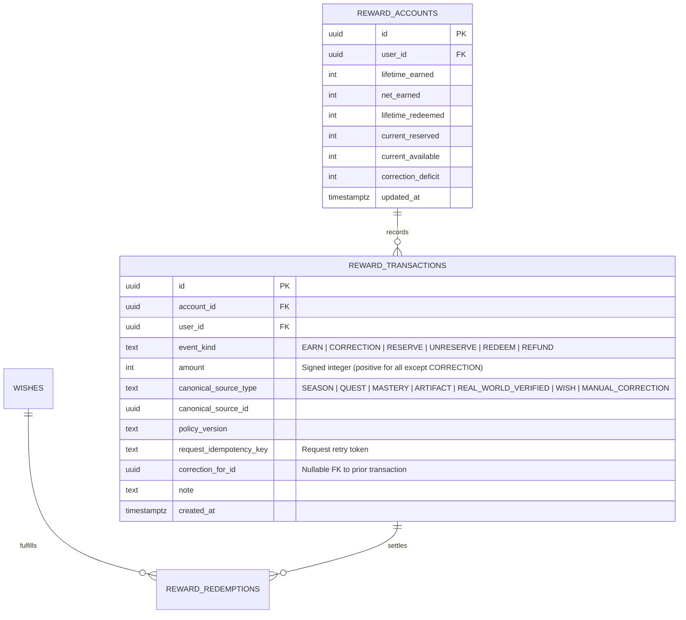
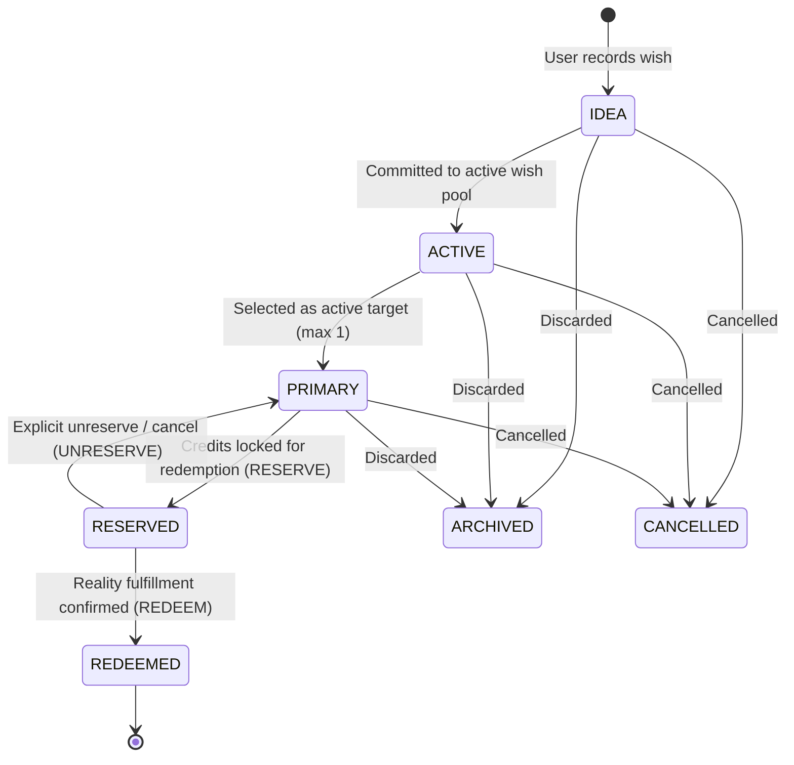

# Phase 8 — Reward Economy & Wishes Specification

## 1. Executive Summary & Foundational Invariants

The **Reward Economy** provides a healthy, tangible bridge between digital growth progression and meaningful real-world celebration. 

In traditional gamification, reward loops frequently devolve into predatory Skinner boxes (loot boxes, gacha drops, artificial streak anxiety, hyper-inflationary micro-task faucets). The AI Personal Growth RPG fundamentally rejects these practices.

### The Non-Negotiable Invariants:
1. **XP is Permanently Non-Spendable (O2)**:
   $$\text{XP} \neq \text{Currency} \neq \text{Reward Credit} \neq \text{Spendable Balance}$$
   XP measures validated capability; it can never be spent, debited, or transferred.
2. **Physical Authority Isolation (O3)**:
   The reward economy operates in dedicated tables (`reward_accounts`, `reward_transactions`, `wishes`, `reward_redemptions`). It shares zero tables, foreign key triggers, or settlement procedures with `xp_transactions`.
3. **Subordination to Real Growth (O4)**:
   No random drops, no gacha, no forced streaks, no loss-aversion traps, no public credit rankings, no trading, and no cash-out capabilities.
4. **Anti-Farming & Sparse High-Value Issuance (O10)**:
   Reward credits cannot be mined through micro-tasks, habit clicks, raw pomodoro time, or journal volume. Credits are minted strictly from sparse, high-value, auditable milestone achievements with server-authoritative amount derivation.

---

## 2. Deliberately Narrow Reward Earning Sources & Mint Authority

To prevent credit inflation, farming exploits, and wrapper double-minting, Phase 8E v1 restricts reward issuance to four versioned, deterministic source classes evaluated strictly on the server:

| Source Class | Required Trigger Condition | Verification Proof | Canonical Reward Source Identity |
| :--- | :--- | :--- | :--- |
| **1. Confirmed Season Completion** | Season concludes with a user-confirmed `FINAL` Review evaluating success criteria. | `Season.status = 'COMPLETED'` + `SeasonReview.review_type = 'FINAL'` | `canonical_source_type = 'SEASON'`, `canonical_source_id = season.id` |
| **2. Major/Epic/Boss Quest Completion** | Successful completion of an eligible high-order Quest in Core. | `quest.status = 'completed' AND (quest.quest_size IN ('major', 'epic', 'main') OR quest.is_boss = true)` | `canonical_source_type = 'QUEST'`, `canonical_source_id = quest.id` |
| **3. Mastery Threshold Milestone** | Verified promotion of a Skill to advanced Mastery tiers in Core. | Growth Core mastery verification backed by verified Evidence (`masteryLevel IN (6, 8, 10)`) | `canonical_source_type = 'MASTERY'`, `canonical_source_id = skill.id` |
| **4. High-Order Durable Artifact / Verified Real-World Milestone** | Production of a significant verified Artifact OR independently confirmed real-world milestone. | Verified `Artifact` record or independently verified milestone evidence | `canonical_source_type = 'ARTIFACT'` or `'REAL_WORLD_VERIFIED'` |

### 2.1 Anti-Double-Minting: Core Source Anchoring
If a Milestone record is created to recognize a Quest, Skill Mastery, or Artifact, **the canonical reward source identity must anchor directly to the underlying Core source entity (`canonical_source_type = 'QUEST'`, `canonical_source_id = quest.id`)**, NOT the Milestone wrapper ID.
- If a user completes Boss Quest X and receives reward credits, any subsequent Milestone created for Boss Quest X cannot mint additional credits because the composite canonical source key `(user_id, 'QUEST', quest_x_id, policy_version, 'EARN')` already exists.

### 2.2 Separation of Real-World Recognition from Reward Eligibility
- A user self-attesting an offline milestone (`USER_CONFIRMED_REAL_WORLD`) creates an honorable recognition record.
- However, **self-attestation does not equal automatic reward eligibility**. Only real-world milestones that satisfy explicit deterministic policy requirements backed by independent external proof (e.g. accredited certification, public race timing link, published paper DOI) are eligible for credit minting. Unverified self-claims mint exactly 0 credits.

### 2.3 Explicitly Excluded Faucets:
- Micro-activity completions (e.g., "Read 10 pages", "Drank water", `quest_size = 'micro'`).
- Daily app logins, check-ins, or streak continuity.
- Accumulated time in Focus sessions or timer apps.
- Number of journal entries or words written.
- Unverified self-claims without supporting artifacts or review.

---

## 3. Single-Account Append-Only Event Ledger & Deterministic Balance Fold

Reward balances are maintained through a **single-account append-only event ledger**: **`reward_transactions`**. Historical rows are strictly immutable.



### 3.1 The Canonical Ledger Fold Specification: `foldRewardLedger`

All authoritative balance states can be deterministically recomputed from the ledger history via a pure fold over `reward_transactions`:

```typescript
export interface RewardLedgerState {
  lifetime_earned: number;    // Cumulative positive gross earnings
  net_earned: number;         // Cumulative net earnings (factoring all signed corrections)
  lifetime_redeemed: number;  // Net cumulative redemptions (gross redemptions minus refunds)
  current_reserved: number;   // Currently locked credits for active PRIMARY wish
  correction_deficit: number; // Accounting deficit when negative correction exceeds available balance
  current_available: number;  // Spendable balance for new wish reservations
}

export function foldRewardLedger(transactions: RewardTransaction[]): RewardLedgerState {
  let lifetime_earned = 0;
  let net_earned = 0;
  let lifetime_redeemed = 0;
  let current_reserved = 0;

  for (const tx of transactions) {
    switch (tx.event_kind) {
      case "EARN":
        if (tx.amount <= 0) throw new Error("EARN amount must be strictly positive");
        lifetime_earned += tx.amount;
        net_earned += tx.amount;
        break;

      case "CORRECTION":
        // Signed integer. Can be positive or negative.
        if (tx.amount > 0) {
          lifetime_earned += tx.amount;
        }
        net_earned += tx.amount;
        break;

      case "RESERVE":
        if (tx.amount <= 0) throw new Error("RESERVE amount must be strictly positive");
        current_reserved += tx.amount;
        break;

      case "UNRESERVE":
        if (tx.amount <= 0) throw new Error("UNRESERVE amount must be strictly positive");
        current_reserved -= tx.amount;
        break;

      case "REDEEM":
        if (tx.amount <= 0) throw new Error("REDEEM amount must be strictly positive");
        current_reserved -= tx.amount;
        lifetime_redeemed += tx.amount;
        break;

      case "REFUND":
        if (tx.amount <= 0) throw new Error("REFUND amount must be strictly positive");
        lifetime_redeemed -= tx.amount;
        break;

      default:
        throw new Error(`Unknown event_kind: ${tx.event_kind}`);
    }
  }

  // Canonical balance invariants:
  const totalCommitted = lifetime_redeemed + current_reserved;
  const correction_deficit = Math.max(0, totalCommitted - net_earned);
  const current_available = Math.max(0, net_earned - totalCommitted);

  return {
    lifetime_earned,
    net_earned,
    lifetime_redeemed: Math.max(0, lifetime_redeemed),
    current_reserved: Math.max(0, current_reserved),
    correction_deficit,
    current_available,
  };
}
```

### 3.2 Canonical Transaction Trace Examples

#### Trace A: Negative Correction
1. `EARN +100` -> `net_earned = 100`, `current_available = 100`, `correction_deficit = 0`.
2. `CORRECTION -20` -> `net_earned = 80`, `current_available = 80`, `lifetime_earned = 100`, `correction_deficit = 0`.
   *(Correctly avoids the bug where available was still 100).*

#### Trace B: Full Redemption and Subsequent Refund
1. `EARN +100` -> `available = 100`.
2. `RESERVE 100` -> `reserved = 100`, `available = 0`.
3. `REDEEM 100` -> `reserved = 0`, `lifetime_redeemed = 100`, `available = 0`.
4. `REFUND 100` -> `lifetime_redeemed = 0`, `available = 100`, `reserved = 0`, `deficit = 0`.
   *(Credits are fully and cleanly restored to available balance).*

#### Trace C: Correction Exceeding Available Balance (Deficit Handling)
1. `EARN +100`, `RESERVE 100`, `REDEEM 100` -> `available = 0`, `lifetime_redeemed = 100`.
2. Auditable `CORRECTION -50` appended -> `net_earned = 50`.
3. `totalCommitted = 100`. Since `totalCommitted > net_earned`:
   - `correction_deficit = 100 - 50 = 50`.
   - `current_available = max(0, 50 - 100) = 0`.
4. Subsequent `EARN +60` appended:
   - `net_earned = 110`.
   - `totalCommitted = 100`.
   - `correction_deficit = max(0, 100 - 110) = 0`.
   - `current_available = max(0, 110 - 100) = 10`.
   *(Deficit automatically absorbs incoming credits before spendable balance increases).*

---

## 4. Server-Authoritative Minting & Canonical Source De-Duplication

### 4.1 Server-Authoritative Amount Derivation
- Procedure `rpc_grant_reward_credit` **does NOT trust client-supplied credit amounts**.
- The caller passes `p_source_type`, `p_source_id`, and `p_policy_version`.
- The PostgreSQL RPC inspects the verified source record in the database, retrieves its parameters, and calculates the exact credit grant using the deterministic server policy table:
  $$\text{grant\_amount} = \text{CalculatePolicyGrant}(\text{p\_source\_type}, \text{source\_record}, \text{p\_policy\_version})$$

### 4.2 Fail-Closed Database Constraint on Canonical Source Identity
To prevent caller retries or forged request keys from double-minting credits, the database enforces:
```sql
CREATE UNIQUE INDEX uq_reward_tx_canonical_source ON reward_transactions (
    user_id,
    canonical_source_type,
    canonical_source_id,
    policy_version,
    event_kind
) WHERE event_kind = 'EARN';
```
- Replaying the same request with a different `p_request_idempotency_key` fails closed against the canonical source unique index.
- Legitimate retries with identical keys return the committed transaction record idempotently.

---

## 5. Wish Lifecycle & Real-World Celebration Mechanics

A **Wish** is an intentional real-world treat, experience, or purchase defined by the user (e.g., *"Weekend hiking trip in the mountains"*, *"Noise-cancelling headphones"*, *"Fine dining celebration with partner"*).



### 5.1 Wish Lifecycle Rules
1. **`IDEA`**: Raw, unpriced wish brainstorm.
2. **`ACTIVE`**: Fully priced wish in the user's backlog with credit cost set by deterministic policy or user calibration.
3. **`PRIMARY` (At most ONE per user)**:
   - The user selects a single Wish as their active "North Star" celebration target.
   - Enforced by database partial unique index: `UNIQUE (user_id) WHERE status = 'PRIMARY'`.
4. **`RESERVED`**:
   - Once sufficient credits are accumulated, the user explicitly reserves the required credits.
   - Triggers atomic `RESERVE` transaction in `reward_transactions`.
5. **`REDEEMED`**:
   - The user celebrates in the physical world and confirms redemption.
   - Triggers atomic `REDEEM` transaction and creates a permanent `reward_redemptions` receipt.
6. **`ARCHIVED` / `CANCELLED`**:
   - User removed or cancelled the wish from their desires.

### 5.2 Cooldowns and Anti-Impulse Guards
- `COOLDOWN` is **not** a lifecycle state; it is stored as metadata: `cooldown_until`.
- When a major wish is redeemed, a cooldown window (e.g., 7 days) may be applied before another primary wish can be reserved, discouraging hedonistic treadmill effects.
- **Informational Cost Only**: Field `real_world_cost` (e.g., USD / CNY value) is strictly informational for personal budgeting. The system does not integrate with banking or payment APIs.

---

## 6. Deferred Capabilities for Initial Phase 8E

To maintain strict architectural boundaries, the following concepts are **deferred from Phase 8E v1**:
- **Digital Vouchers & Third-Party Gift Cards**: Requires external API trust, vendor agreements, and financial KYC.
- **Automated Cash Budgeting**: Connecting bank accounts or expense trackers.
- **Credit Gifting or P2P Transfers**: Strictly forbidden to avoid secondary markets.

---

## 7. AI Game Master Contract for Wishes & Rewards

- **Cost Suggestion (`WISH_COST_SUGGESTION`)**: When a user creates a wish, the AI GM may suggest a calibrated credit cost based on the rarity and effort scale of the user's typical quests. Emitted via `OuterLoopProposal`.
- **Celebration Prompting**: Upon completing a Season or Boss Quest, the AI GM prompts the user: *"You have accumulated enough credits to celebrate your Primary Wish: [Noise-cancelling headphones]. Would you like to reserve this reward?"*
- **No Direct Minting Authority (O8)**: The AI GM can never directly mint, grant, or alter reward balances.

---

## 8. Verification & Deterministic Test Scenarios

- **O001_XP_NEVER_SPENDABLE**: Executing any reward reservation or redemption leaves `xp_transactions` and total user XP completely identical before and after the operation.
- **O002_REWARD_LEDGER_ISOLATED**: Database inspection verifies zero foreign keys or shared tables between `reward_transactions` and `xp_transactions`.
- **O003_MICRO_TASK_FARMING_BLOCKED**: Attempting to invoke `grant_reward_credit` with a `source_type` of `MICRO_ACTIVITY` or `DAILY_LOGIN` fails closed with HTTP 400.
- **O004_DUPLICATE_REWARD_BLOCKED**: Submitting the same credit grant payload twice with identical idempotency key returns the original transaction record and does not double the balance.
- **O005_REWARD_REVERSAL_IS_CORRECTION**: Triggering an invalidation of a source milestone creates an append-only `CORRECTION` transaction; zero rows are deleted from `reward_transactions`.
- **O019_WISH_REDEEM_IS_IDEMPOTENT_ATOMIC**: Concurrently submitting double-redemption requests for the same wish results in exactly one redemption and one ledger entry; the second fails gracefully via database row locking.
- **O020_REWARD_CORRECTION_PRESERVES_LEDGER_HISTORY**: Net balance corrections calculate properly even if resulting available balance drops below zero, correctly recording `correction_deficit`.
