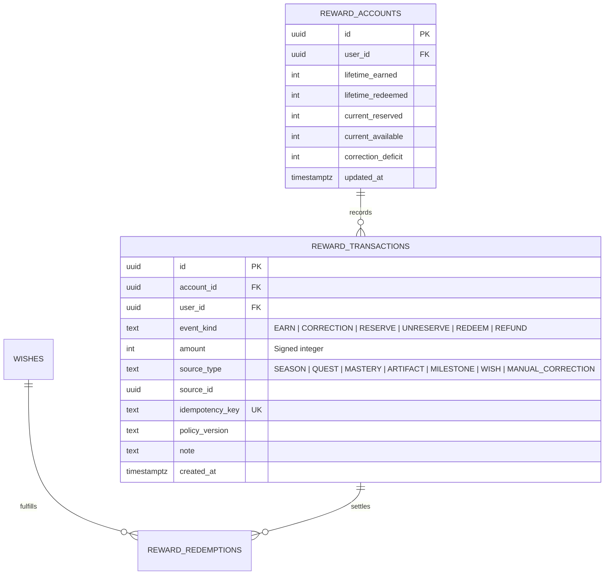
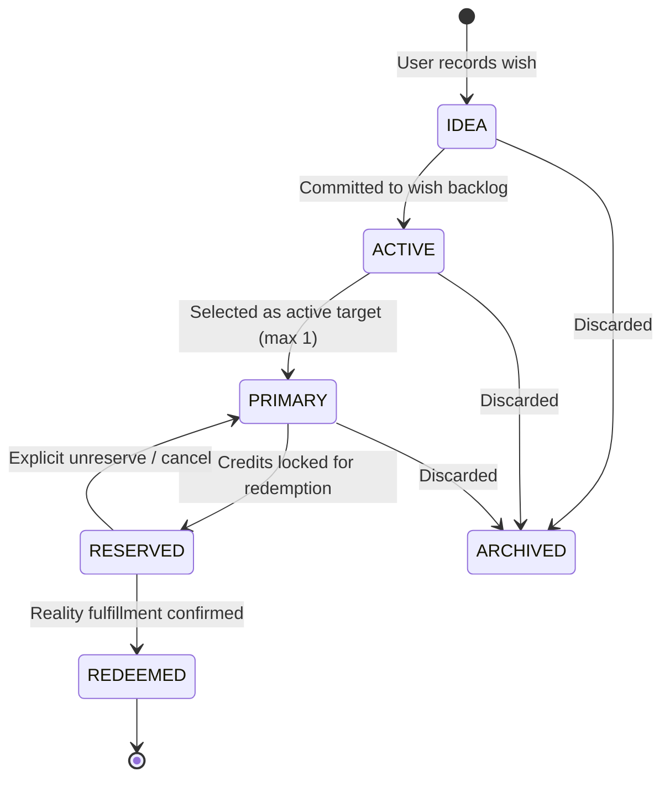

# Phase 8 — Reward Economy & Wishes Specification

## 1. Executive Summary & Foundational Invariants

The **Reward Economy** provides a healthy, tangible bridge between digital growth progression and meaningful real-world celebration. 

In traditional gamification, reward loops frequently devolve into predatory Skinner boxes (loot boxes, gacha drops, artificial streak anxiety, hyper-inflationary micro-task faucets). The AI Personal Growth RPG fundamentally rejects these practices.

### The Non-Negotiable Invariants:
1. **XP is Permanently Non-Spendable (O2)**:
   $$\text{XP} \neq \text{Currency} \neq \text{Reward Credit} \neq \text{Spendable Balance}$$
   XP measures validated capability; it can never be spent, debited, or transferred.
2. **Physical Authority Isolation (O3)**:
   The reward economy operates in dedicated tables (`reward_accounts`, `reward_transactions`, `wishes`, `reward_redemptions`). It shares zero tables, foreign key triggers, or settlement procedures with `xp_transactions`.
3. **Subordination to Real Growth (O4)**:
   No random drops, no gacha, no forced streaks, no loss-aversion traps, no public credit rankings, no trading, and no cash-out capabilities.
4. **Anti-Farming & Sparse High-Value Issuance (O10)**:
   Reward credits cannot be mined through micro-tasks, habit clicks, raw pomodoro time, or journal volume. Credits are minted strictly from sparse, high-value, auditable milestone achievements.

---

## 2. Deliberately Narrow Reward Earning Sources (O10)

To prevent credit inflation and gamification abuse, Phase 8E v1 restricts reward issuance to four versioned, deterministic source classes:

| Source Class | Required Trigger Condition | Verification Proof |
| :--- | :--- | :--- |
| **1. Confirmed Season Completion** | Season concludes with a user-confirmed `FINAL` Review evaluating success criteria. | `Season.status = 'COMPLETED'` + `SeasonReview.review_type = 'FINAL'` |
| **2. Major/Epic/Boss Quest Completion** | Successful completion of an eligible high-tier Quest. | `Quest.tier IN ('MAJOR', 'EPIC', 'BOSS')` + `Quest.status = 'COMPLETED'` |
| **3. Mastery Milestone Threshold** | Verified promotion of a Skill to Mastery Level 3, 4, or 5. | Core Growth Engine `user_skills.mastery_level` backed by verified `evidence` |
| **4. High-Order Durable Artifact / Real-World Breakthrough** | Production of a significant real-world work product or confirmed milestone. | Verified `Artifact` record or confirmed `Milestone.recognition_type = 'CORE_VERIFIED'` |

### Explicitly Excluded Faucets:
- Micro-activity completions (e.g., "Read 10 pages", "Drank water").
- Daily app logins, check-ins, or streak continuity.
- Accumulated time in Focus sessions or timer apps.
- Number of journal entries or words written.
- Unverified self-claims without supporting artifacts or review.

---

## 3. Append-Only Ledger Event Model & Balance Mathematics

Reward balances are maintained through a double-entry, append-only accounting ledger: **`reward_transactions`**. Historical rows are immutable.

### 3.1 Canonical Event Classes
- **`EARN`**: Minting of new credits resulting from a verified growth breakthrough ($+\text{amount}$).
- **`RESERVE`**: Holding credits against a specific `PRIMARY` Wish before physical redemption ($-\text{amount}$ from available, $+\text{amount}$ to reserved).
- **`UNRESERVE`**: Releasing reserved credits back to available if a wish is cancelled or demoted.
- **`REDEEM`**: Permanent expenditure of credits upon physical fulfillment of a real-world wish ($-\text{amount}$ from reserved, $+\text{amount}$ to lifetime redeemed).
- **`REFUND`**: Compensating entry restoring credits if a real-world wish could not be fulfilled.
- **`CORRECTION`**: Signed adjustment transaction linked to a prior erroneous transaction (`correction_for_id`).

### 3.2 Balance Formulas & Integrity
The canonical balances are calculated strictly from the ledger:
$$\text{LifetimeEarned} = \sum_{\text{event}=\text{EARN}} \text{amount} + \sum_{\text{event}=\text{CORRECTION} \land \text{amount} > 0} \text{amount}$$
$$\text{LifetimeRedeemed} = \sum_{\text{event}=\text{REDEEM}} \text{amount}$$
$$\text{CurrentReserved} = \sum_{\text{event}=\text{RESERVE}} \text{amount} - \sum_{\text{event} \in (\text{UNRESERVE}, \text{REDEEM})} \text{amount}$$
$$\text{CurrentAvailable} = \text{LifetimeEarned} - \text{LifetimeRedeemed} - \text{CurrentReserved} - \text{CorrectionDeficit}$$

---

## 4. Idempotency, Replays, and Deficit Handling (O4, O5, O20)

### 4.1 Strict Idempotency Key Invariant (O4)
Every `EARN` transaction requires a deterministic composite idempotency key:
$$\text{idempotency\_key} = \text{SHA256}(\text{user\_id} \mathbin{\Vert} \text{source\_type} \mathbin{\Vert} \text{source\_id} \mathbin{\Vert} \text{policy\_version} \mathbin{\Vert} \text{event\_kind})$$
- Database enforces `UNIQUE(idempotency_key)`.
- Any duplicate API request or webhook retry yields the existing transaction without double-crediting.

### 4.2 Handling Negative Reversals & Correction Deficits (O5, O20)
If a historical Season or Quest completion is invalidated upon retrospective audit:
1. A compensating `CORRECTION` transaction with a negative amount is appended to the ledger.
2. If the user has already redeemed wishes such that $\text{CurrentAvailable} < 0$:
   - The system **does not** delete historical redemption records.
   - The system records an explicit **`correction_deficit`**.
   - `CurrentAvailable` is clamped to $0$ for UI spending purposes.
   - Future legitimate earnings automatically pay down the `correction_deficit` before available credits can be accumulated.

---

## 5. Wish Lifecycle & Real-World Celebration Mechanics

A **Wish** is an intentional real-world treat, experience, or purchase defined by the user (e.g., *"Weekend hiking trip in the mountains"*, *"Noise-cancelling headphones"*, *"Fine dining celebration with partner"*).

### 5.1 Wish Lifecycle Rules
1. **`IDEA`**: Raw, unpriced wish brainstorm.
2. **`ACTIVE`**: Fully priced wish in the user's backlog with credit cost set by deterministic policy or user calibration.
3. **`PRIMARY` (At most ONE per user)**:
   - The user selects a single Wish as their active "North Star" celebration target.
   - Enforced by partial unique index: `UNIQUE (user_id) WHERE status = 'PRIMARY'`.
4. **`RESERVED`**:
   - Once sufficient credits are accumulated, the user explicitly reserves the required credits.
   - Triggers atomic `RESERVE` transaction in `reward_transactions`.
5. **`REDEEMED`**:
   - The user celebrates in the physical world and confirms redemption.
   - Triggers atomic `REDEEM` transaction and creates a permanent `reward_redemptions` receipt.
6. **`ARCHIVED`**:
   - User removed the wish from their desires.

### 5.2 Cooldowns and Anti-Impulse Guards
- `COOLDOWN` is **not** a lifecycle state; it is stored as metadata: `cooldown_until`.
- When a major wish is redeemed, a cooldown window (e.g., 7 days) may be applied before another primary wish can be reserved, discouraging hedonistic treadmill effects.
- **Informational Cost Only**: Field `real_world_cost` (e.g., USD / CNY value) is strictly informational for the user's personal budgeting. The system does not integrate with banking or payments.

---

## 6. Deferred Capabilities for Initial Phase 8E

To maintain strict architectural boundaries, the following concepts are **deferred from Phase 8E v1**:
- **Digital Vouchers & Third-Party Gift Cards**: Requires external API trust, vendor agreements, and financial KYC.
- **Automated Cash Budgeting**: Connecting bank accounts or expense trackers.
- **Credit Gifting or P2P Transfers**: Strictly forbidden to avoid secondary markets.

---

## 7. AI Game Master Contract for Wishes & Rewards

- **Cost Suggestion (`WISH_COST_SUGGESTION`)**: When a user creates a wish, the AI GM may suggest a calibrated credit cost based on the rarity and effort scale of the user's typical quests. Emitted via `OuterLoopProposal`.
- **Celebration Prompting**: Upon completing a Season or Boss Quest, the AI GM prompts the user: *"You have accumulated enough credits to celebrate your Primary Wish: [Noise-cancelling headphones]. Would you like to reserve this reward?"*
- **No Direct Minting Authority (O8)**: The AI GM can never directly mint, grant, or alter reward balances.

---

## 8. Verification & Deterministic Test Scenarios

- **O001_XP_NEVER_SPENDABLE**: Executing any reward reservation or redemption leaves `xp_transactions` and total user XP completely identical before and after the operation.
- **O002_REWARD_LEDGER_ISOLATED**: Database inspection verifies zero foreign keys or shared tables between `reward_transactions` and `xp_transactions`.
- **O003_MICRO_TASK_FARMING_BLOCKED**: Attempting to invoke `grant_reward_credit` with a `source_type` of `MICRO_ACTIVITY` or `DAILY_LOGIN` fails closed with HTTP 400.
- **O004_DUPLICATE_REWARD_BLOCKED**: Submitting the same credit grant payload twice with identical idempotency key returns the original transaction record and does not double the balance.
- **O005_REWARD_REVERSAL_IS_CORRECTION**: Triggering an invalidation of a source milestone creates an append-only `CORRECTION` transaction; zero rows are deleted from `reward_transactions`.
- **O019_WISH_REDEEM_IS_IDEMPOTENT_ATOMIC**: Concurrently submitting double-redemption requests for the same wish results in exactly one redemption and one ledger entry; the second fails gracefully via database row locking.
- **O020_REWARD_CORRECTION_PRESERVES_LEDGER_HISTORY**: Net balance corrections calculate properly even if resulting available balance drops below zero, correctly recording `correction_deficit`.
