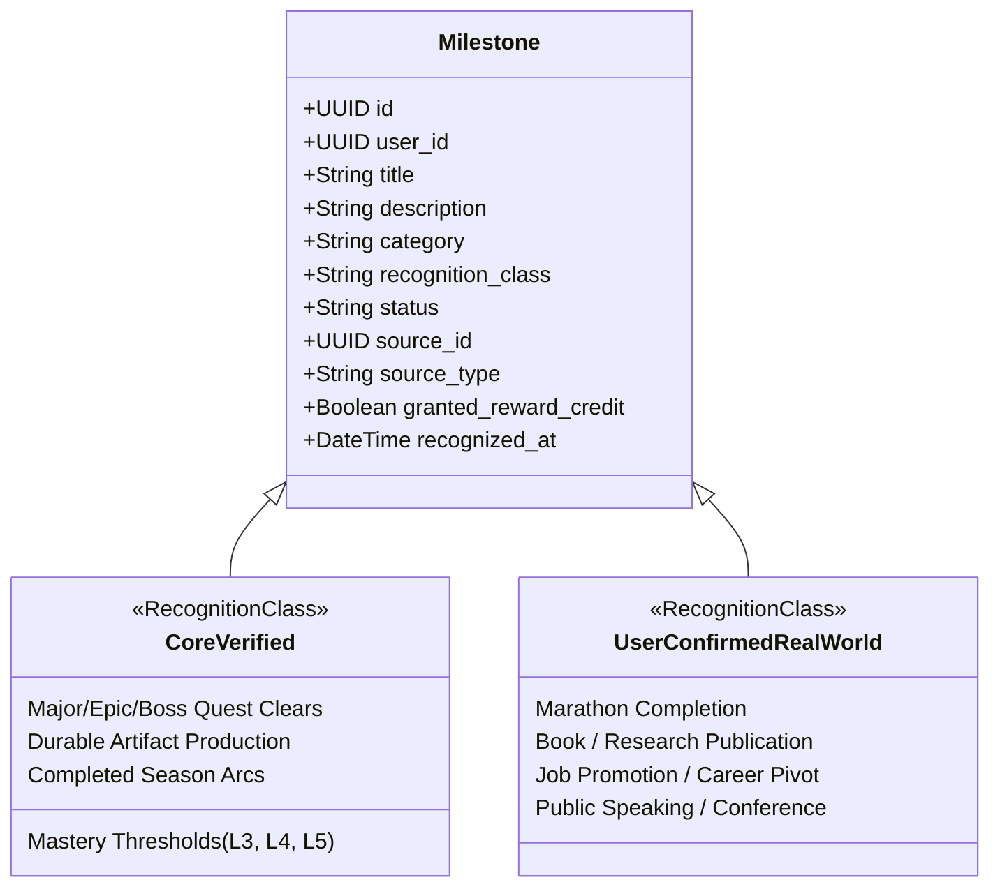

# Phase 8 — Milestone & Achievement Specification

## 1. Purpose & Conceptual Boundary

A **Milestone** (or Achievement) in the AI Personal Growth RPG is a **formal recognition layer** celebrating meaningful leaps in real-world capability, creative output, and strategic discipline.

### Critical System Invariants:
1. **Recognition Layer, Not Growth Truth (O1)**:
   A Milestone does not generate XP, does not create Skills, and does not alter historical Activity truth. It recognizes and commemorates truth that has already been verified in the Growth Core.
2. **Real-World Growth Over App Vanity (O12)**:
   Traditional games reward "vanity engagement" (e.g., "Logged in 7 days in a row", "Clicked 100 buttons", "Shared on social media"). The RPG strictly prohibits vanity achievements. Milestones recognize only authentic competence thresholds and creative artifacts.
3. **Immutability and Auditability (O9)**:
   Milestones are permanent records of personal history. If an underlying prerequisite is subsequently invalidated, the Milestone is marked `REVOKED` or `CORRECTED` with an audit note; it is never silently deleted.

---

## 2. Milestone Classification Taxonomy

Canonical Milestone records are categorized into two primary recognition classes:

### 2.1 `CORE_VERIFIED`
Milestones whose prerequisites are completely and deterministically validated by existing Growth Core tables:
- **Mastery Threshold**: Achieving Mastery Level 3 ("Proficient"), Level 4 ("Advanced"), or Level 5 ("Master") in a recognized Skill backed by verified Evidence.
- **Epic Quest Victory**: Successful completion of a high-complexity Quest (`tier = 'EPIC'` or `'BOSS'`).
- **Durable Artifact Tier**: Authoring a major verified Artifact (e.g., open-source library, published essay, comprehensive architecture blueprint).
- **Season Arc Completion**: Successfully completing an active Season with a user-confirmed Final Review.

### 2.2 `USER_CONFIRMED_REAL_WORLD`
Milestones recognizing external, offline accomplishments that exceed the typical boundary of daily digital logging:
- Running a marathon or achieving a significant fitness standard.
- Securing a career promotion or launching an independent business.
- Delivering a keynote speech or passing a professional accreditation exam.
- **Validation Requirement**: User self-attestation with optional descriptive context or external links, confirmed via explicit modal review.

---

## 3. Explicitly Forbidden Vanity Metrics

The system will reject any milestone definition based on the following anti-patterns:
- Daily or weekly login streaks (e.g., "7-Day Streak Warrior").
- Raw app time or screen time accumulation.
- Number of clicks, taps, or UI navigation events.
- Micro-task quantity counts (e.g., "Completed 50 quick tasks").
- Social vanity metrics (e.g., "Invited 3 friends").

---

## 4. De-duplication and Reward Economy Linkage

Milestones serve as one of the four sparse, high-value source classes authorized to mint Reward Credits in Phase 8E.

### 4.1 Idempotent Reward Minting
When a Milestone is confirmed, it may trigger an atomic Reward Credit grant:
$$\text{idempotency\_key} = \text{SHA256}(\text{user\_id} \mathbin{\Vert} \text{'MILESTONE'} \mathbin{\Vert} \text{milestone\_id} \mathbin{\Vert} \text{policy\_version} \mathbin{\Vert} \text{'EARN'})$$
- The milestone record sets `granted_reward_credit = true` and references the resulting transaction.
- If the grant RPC is retried, the unique idempotency key prevents duplicate credit minting.

### 4.2 Revocation and Correction Model (O5, O20)
If a prerequisite Activity or Quest is subsequently deleted or flagged as fraudulent:
1. The Milestone status transitions to `REVOKED`.
2. An audit record is created explaining the revocation reason.
3. If reward credits were previously issued, an offsetting `CORRECTION` transaction is appended to `reward_transactions`.
4. The Milestone record itself is retained in history to ensure full auditability.

---

## 5. AI Game Master Contract for Milestones

- **Milestone Candidacy Detection (`MILESTONE_CANDIDATE`)**:
  - The AI GM monitors completed Season Reviews and durable Artifact submissions.
  - When it detects that a user's recent achievements satisfy an unawarded milestone rubric, it formats an `OuterLoopProposal`.
  - The proposal highlights the evidence: *"Based on your successful deployment of the production database migration in Quest #42 and your Mastery Level 4 verification, you are eligible for the 'Database Architect' Milestone."*
- **No Direct Award Authority (O8)**:
  - The AI GM can never directly award a milestone.
  - The user reviews the candidate proposal and confirms the recognition.

---

## 6. Verification & Deterministic Test Scenarios

- **O012_MILESTONES_PRIORITIZE_REAL_GROWTH**: Automated test asserts that all seeded and candidate milestones evaluate against Mastery, Quests, Artifacts, or Real-World criteria; attempts to create a milestone with `source_type = 'LOGIN_STREAK'` fail schema validation.
- **O021_MILESTONE_AI_PROPOSAL_CONFIRMATION**: AI candidacy proposal remains in `PROPOSED` state until an authenticated user RPC accepts it.
- **MILESTONE_REVOCATION_REWARDS_CORRECTED**: Triggering milestone revocation appends an auditable negative ledger entry without hard-deleting the milestone record.
