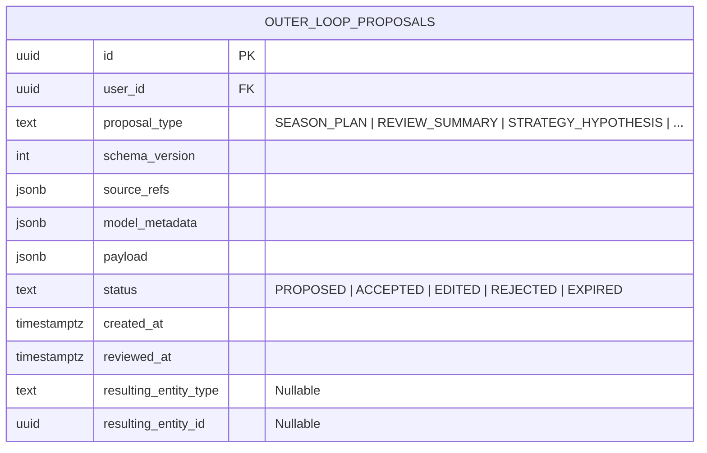

# Phase 8 — AI Game Master Outer Loop Contract

## 1. Executive Summary & Core Invariant (O8)

The AI Game Master (AI GM) operates as an analytical synthesizer, strategic sparring partner, and biographer. It possesses broad observational and reasoning capabilities across the user's historical growth data.

However, to maintain absolute integrity over character progression:
> **AI possesses PROPOSAL authority only. AI NEVER possesses COMMIT authority.**

```text
FORBIDDEN:  LLM Completion ──► Direct INSERT/UPDATE of Domain State
CANONICAL:  LLM Completion ──► OuterLoopProposal ──► UI Preview ──► User Action ──► RPC Validation ──► Commit ──► Audit
```

---

## 2. The Unified Proposal Envelope (`outer_loop_proposals`)

Rather than scattering AI proposal tables across every subsystem, Phase 8 standardizes all AI suggestions into a single canonical table: **`outer_loop_proposals`**.



### 2.1 Envelope Schema Attributes
- **`proposal_type`**: Discriminator identifying the target domain and payload schema.
- **`schema_version`**: Integer version of the JSON schema for backward compatibility.
- **`source_refs`**: Array of upstream entities ingested by the prompt (e.g., `[{"type": "Season", "id": "..."}, {"type": "Activity", "id": "..."}]`).
- **`model_metadata`**: Provenance tracking (e.g., `{"model": "deepseek-v4-flash", "prompt_contract": "review-summary-v2", "temperature": 0.3}`).
- **`payload`**: Strongly typed JSON containing the structured proposal details.
- **`status`**: Lifecycle state of the proposal:
  - `PROPOSED`: Awaiting user review.
  - `ACCEPTED`: User accepted the proposal verbatim.
  - `EDITED`: User modified fields in the preview modal prior to commit.
  - `REJECTED`: User explicitly dismissed the proposal.
  - `EXPIRED`: Proposal lapsed without action (default: 14 days) to prevent stale application.
- **`resulting_entity_type` & `resulting_entity_id`**: Foreign pointer populated upon atomic domain commit.

---

## 3. Canonical Six-Stage Mutation Pipeline

Every state modification originating from AI GM intelligence must execute sequentially through the six-stage pipeline:

```mermaid
flowchart TD
    S1[Stage 1: AI Analysis & Proposal Generation] -->|Creates OuterLoopProposal (PROPOSED)| S2[Stage 2: Client UI Presentation & Preview]
    S2 -->|User Inspects Diff & Context| S3{Stage 3: User Sovereignty Decision}
    S3 -->|Reject| S3R[Mark Proposal REJECTED]
    S3 -->|Accept or Edit| S4[Stage 4: Deterministic Server Validation]
    S4 -->|Schema or Invariant Fails| S4E[Reject with HTTP 422]
    S4 -->|Passes| S5[Stage 5: Atomic RPC Database Commit]
    S5 -->|Insert Domain Record + Link ID| S6[Stage 6: Immutable Audit Event Logged]
```

1. **Stage 1 (Generation)**: The AI GM analyzes read-only context and invokes the proposal API. The proposal is saved in `outer_loop_proposals` with `status = 'PROPOSED'`.
2. **Stage 2 (Preview)**: The UI renders the proposal as an interactive card or modal showing clear diffs and rationale.
3. **Stage 3 (User Sovereignty)**: The user makes an uncoerced decision: Accept, Edit payload fields, or Dismiss.
4. **Stage 4 (Deterministic Validation)**: The target RPC validates that all proposed foreign keys belong to the user and that business invariants (e.g., single active season, valid state ranges) are upheld.
5. **Stage 5 (Atomic Commit)**: The target domain record (e.g., `strategies`, `seasons`) is created inside a database transaction, and `outer_loop_proposals` is updated with `resulting_entity_id`.
6. **Stage 6 (Audit)**: An entry is written to `outer_loop_audit_events`.

---

## 4. Canonical Proposal Types & Payload Schemas

Phase 8 defines nine standard proposal types:

### 4.1 `SEASON_PLAN`
- **Purpose**: Blueprints a new 14–84 day growth chapter.
- **Payload Schema**:
  ```json
  {
    "title": "Season 3: Distributed Systems Mastery",
    "theme": "Deep Infrastructure Architecture",
    "target_start_date": "2026-10-01",
    "duration_days": 28,
    "main_quest_candidate_id": "uuid-or-new-spec",
    "focus_quest_candidate_ids": ["uuid-1", "uuid-2"],
    "baseline_summary": "Solid single-node SQL proficiency; zero production consensus experience.",
    "success_criteria": [
      "Deploy 3-node Raft cluster with passing partition tests",
      "Author architecture blueprint artifact"
    ]
  }
  ```

### 4.2 `SEASON_ADJUSTMENT`
- **Purpose**: Mid-season calibration proposing scope reduction or quest re-prioritization.
- **Payload Schema**:
  ```json
  {
    "season_id": "uuid",
    "adjustment_reason": "High burnout / stress scores observed in journal",
    "recommended_descope_quest_ids": ["uuid-2"],
    "revised_focus": "Consolidate core cluster stability rather than adding multi-region replication"
  }
  ```

### 4.3 `REVIEW_SUMMARY`
- **Purpose**: Draft synthesis for Weekly or Final Season Retrospectives.
- **Payload Schema**:
  ```json
  {
    "review_type": "FINAL",
    "season_id": "uuid",
    "period_start": "2026-10-01T00:00:00Z",
    "period_end": "2026-10-28T23:59:59Z",
    "objective_recap": "14 activities completed, 2 Quests finished, 1 Artifact produced, +450 XP earned.",
    "qualitative_synthesis": "Strong early momentum followed by a mid-season plateau during consensus edge-case debugging.",
    "criteria_evaluation": [
      {"criterion": "Deploy Raft cluster", "status": "MET"},
      {"criterion": "Author blueprint", "status": "EXCEEDED"}
    ],
    "identified_growth_edges": ["Debugging concurrency under sleep deprivation leads to cascading rework."]
  }
  ```

### 4.4 `JOURNAL_INSIGHT`
- **Purpose**: Noticing longitudinal psychological or physiological correlations.
- **Payload Schema**:
  ```json
  {
    "observation_title": "Sleep-State Correlation",
    "correlation_summary": "When recovery <= 2, resistance was rated >= 4 in 80% of entries.",
    "recommendation": "Adopt a 15-minute low-resistance warm-up protocol on low-recovery days."
  }
  ```

### 4.5 `STRATEGY_HYPOTHESIS`
- **Purpose**: Recommending an empirical playbook strategy based on observed execution.
- **Payload Schema**:
  ```json
  {
    "title": "Architecture Narrative First",
    "description": "Write conversational walkthroughs before implementing complex schemas.",
    "context_trigger": "Beginning a new multi-table feature or state machine",
    "action_protocol": "Draft 3 example user stories and 1 edge case in markdown before creating migrations",
    "expected_outcome": "Eliminates database migration rollbacks and schema rework",
    "supporting_activity_ids": ["uuid-activity-1", "uuid-activity-2"]
  }
  ```

### 4.6 `STRATEGY_COUNTEREVIDENCE_ALERT`
- **Purpose**: Alerting the user to recent failures under a supported strategy.
- **Payload Schema**:
  ```json
  {
    "strategy_id": "uuid",
    "counter_evidence_activity_id": "uuid",
    "observation": "Strategy 'Late Night Deep Work' resulted in 3 syntax regressions and low next-day recovery.",
    "recommended_action": "Downgrade confidence to CONTEXTUAL or RETIRED."
  }
  ```

### 4.7 `WISH_COST_SUGGESTION`
- **Purpose**: Suggesting a fair credit price for a newly drafted wish.
- **Payload Schema**:
  ```json
  {
    "wish_id": "uuid",
    "suggested_credits": 250,
    "calibration_rationale": "Calibrated against equivalent of 1 completed Season (150cr) + 1 Major Quest (100cr)."
  }
  ```

### 4.8 `MILESTONE_CANDIDATE`
- **Purpose**: Alerting the user that their accomplishments satisfy a milestone threshold.
- **Payload Schema**:
  ```json
  {
    "milestone_key": "RAFT_CONSENSUS_BUILDER",
    "title": "Distributed Consensus Builder",
    "recognition_class": "CORE_VERIFIED",
    "qualifying_evidence_refs": ["uuid-artifact-1", "uuid-quest-1"],
    "reward_credit_value": 100
  }
  ```

### 4.9 `PROTOCOL_SUGGESTION` (Phase 8G Expansion)
- **Purpose**: Suggesting structured execution protocols for routines or focus rituals.

---

## 5. Security, Sandboxing, and Secret Isolation

1. **Zero Database Service-Role Exposure**: AI providers never receive database service-role keys. They communicate strictly via API routes that authenticate as standard users or ephemeral microservice workers.
2. **Deterministic RPC Gateways**: The database only accepts writes from authenticated user sessions invoking bounded RPC procedures.
3. **Auditability (O9)**: Every proposal transition logs the exact prompt version, model identifier, and timestamp to ensure complete explainability.
