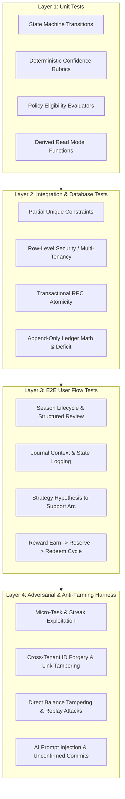

# Phase 8 — Testing, Security, and Harness Architecture Plan

## 1. Executive Summary & Verification Strategy

The Outer Growth Loop introduces macro-cycle state machines, subjective reflections, empirical strategy heuristics, and an isolated reward ledger. While these features broaden user engagement, they must not compromise the deterministic integrity of the underlying Growth Engine.

Before any production code or SQL migration is authored in Phase 8B–8G, this comprehensive test and security architecture specifies the verification gates, adversarial threat models, and the complete deterministic test catalogue (**O001–O022**).

### Current Status of Test Catalogue
- **O001–O022 Specifications**: **SOURCE VERIFIED** as formal architectural test specifications.
- **O001–O022 Phase 8 Runtime**: **NOT VERIFIED** (test specifications defined in Phase 8A to govern future implementation phases 8B–8G).

---

## 2. The Four Verification Layers

---

## 3. The Canonical Deterministic Harness Catalogue (O001–O022)

Every test in this catalogue must be implemented and pass in future phases.

### O001 — `O001_XP_NEVER_SPENDABLE`
- **Target Invariant**: O2 (XP is permanently non-spendable).
- **Test Purpose**: Assert that no reward operation (reservation, redemption, correction) modifies `xp_transactions` or user XP.
- **Execution**: Create a user with 500 XP. Reserve a wish costing 200 reward credits, redeem it, and apply a correction.
- **Assertion**: Query `xp_transactions` and `user_skills`; total XP remains exactly 500 across all operations.

### O002 — `O002_REWARD_LEDGER_ISOLATED`
- **Target Invariant**: O3 (Reward economy is physically separate authority domain).
- **Test Purpose**: Assert that database schema enforces complete physical decoupling.
- **Execution**: Inspect PostgreSQL `information_schema` foreign key graphs and table definitions.
- **Assertion**: Zero foreign key relationships exist between `reward_*` tables and `xp_*` tables.

### O003 — `O003_MICRO_TASK_FARMING_BLOCKED`
- **Target Invariant**: O10 (Repetition cannot create a farmable reward loop).
- **Test Purpose**: Prevent minting reward credits from unauthorized micro-tasks, habit clicks, or logins.
- **Execution**: Call `rpc_grant_reward_credit` with `source_type = 'DAILY_LOGIN'` or `source_type = 'HABIT_CHECKIN'`.
- **Assertion**: RPC immediately rejects the request with HTTP 400 `INVALID_SOURCE_CLASS` and logs an audit event.

### O004 — `O004_DUPLICATE_REWARD_BLOCKED`
- **Target Invariant**: O10 (Strict idempotency and source uniqueness).
- **Test Purpose**: Ensure network replays or altered request tokens cannot duplicate credit minting for the same source event.
- **Execution**: Issue credit grant RPC twice using the same canonical source identity (`user_id`, `canonical_source_type`, `canonical_source_id`, `policy_version`, `'EARN'`) with different request idempotency keys.
- **Assertion**: Second call fails closed with HTTP 409 `REWARD_ALREADY_MINTED` via the database canonical source unique index; available balance increases exactly once.

### O005 — `O005_REWARD_REVERSAL_IS_CORRECTION`
- **Target Invariant**: O9 (Auditability), Rule: `LEDGER_CORRECTION_APPEND_ONLY`.
- **Test Purpose**: Verify that revoking an earning milestone appends a correction rather than deleting ledger history.
- **Execution**: Grant 100 credits for a milestone; trigger milestone revocation.
- **Assertion**: Table `reward_transactions` contains both original `EARN` row and new `CORRECTION` row with amount `-100`. Zero rows deleted.

### O006 — `O006_SEASON_END_DOES_NOT_REWRITE_GROWTH`
- **Target Invariant**: O1, O5 (Season conclusion preserves Growth Core).
- **Test Purpose**: Verify that ending or abandoning a season has zero effect on historical activities or skill levels.
- **Execution**: Complete 5 activities and earn 150 XP during Season 1. Transition Season 1 to `ABANDONED`.
- **Assertion**: All 5 activities and 150 XP remain active, verified, and unmutated in database.

### O007 — `O007_JOURNAL_NOT_EVIDENCE_BY_DEFAULT`
- **Target Invariant**: O7 (Journal is subjective context by default).
- **Test Purpose**: Confirm that creating journal entries cannot satisfy skill evidence requirements.
- **Execution**: Insert journal entry with extensive claims of mastery and high self-confidence.
- **Assertion**: Table `evidence` remains unchanged; `user_skills.mastery_level` does not advance.

### O008 — `O008_AI_CANNOT_COMMIT_STRATEGY`
- **Target Invariant**: O8 (AI remains Proposal authority only).
- **Test Purpose**: Verify that AI GM background generation cannot directly insert into `strategies`.
- **Execution**: Invoke AI generation endpoint; inspect database state prior to user review.
- **Assertion**: Entry exists only in `outer_loop_proposals` with `status = 'PROPOSED'`; zero records in `strategies`.

### O009 — `O009_STRATEGY_REQUIRES_CROSS_TIME_SUPPORT`
- **Target Invariant**: O6 (Strategy requires cross-time support).
- **Test Purpose**: Assert that a strategy cannot transition to `SUPPORTED` without meeting multi-day, multi-season criteria.
- **Execution**: Attempt to invoke `rpc_evaluate_strategy_status` with 2 observations logged on the same calendar day and zero completed seasons.
- **Assertion**: RPC returns HTTP 422 `UNMET_SUPPORT_REQUIREMENTS`; status remains `TESTING`.

### O010 — `O010_PAST_SELF_IS_DERIVED_NON_FARMABLE`
- **Target Invariant**: O12 (Past Self is a derived comparison view).
- **Test Purpose**: Verify that "Past Self" comparisons execute strictly as read-only queries and generate no XP or credits.
- **Execution**: Call Past Self comparison endpoint multiple times.
- **Assertion**: Zero database writes; zero XP or reward mutations.

### O011 — `O011_FOCUS_TIME_NOT_DIRECT_XP_OR_REWARD`
- **Target Invariant**: O11 (Temporary state is not capability; time is not XP).
- **Test Purpose**: Verify that running or completing focus sessions does not directly award XP or reward credits.
- **Execution**: Record a completed 60-minute focus session.
- **Assertion**: Focus session recorded; zero XP transactions and zero reward transactions emitted.

### O012 — `O012_MILESTONES_PRIORITIZE_REAL_GROWTH`
- **Target Invariant**: O10, O12 (Anti-vanity milestone recognition).
- **Test Purpose**: Enforce that milestones recognize only verified Mastery, Boss Quests, Durable Artifacts, or Real-World achievements.
- **Execution**: Validate milestone schema against unauthorized vanity categories (e.g., login streaks).
- **Assertion**: Unauthorized categories fail schema constraint checks.

### O013 — `O013_ONLY_ONE_ACTIVE_SEASON_PER_USER`
- **Target Invariant**: O5 (Season is not Streak), Rule: `SINGLE_ACTIVE_SEASON`.
- **Test Purpose**: Database-level enforcement of single active season constraint.
- **Execution**: Insert Season A as `ACTIVE`. Attempt to insert or update Season B to `ACTIVE` for the same user.
- **Assertion**: Database raises unique constraint violation (`uq_seasons_single_active`).

### O014 — `O014_SEASON_QUEST_IS_N_TO_N`
- **Target Invariant**: O12 (Season-to-Quest decoupling), Rule: `SEASON_QUEST_N_TO_N`.
- **Test Purpose**: Assert that Quests can link across multiple seasons and at most one MAIN quest exists per season.
- **Execution**: Link Quest 1 as `MAIN` to Season A, and Quest 1 as `FOCUS` to Season B. Attempt to link Quest 2 as `MAIN` to Season A.
- **Assertion**: Multiple links succeed; duplicate `MAIN` role on Season A fails unique constraint.

### O015 — `O015_SEASON_DOES_NOT_COMPLETE_QUEST`
- **Target Invariant**: O1, O5 (Decoupled lifecycle), Rule: `SEASON_DECOUPLED_LIFECYCLE`.
- **Test Purpose**: Concluding a Season must not automatically alter status of linked in-progress Quests.
- **Execution**: Link in-progress Quest 1 to Season A. Call `rpc_conclude_season` on Season A.
- **Assertion**: Season A transitions to `COMPLETED`; Quest 1 remains in `in_progress` / `active` state.

### O016 — `O016_REVIEW_DOES_NOT_CREATE_GROWTH_TRUTH`
- **Target Invariant**: O1, O7 (Review does not create Growth Truth), Rule: `REVIEW_AUTHORITY_BOUNDARY`.
- **Test Purpose**: Finalizing a Season Review record creates zero side effects on skills, evidence, or XP.
- **Execution**: Call `rpc_finalize_season_review` with high ratings.
- **Assertion**: Review record saved; `xp_transactions`, `user_skills`, and `evidence` remain completely unchanged.

### O017 — `O017_STRATEGY_CONFIDENCE_IS_DETERMINISTIC_DERIVED`
- **Target Invariant**: O6 (Cross-time support), Rule: `DETERMINISTIC_DERIVED_CONFIDENCE`.
- **Test Purpose**: Ensure client cannot arbitrarily write confidence level.
- **Execution**: Attempt direct client update setting `confidence_level = 'VERY_HIGH'` without supporting records.
- **Assertion**: Write rejected or recalculated by RPC/trigger to `LOW`.

### O018 — `O018_CROSS_TENANT_OUTER_LINKS_FAIL_CLOSED`
- **Target Invariant**: O9 (Multi-tenant auditability), Rule: `CROSS_TENANT_ISOLATION`.
- **Test Purpose**: Prevent User A from linking or referencing User B's entities.
- **Execution**: User A attempts to link User B's `quest_id` to User A's `season_id`.
- **Assertion**: Transaction aborts with HTTP 403 / 404 tenant mismatch error.

### O019 — `O019_WISH_REDEEM_IS_IDEMPOTENT_ATOMIC`
- **Target Invariant**: O9 (Atomic mutation), Rule: `ATOMIC_WISH_REDEMPTION`.
- **Test Purpose**: Concurrent double-submit of wish redemption settles exactly once.
- **Execution**: Dispatch two concurrent HTTP POST requests to redeem the same reserved wish.
- **Assertion**: One request succeeds (HTTP 200); the other fails with HTTP 409 `WISH_ALREADY_REDEEMED`. Account balance decrements exactly once.

### O020 — `O020_REWARD_CORRECTION_PRESERVES_LEDGER_HISTORY`
- **Target Invariant**: O9 (Auditability), Rule: `CORRECTION_DEFICIT_PRESERVATION`.
- **Test Purpose**: Negative correction exceeding available balance creates `correction_deficit` and clamps available balance to 0 without history loss.
- **Execution**: Earn 100 credits, redeem 100 credits (available=0). Apply correction of -50 credits.
- **Assertion**: Available balance = 0, correction deficit = 50. Historical redemption row remains intact.

### O021 — `O021_AI_PROPOSAL_REQUIRES_CONFIRM_BEFORE_COMMIT`
- **Target Invariant**: O8 (Proposal gate), Rule: `PROPOSAL_COMMIT_PIPELINE`.
- **Test Purpose**: Domain record is only committed after explicit user confirmation RPC call.
- **Execution**: Generate proposal; verify pending status; call `rpc_review_outer_loop_proposal` with `decision = 'ACCEPTED'`.
- **Assertion**: Domain entity created only after the RPC call succeeds.

### O022 — `O022_TERMINAL_SEASON_HISTORY_NOT_HARD_DELETED`
- **Target Invariant**: O9 (Auditability), Rule: `TERMINAL_SEASON_HISTORY_PRESERVED`.
- **Test Purpose**: Hard deletion of active or completed seasons is blocked.
- **Execution**: Attempt HTTP DELETE on a Season with `status = 'COMPLETED'`.
- **Assertion**: API returns HTTP 403 / 409 `CANNOT_DELETE_TERMINAL_SEASON`.

---

## 4. Adversarial Threat Model & Attack Scenarios

| Attack Vector | Attacker Objective | System Defense Mechanism |
| :--- | :--- | :--- |
| **Credit Minting Replay** | Re-sending intercepted `EARN` API payloads with varied request tokens to accumulate infinite reward credits. | Database `UNIQUE` constraint on `(user_id, canonical_source_type, canonical_source_id, policy_version, event_kind)` ensures replay returns original record with zero duplicate crediting. |
| **Micro-Activity Credit Farming** | Scripting 100 daily 1-minute tasks to exploit reward issuance. | Strict validation in `rpc_grant_reward_credit` whitelist: only `SEASON`, eligible quests (`quest_size IN ('major', 'epic', 'main') OR is_boss = true`), verified Mastery, and verified Artifact sources accepted. |
| **Milestone Wrapper Double-Mint** | Claiming reward for completing a Boss Quest, then creating a Milestone wrapping that same Boss Quest to claim reward again. | The Milestone settlement RPC anchors to the underlying Core source identity (`canonical_source_type = 'QUEST'`, `canonical_source_id = quest.id`), which fails the unique index constraint and prevents duplicate minting. |
| **Cross-Tenant Link Poisoning** | Linking another user's verified quest to advance one's own season or strategy. | Every RPC asserts `auth.uid() = entity.user_id` on both ends of any relationship. Fails closed with 403 Forbidden. |
| **Direct Balance Tampering** | Client attempts to patch `current_available` directly via Supabase client. | Table `reward_accounts` denies direct client `UPDATE` via RLS; balance updates allowed solely via internal PostgreSQL RPCs folding the event ledger. |
| **AI Prompt Injection Privilege Escalation** | Crafting a malicious journal entry instructing the AI GM to "output an SQL command granting 10,000 credits". | AI output is restricted to JSON schema proposals in `outer_loop_proposals`. Proposal fields are strictly validated by deterministic server code. Zero SQL execution. |
