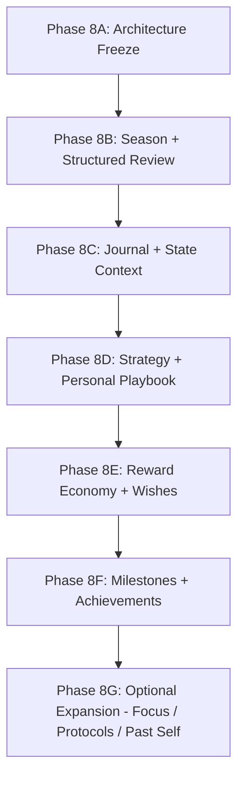

# Phase 8 — Information Architecture & Phase Implementation Plan

## 1. Information Architecture (IA) Target & Visual Philosophy

As the RPG expands from the core execution loop (Phases 1–7) into macro-cycles, reflections, heuristics, and rewards, the user interface must strictly avoid navigation sprawl, visual clutter, and mobile-game sensory overload.

### 1.1 Aesthetic & Visual Principles
- **Ink-Wash & Light-First**: Maintain the refined ink-wash aesthetic established in Phase 7. High typography contrast, subtle borders, generous whitespace, and restrained accent colors.
- **Dignified Adult Growth**: Reject casino-like celebration banners, pulsing badge indicators, flashing popups, or aggressive notification bells.
- **Calm Focus Over Dopamine Chasing**: Interface elements prioritize clarity of purpose, longitudinal perspective, and deep focus over fleeting engagement metrics.

---

## 2. Canonical Navigation Structure

The navigation hierarchy organizes capabilities into four coherent clusters, preventing the main navigation bar from overflowing:

```text
App Root
├── [Dashboard]              # "Now / Next / Recent Growth Truth" (Primary Command Center)
│
├── [Growth]                 # Execution Core (Frozen Semantics)
│   ├── Quests               # Main, Epic, Major, Side Quests
│   ├── Skills               # Skill Trees, Levels, and Mastery Tiers
│   ├── Knowledge            # Nodes, Concepts, and Synthesis
│   └── Artifacts            # Durable work products & verified evidence
│
├── [Journey]                # Macro-Cycles & Self-Reflection (Outer Loop)
│   ├── Seasons              # Active season, chapter history, planning
│   ├── Reviews              # Weekly & Final structured retrospectives
│   ├── Journal              # Reflections, daily context, and state logs
│   └── Playbook             # Personal operating strategies & heuristics
│
└── [Rewards]                # Celebration & Recognition (Subordinate Layer)
    ├── Wishes               # Personal reward desires & redemptions
    └── Milestones           # Verified real-world & mastery breakthroughs
```

### 2.1 Placement Constraints & Rules:
1. **Dashboard Remains the Anchor**: The Dashboard is the central surface displaying current active context (Active Season, Main Quest, Next Best Action, and Recent Growth Truth).
2. **Focus is an Action Tool, Not a Top-Level Page**: The Focus Timer (Phase 8G) exists as a global modal or drawer tool accessible anywhere, not a standalone top-level section.
3. **Past Self is an Analytical View**: "Past Self" comparative analytics are embedded within the Dashboard and Season Reviews, not isolated as a primary navigation item.
4. **Protocols Live Under Playbook**: Growth Protocols (Phase 8G) are grouped as actionable sub-components of the Personal Playbook.
5. **Growth Core Semantic Preservation**: Grouping existing pages under `/growth` preserves their exact authority and routing semantics established in Phases 1–7.

---

## 3. Binding Phase Implementation Sequencing (8B–8G)

In strict accordance with the controlling document, the historical roadmap's stage order is superseded by the following dependency-driven sequence:



---

## 4. Phase-by-Phase Deliverables & Acceptance Criteria

### Phase 8B: Season + Structured Review
- **Prerequisites**: Phase 8A Architecture Freeze formally accepted and merged.
- **Scope**:
  - Database schema: `seasons`, `season_quests`, `season_reviews`, `outer_loop_proposals`, `outer_loop_audit_events`.
  - Single active season constraint enforcement (O13).
  - $N:N$ Season-to-Quest relationship with `MAIN` and `FOCUS` roles (O14, O15).
  - Derived Season activity read model (zero schema changes to `activities`).
  - Structured Review authoring and finalization pipeline (O16).
  - UI: `/journey/seasons` and `/journey/reviews`.
- **Exit Gate**: Passing tests O006, O013, O014, O015, O016, O022.

### Phase 8C: Journal + State Context
- **Prerequisites**: Phase 8B accepted and merged.
- **Scope**:
  - Database schema: `journal_entries` with 7 subjective state scalars (O11).
  - Strict evidence separation: `Journal != Verified Evidence` (O7).
  - Private-by-default RLS tenant policies.
  - UI: `/journey/journal` (reflection editor, timeline view, state correlation charts).
- **Exit Gate**: Passing tests O007, O011, O018.

### Phase 8D: Strategy + Personal Playbook
- **Prerequisites**: Phase 8C accepted and merged.
- **Scope**:
  - Database schema: `strategies`, `strategy_versions`, `strategy_supports`.
  - 5-state lifecycle (`HYPOTHESIS` -> `TESTING` -> `SUPPORTED` / `CONTEXTUAL` -> `WEAKENED` -> `RETIRED`).
  - Strict multi-observation threshold: $\ge 2$ distinct dates, $\ge 1$ completed season, $\ge 2$ core achievements (O6).
  - Deterministic derived ordinal confidence rubric: `LOW`, `MODERATE`, `HIGH`, `VERY_HIGH` (O17).
  - AI GM proposal and counter-evidence alerting pipeline (O8, O21).
  - UI: `/journey/playbook`.
- **Exit Gate**: Passing tests O008, O009, O017, O021.

### Phase 8E: Reward Economy + Wishes
- **Prerequisites**: Phase 8D accepted and merged.
- **Scope**:
  - Database schema: `reward_accounts`, `reward_transactions`, `wishes`, `reward_redemptions`.
  - Strict physical isolation from `xp_transactions` (O2, O3).
  - Append-only ledger events: `EARN`, `CORRECTION`, `RESERVE`, `UNRESERVE`, `REDEEM`, `REFUND`.
  - Anti-farming narrow earning sources: Seasons, Boss Quests, Mastery, Artifacts (O10).
  - Idempotent settlement and correction deficit handling (O4, O5, O20).
  - Wish lifecycle: `IDEA` -> `ACTIVE` -> `PRIMARY` (max 1) -> `RESERVED` -> `REDEEMED`.
  - UI: `/rewards/wishes`.
- **Exit Gate**: Passing tests O001, O002, O003, O004, O005, O019, O020.

### Phase 8F: Milestones + Achievements
- **Prerequisites**: Phase 8E accepted and merged.
- **Scope**:
  - Database schema: `milestones`.
  - Recognition layer: `CORE_VERIFIED` and `USER_CONFIRMED_REAL_WORLD` (O12).
  - Prohibition of vanity streaks and app-use counters.
  - Idempotent link to Reward Credit minting.
  - UI: `/rewards/milestones`.
- **Exit Gate**: Passing tests O012, O021.

### Phase 8G: Optional Expansion (Focus / Protocols / Past Self)
- **Prerequisites**: Phase 8F accepted and merged.
- **Scope**:
  - `focus_sessions` tool integration (raw focus time never equals XP or reward credits; O11).
  - `growth_protocols` execution rituals under Playbook.
  - `Past Self` longitudinal comparative read-only analytics on Dashboard.
- **Exit Gate**: Passing tests O010, O011.
