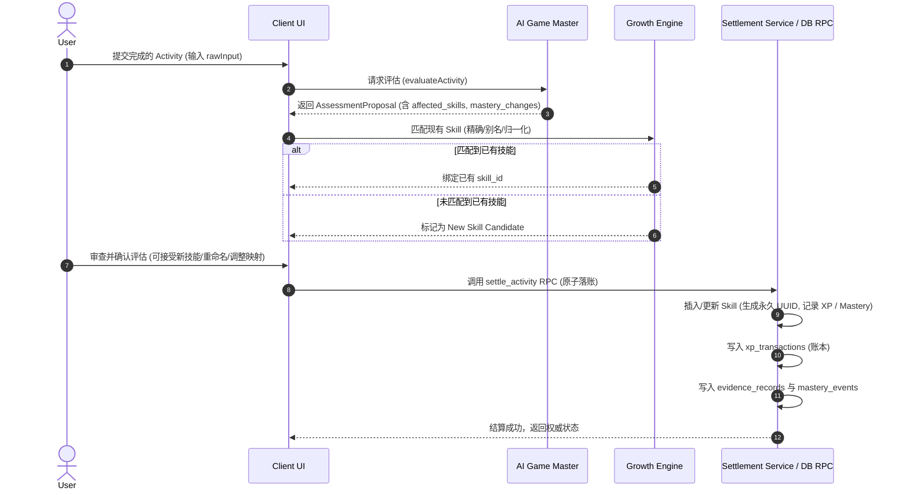

# Stage 5 — Skill Tree Authority & Evidence Rules

> **Status**: PROPOSED / DESIGN FREEZE CANDIDATE  
> **Target Milestone**: Stage 5 (Skill Tree)  
> **Related Rules**: `docs/Design ChatGPT/01_SYSTEM_RULES.md`, `docs/Design ChatGPT/05_AI_GAME_MASTER_CONTRACT.md`, `docs/Design ChatGPT/06_DATABASE_SCHEMA_AND_DATA_DICTIONARY.md`

---

## 1. Skill Lifecycle & Creation Authority

In accordance with Core Invariant **"LLM produces proposals; application code commits permanent growth state"**, AI Game Master (LLM) is strictly prohibited from directly writing persistent skills into the database.



---

## 2. Skill Matching & Duplicate Prevention Protocol

```text
[Input Label from Proposal/User]
               │
               ▼
   1. Normalization Step
      • lower()
      • trim()
      • collapse whitespace ('\s+' -> ' ')
               │
               ▼
   2. Exact Normalized Match
      • skills.normalized_name == normalized(Input) ? ─── YES ───► [Bind Existing Skill ID]
               │ NO
               ▼
   3. Alias Array Match
      • normalized(Input) in normalized(skills.aliases) ? ── YES ─► [Bind Existing Skill ID]
               │ NO
               ▼
   4. High-Confidence Fuzzy/Semantic Match (Threshold >= 0.85)
      • Match suggested in UI to User ? ───────────────── YES ───► [Bind Existing Skill ID]
               │ NO
               ▼
   5. New Skill Candidate Proposal
      • Displayed in Assessment Confirmation Modal
      • User Confirms Creation ────────────────────────── YES ───► [Assign new UUID, persist in RPC]
```

### 2.1 Renaming and Alias Conservation
- 当用户在 UI 中重命名某个 Skill（例如将 `React` 重命名为 `React.js`）时：
  1. `skills.name` 更新为新名称；
  2. 旧名称 `React` 自动追加至 `skills.aliases` 数组中；
  3. `skills.normalized_name` 重新计算；
  4. 历史 `xp_transactions` 中的 `skill_name_snapshot` 保持不变（快照不可变性），但其 `skill_id` 外键始终指向该永久技能。

### 2.2 Archiving Policy
- 技能被归档（`status = 'archived'`）后：
  - 不再出现在日常活跃技能推荐中；
  - 历史账本、证据、已获得的 Mastery 和 XP 永久保留；
  - 若未来新的 Activity 再次匹配到该技能，系统提示用户是否重新激活（Unarchive）。

---

## 3. Evidence Traceability Chain

每一个 Skill 的当前 Mastery 等级必须能够向下完整穿透追溯，回答：**“为什么系统判定该技能达到当前掌握度？”**

```text
Skill (skills: id, name, mastery_level, mastery_confidence)
  │
  ├── 1. Mastery History (public.mastery_events)
  │     ├── event_type: 'upgrade' | 'confidence_refresh' | 'confidence_decay'
  │     ├── from_level -> to_level
  │     └── reason & timestamp
  │
  ├── 2. Verification Records (public.mastery_verifications)
  │     ├── status: 'verified' (对于高等级 M4+ 必须具备)
  │     └── resolved_at & verifier audit
  │
  ├── 3. Evidence Ladder Fact Records (public.evidence_records)
  │     ├── evidence_level: E0 (Self-report) .. E6 (Systemized/Created)
  │     ├── evidence_type: 'code_repo' | 'published_article' | 'exam_passed' | ...
  │     └── description & verification status
  │
  ├── 4. Primary Practice Activities (public.activities)
  │     ├── raw_input & title
  │     └── total_minutes & effective_minutes
  │
  └── 5. Immutable XP Ledger Entries (public.xp_transactions)
        ├── amount, base_amount, modifier_json
        └── rules_version
```

### 3.1 Zero-Duplication Architecture
- **严禁** 在 Stage 5 新建冗余的证据表或修改历史账本结构；
- 完整复用 Stage 2–4 建立的 `evidence_records`, `mastery_events`, `mastery_verifications`, `xp_transactions` 事实表体系。

---

## 4. Security & RLS Matrix for Skill Tree

| 表名 (`Table`) | SELECT 权限 | INSERT 权限 | UPDATE 权限 | DELETE 权限 |
|---|---|---|---|---|
| `public.domains` | `auth.uid() = user_id` | `auth.uid() = user_id` | `auth.uid() = user_id` | `auth.uid() = user_id` |
| `public.skills` | `auth.uid() = user_id` | **Revoked** (由 `settle_activity` RPC 或用户显式管理 RPC 创建) | **Restricted** (用户仅可修改 `name`, `aliases`, `description`, `domain_id`, `status`；禁止直接改 `xp`, `level`, `mastery_level`) | **Revoked** (仅允许软删除/归档 `status = 'archived'`) |
| `public.skill_edges` | `auth.uid() = user_id` | `auth.uid() = user_id` (经 DAG/租户校验) | `auth.uid() = user_id` | `auth.uid() = user_id` |
| `public.evidence_records` | `auth.uid() = user_id` | **Service Role Only** (RPC 写入) | **Service Role Only** | **Revoked** (不可变事实) |
| `public.mastery_events` | `auth.uid() = user_id` | **Service Role Only** (RPC 写入) | **Revoked** (不可变审计事实) | **Revoked** |
