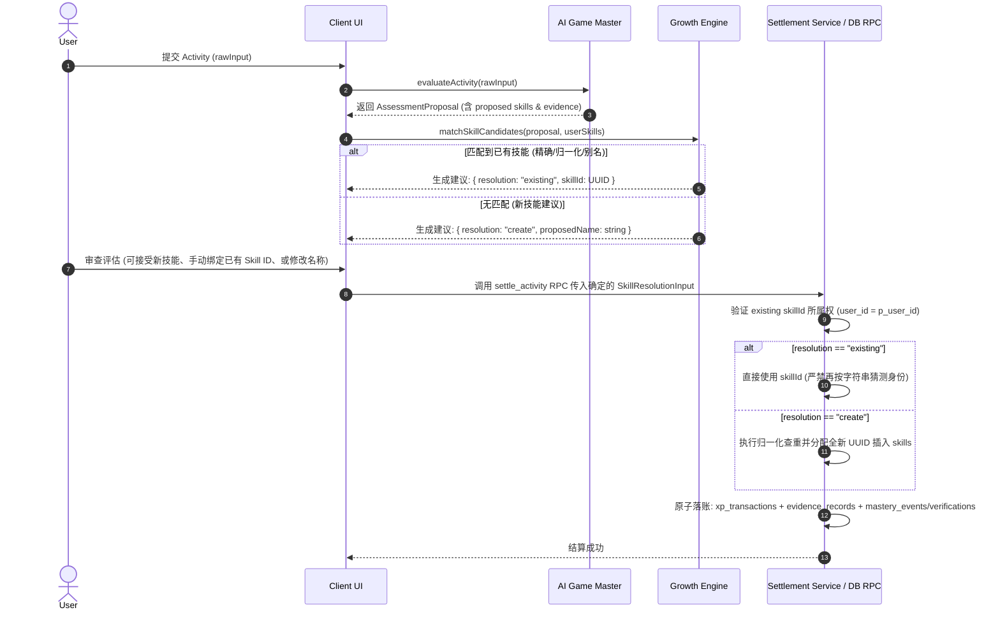

# Stage 5 — Skill Tree Authority & Evidence Rules

> **Status**: PROPOSED / DESIGN FREEZE (ROUND 4)  
> **Target Milestone**: Stage 5 (Skill Tree)  
> **Related Rules**: `docs/Design ChatGPT/01_SYSTEM_RULES.md`, `docs/Design ChatGPT/05_AI_GAME_MASTER_CONTRACT.md`, `docs/Design ChatGPT/06_DATABASE_SCHEMA_AND_DATA_DICTIONARY.md`

---

## 1. Skill Resolution & Settlement Authority

In accordance with Core Invariant **"LLM produces proposals; application code commits permanent growth state"**, AI Game Master (LLM) is strictly prohibited from directly writing persistent skills into the database.

### 1.1 Resolution Authority Discriminated Union & MasteryAction 3-State

To completely close the authority gap where label matching might hallucinate duplicate skills during settlement, `SettlementToApply` and the database `settle_activity` RPC contract are frozen to an **explicit discriminated union**:

```typescript
export type SkillResolutionInput =
  | {
      resolution: "existing";
      /** Authoritative stable UUID of an existing skill verified for this user. */
      skillId: string;
    }
  | {
      resolution: "create";
      /** User-confirmed proposed name for a newly created skill. */
      proposedName: string;
    };

/**
 * Stage 5A MUST preserve existing Stage 2 MasteryAction semantics:
 * - `none`: No change in mastery
 * - `upgrade`: Immediate upgrade (for lower levels M1-M3 or already verified)
 * - `request_verification`: High mastery (M4+) queues a pending MasteryVerification record
 */
export type MasteryAction =
  | { action: "none" }
  | {
      action: "upgrade";
      proposedLevel: number;
      confidence: number;
    }
  | {
      action: "request_verification";
      fromLevel: number;
      toLevel: number;
      confidence: number;
    };

export interface SettlementSkillToApply {
  skill: SkillResolutionInput;
  xpDelta: number;
  masteryAction: MasteryAction;
}
```



### 1.2 Resolution Rules & Invariants
1. **Existing Skill Authority**:
   - 当传入 `{ resolution: "existing", skillId }` 时，服务端 / RPC **必须校验该 `skillId` 存在且 `user_id = p_user_id`**；
   - 校验通过后，RPC **绝对禁止再通过 label/name 重新猜测或创建新技能**，必须直接在此 `skill_id` 上累加 XP 与执行 `masteryAction`；
2. **New Skill Creation Authority**:
   - 当传入 `{ resolution: "create", proposedName }` 时，由 RPC 执行 normalized_name 查重（`ON CONFLICT (user_id, normalized_name)`），创建新 Skill 行并分配永久 UUID；
3. **Secondary Skills**:
   - 关联技能列表 (`relatedSkillResolutions`) 同样强制采用 `SkillResolutionInput` 数组，杜绝任何二次技能的别名分裂。

---

## 2. Authoritative Evidence Write Path

Stage 5 严格执行 **“High Mastery requires Evidence”**，并在 `/skills` 详情抽屉中提供真实的 Evidence Timeline。

### 2.1 Schema Reuse & Referential Integrity
- **严禁** 新建任何形式的重复 evidence 表；
- 完整复用 Stage 2–4 建立的 `public.evidence_records` 事实表；
- **外键闭环 (P2)**：确保 `public.mastery_events.evidence_id` 具备指向 `public.evidence_records(id)` 的显式外键约束（`FOREIGN KEY (evidence_id) REFERENCES public.evidence_records(id) ON DELETE SET NULL`）。

### 2.2 Atomic Write Execution Order in `settle_activity`
在结算确认时，`settle_activity` RPC 在**单次数据库事务**中执行以下原子步骤：

```text
1. Lock Activity & Assessment Rows (FOR UPDATE)
   │
2. Validate Ownership & One-Settlement Idempotency (xp_type = 'activity')
   │
3. Resolve/Validate Primary Skill ID (via SkillResolutionInput: existing vs create)
   │
4. Append Immutable Ledger Entry -> public.xp_transactions
   │
5. Write Authoritative Evidence Record -> public.evidence_records
   • user_id = p_user_id
   • activity_id = v_activity_id
   • skill_id = v_skill_id
   • evidence_level = v_evidence_level (E0..E6)
   • evidence_type = v_evidence_type
   • description = v_evidence_explanation
   • verified = (v_mastery_level < 4 OR v_is_verified)
   │
6. Process MasteryAction 3-State Protocol:
   ├── If action == "none":
   │     No mastery changes
   ├── If action == "upgrade":
   │     Update public.skills (mastery_level = proposedLevel, mastery_confidence = confidence)
   │     Insert public.mastery_events (event_type = 'upgrade', evidence_id = v_evidence_id)
   └── If action == "request_verification":
         Insert public.mastery_verifications (status = 'pending', linking skill_id, evidence_level)
         (Skill mastery_level remains unchanged until verified)
   │
7. Update Player Totals & Linked Quest Progress
   │
8. Commit Transaction & Return Authoritative Snapshot
```

---

## 3. Tenant-Safe Reference Integrity (Column-Specific SET NULL)

为杜绝跨租户篡改，所有关联关系在**数据库引擎层**通过复合外键保证绝对隔离。对于可空关联字段，**必须使用 PostgreSQL 字段级 `ON DELETE SET NULL (column_name)`**，严格防止非空的 `user_id` 被意外置 NULL：

```sql
-- 1. Skills composite key
ALTER TABLE public.skills ADD CONSTRAINT skills_user_id_composite_key UNIQUE (user_id, id);

-- 2. Domains composite key
ALTER TABLE public.domains ADD CONSTRAINT domains_user_id_composite_key UNIQUE (user_id, id);

-- 3. Domains hierarchy composite foreign key (Blocker 2B & Column-Specific SET NULL)
ALTER TABLE public.domains ADD CONSTRAINT fk_domains_parent_tenant_safe
  FOREIGN KEY (user_id, parent_id) REFERENCES public.domains(user_id, id)
  ON DELETE SET NULL (parent_id);

-- 4. Skills domain association composite foreign key (Blocker 2B & Column-Specific SET NULL)
ALTER TABLE public.skills ADD CONSTRAINT fk_skills_domain_tenant_safe
  FOREIGN KEY (user_id, domain_id) REFERENCES public.domains(user_id, id)
  ON DELETE SET NULL (domain_id);

-- 5. Skill Edges composite foreign keys (Blocker 2)
ALTER TABLE public.skill_edges ADD CONSTRAINT fk_skill_edges_source_tenant_safe
  FOREIGN KEY (user_id, source_skill_id) REFERENCES public.skills(user_id, id)
  ON DELETE CASCADE;

ALTER TABLE public.skill_edges ADD CONSTRAINT fk_skill_edges_target_tenant_safe
  FOREIGN KEY (user_id, target_skill_id) REFERENCES public.skills(user_id, id)
  ON DELETE CASCADE;

-- 6. Evidence Records composite foreign key (Column-Specific SET NULL)
ALTER TABLE public.evidence_records ADD CONSTRAINT fk_evidence_records_skill_tenant_safe
  FOREIGN KEY (user_id, skill_id) REFERENCES public.skills(user_id, id)
  ON DELETE SET NULL (skill_id);
```

---

## 4. Skill Metadata Mutation Authority

为彻底杜绝客户端篡改核心成长属性，权限矩阵与专属 RPC 冻结如下：

### 4.1 Dedicated `update_skill_metadata` RPC
客户端修改技能展示信息（如重命名、别名、归属域、归档状态）必须调用服务端专属 RPC：

```sql
CREATE OR REPLACE FUNCTION public.update_skill_metadata(
  p_skill_id UUID,
  p_name TEXT,
  p_aliases TEXT[],
  p_description TEXT,
  p_domain_id UUID,
  p_status TEXT
)
RETURNS public.skills
LANGUAGE plpgsql
SECURITY DEFINER
SET search_path = public
AS $$
DECLARE
  v_skill public.skills;
  v_old_name TEXT;
  v_new_aliases TEXT[];
  v_now TIMESTAMPTZ := now();
BEGIN
  -- 1. Ownership validation on skill
  SELECT * INTO v_skill FROM public.skills
  WHERE id = p_skill_id AND user_id = auth.uid()
  FOR UPDATE;
  
  IF NOT FOUND THEN
    RAISE EXCEPTION 'Skill not found or access denied';
  END IF;

  -- 2. Domain tenant ownership validation (Blocker 2B)
  IF p_domain_id IS NOT NULL THEN
    IF NOT EXISTS (SELECT 1 FROM public.domains WHERE id = p_domain_id AND user_id = auth.uid()) THEN
      RAISE EXCEPTION 'Invalid domain_id or cross-tenant domain access denied';
    END IF;
  END IF;

  v_old_name := v_skill.name;
  v_new_aliases := coalesce(p_aliases, '{}'::text[]);

  -- 3. Rename Alias Conservation: If name changed, append old name to aliases
  IF p_name IS NOT NULL AND btrim(p_name) <> '' AND btrim(p_name) <> v_old_name THEN
    IF NOT (v_old_name = ANY(v_new_aliases)) THEN
      v_new_aliases := array_append(v_new_aliases, v_old_name);
    END IF;
  END IF;

  -- 4. Whitelist Update (XP, Level, Mastery strictly untouched)
  UPDATE public.skills
  SET
    name = coalesce(nullif(btrim(p_name), ''), name),
    aliases = v_new_aliases,
    description = p_description,
    domain_id = p_domain_id,
    status = coalesce(p_status, status),
    updated_at = v_now
  WHERE id = p_skill_id AND user_id = auth.uid()
  RETURNING * INTO v_skill;

  RETURN v_skill;
END;
$$;
```

---

## 5. Security & RLS Matrix

| 表名 (`Table`) | SELECT 权限 | INSERT 权限 | UPDATE 权限 | DELETE 权限 | 租户外键防护 (Composite FK) |
|---|---|---|---|---|---|
| `public.domains` | `auth.uid() = user_id` | `auth.uid() = user_id` | `auth.uid() = user_id` | `auth.uid() = user_id` | `(user_id, parent_id) -> domains(user_id, id) ON DELETE SET NULL (parent_id)` |
| `public.skills` | `auth.uid() = user_id` | **Revoked** (仅 `settle_activity` RPC 可插入) | **Revoked** (仅 `update_skill_metadata` RPC 白名单更新) | **Revoked** (仅允许归档 `status = 'archived'`) | `(user_id, domain_id) -> domains(user_id, id) ON DELETE SET NULL (domain_id)` |
| `public.skill_edges` | `auth.uid() = user_id` | `auth.uid() = user_id` (受 DAG/单父/自环触发器约束) | `auth.uid() = user_id` | `auth.uid() = user_id` | `(user_id, source/target) -> skills(user_id, id) ON DELETE CASCADE` |
| `public.evidence_records` | `auth.uid() = user_id` | **Service Role Only** (RPC 写入) | **Service Role Only** | **Revoked** | `(user_id, skill_id) -> skills(user_id, id) ON DELETE SET NULL (skill_id)` |
| `public.mastery_events` | `auth.uid() = user_id` | **Service Role Only** (RPC 写入) | **Revoked** | **Revoked** | `evidence_id -> evidence_records(id) ON DELETE SET NULL` |
| `public.mastery_verifications` | `auth.uid() = user_id` | **Service Role Only** (RPC 写入) | **Service Role / Admin** | **Revoked** | `skill_id -> skills(id)` |
