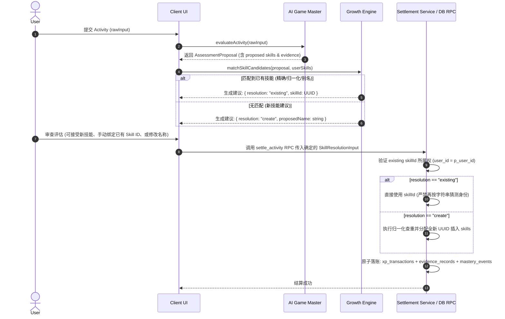

# Stage 5 — Skill Tree Authority & Evidence Rules

> **Status**: PROPOSED / DESIGN FREEZE (ROUND 2)  
> **Target Milestone**: Stage 5 (Skill Tree)  
> **Related Rules**: `docs/Design ChatGPT/01_SYSTEM_RULES.md`, `docs/Design ChatGPT/05_AI_GAME_MASTER_CONTRACT.md`, `docs/Design ChatGPT/06_DATABASE_SCHEMA_AND_DATA_DICTIONARY.md`

---

## 1. Skill Resolution & Settlement Authority

In accordance with Core Invariant **"LLM produces proposals; application code commits permanent growth state"**, AI Game Master (LLM) is strictly prohibited from directly writing persistent skills into the database.

### 1.1 Resolution Authority Discriminated Union

To completely close the authority gap where label matching might hallucinate duplicate skills during settlement, `SettlementToApply` and the database `settle_activity` RPC contract are frozen to an **explicit discriminated union**:

```typescript
export type SkillResolutionInput =
  | {
      resolution: "existing";
      /** Authoritative stable UUID of an existing skill verified for this user. */
      skillId: string;
    }
  | {
      resolution: "create";
      /** User-confirmed proposed name for a newly created skill. */
      proposedName: string;
    };

export interface SettlementSkillToApply {
  skill: SkillResolutionInput;
  xpDelta: number;
  masteryAction: {
    action: "upgrade" | "none";
    proposedLevel: number;
    confidence: number;
  };
}
```



### 1.2 Resolution Rules & Invariants
1. **Existing Skill Authority**:
   - 当传入 `{ resolution: "existing", skillId }` 时，服务端 / RPC **必须校验该 `skillId` 存在且 `user_id = p_user_id`**；
   - 校验通过后，RPC **绝对禁止再通过 label/name 重新猜测或创建新技能**，必须直接在此 `skill_id` 上累加 XP 与更新 Mastery；
2. **New Skill Creation Authority**:
   - 当传入 `{ resolution: "create", proposedName }` 时，由 RPC 执行 normalized_name 查重（`ON CONFLICT (user_id, normalized_name)`），创建新 Skill 行并分配永久 UUID；
3. **Secondary Skills**:
   - 关联技能列表 (`relatedSkillResolutions`) 同样强制采用 `SkillResolutionInput` 数组，杜绝任何二次技能的别名分裂。

---

## 2. Authoritative Evidence Write Path

Stage 5 严格执行 **“High Mastery requires Evidence”**，并在 `/skills` 详情抽屉中提供真实的 Evidence Timeline。

### 2.1 Schema Reuse & Zero-Duplication
- **严禁** 新建任何形式的重复 evidence 表；
- 完整复用 Stage 2–4 建立的 `public.evidence_records` 事实表：
  - `id`: UUID (Primary Key)
  - `user_id`: UUID (Tenant)
  - `activity_id`: UUID (FK -> activities)
  - `skill_id`: UUID (FK -> skills)
  - `evidence_level`: INTEGER (0..6, E0..E6)
  - `evidence_type`: TEXT
  - `description`: TEXT
  - `verified`: BOOLEAN
  - `created_at`: TIMESTAMPTZ

### 2.2 Atomic Write Execution Order in `settle_activity`
在结算确认时，`settle_activity` RPC 在**单次数据库事务**中执行以下原子步骤：

```text
1. Lock Activity & Assessment Rows (FOR UPDATE)
   │
2. Validate Ownership & One-Settlement Idempotency (xp_type = 'activity')
   │
3. Resolve/Validate Primary Skill ID (via SkillResolutionInput: existing vs create)
   │
4. Append Immutable Ledger Entry -> public.xp_transactions
   │
5. Write Authoritative Evidence Record -> public.evidence_records
   • user_id = p_user_id
   • activity_id = v_activity_id
   • skill_id = v_skill_id
   • evidence_level = v_evidence_level (E0..E6)
   • evidence_type = v_evidence_type
   • description = v_evidence_explanation
   • verified = (v_mastery_level < 4 OR v_is_verified)
   │
6. Process Mastery Progression:
   ├── If Verification Required (M >= 4 & unverified):
   │     Insert public.mastery_verifications (status = 'pending', linking skill_id, evidence_level)
   └── If Immediate Upgrade:
         Update public.skills (mastery_level, mastery_confidence)
         Insert public.mastery_events (event_type = 'upgrade', evidence_id = v_evidence_id)
   │
7. Update Player Totals & Linked Quest Progress
   │
8. Commit Transaction & Return Authoritative Snapshot
```

### 2.3 Idempotency & Evidence Deduplication
- 每个 Activity 仅能完成一次 `activity` 主结算，数据库部分唯一索引 `xp_transactions_one_activity_settlement_idx` 是绝对屏障；
- `evidence_records` 的写入伴随该主结算发生，确保单个 Activity 对特定 Skill 的主证据记录单次唯一。

---

## 3. Skill Metadata Mutation Authority

为彻底杜绝客户端通过直接 `UPDATE` 篡改 `xp`, `level`, `mastery_level` 等核心成长属性，权限矩阵冻结如下：

### 3.1 Dedicated `update_skill_metadata` RPC
客户端修改技能展示信息（如重命名、别名、归属域、归档状态）必须调用服务端专属 RPC：

```sql
CREATE OR REPLACE FUNCTION public.update_skill_metadata(
  p_skill_id UUID,
  p_name TEXT,
  p_aliases TEXT[],
  p_description TEXT,
  p_domain_id UUID,
  p_status TEXT
)
RETURNS public.skills
LANGUAGE plpgsql
SECURITY DEFINER
SET search_path = public
AS $$
DECLARE
  v_skill public.skills;
  v_old_name TEXT;
  v_new_aliases TEXT[];
  v_now TIMESTAMPTZ := now();
BEGIN
  -- 1. Ownership validation
  SELECT * INTO v_skill FROM public.skills
  WHERE id = p_skill_id AND user_id = auth.uid()
  FOR UPDATE;
  
  IF NOT FOUND THEN
    RAISE EXCEPTION 'Skill not found or access denied';
  END IF;

  v_old_name := v_skill.name;
  v_new_aliases := coalesce(p_aliases, '{}'::text[]);

  -- 2. Rename Alias Conservation: If name changed, append old name to aliases
  IF p_name IS NOT NULL AND btrim(p_name) <> '' AND btrim(p_name) <> v_old_name THEN
    IF NOT (v_old_name = ANY(v_new_aliases)) THEN
      v_new_aliases := array_append(v_new_aliases, v_old_name);
    END IF;
  END IF;

  -- 3. Whitelist Update (XP, Level, Mastery strictly untouched)
  UPDATE public.skills
  SET
    name = coalesce(nullif(btrim(p_name), ''), name),
    aliases = v_new_aliases,
    description = p_description,
    domain_id = p_domain_id,
    status = coalesce(p_status, status),
    updated_at = v_now
  WHERE id = p_skill_id AND user_id = auth.uid()
  RETURNING * INTO v_skill;

  RETURN v_skill;
END;
$$;
```

---

## 4. Security & RLS Matrix

| 表名 (`Table`) | SELECT 权限 | INSERT 权限 | UPDATE 权限 | DELETE 权限 |
|---|---|---|---|---|
| `public.domains` | `auth.uid() = user_id` | `auth.uid() = user_id` | `auth.uid() = user_id` | `auth.uid() = user_id` |
| `public.skills` | `auth.uid() = user_id` | **Revoked** (仅 `settle_activity` RPC 可插入) | **Revoked** (直接 UPDATE 撤销，仅由 `update_skill_metadata` RPC 修改白名单展示字段) | **Revoked** (仅允许归档 `status = 'archived'`) |
| `public.skill_edges` | `auth.uid() = user_id` | `auth.uid() = user_id` (受 DAG/单父/自环触发器约束) | `auth.uid() = user_id` | `auth.uid() = user_id` |
| `public.evidence_records` | `auth.uid() = user_id` | **Service Role Only** (RPC 写入) | **Service Role Only** | **Revoked** |
| `public.mastery_events` | `auth.uid() = user_id` | **Service Role Only** (RPC 写入) | **Revoked** | **Revoked** |
| `public.mastery_verifications` | `auth.uid() = user_id` | **Service Role Only** (RPC 写入) | **Service Role / Admin** | **Revoked** |
