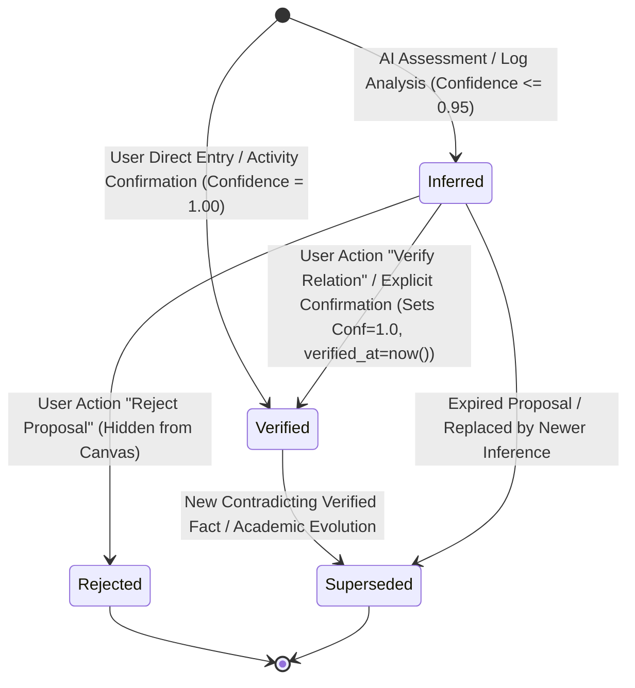

# Stage 6 — Knowledge Map Authority & Provenance Rules

> **Status**: FINAL FROZEN (STAGE 6A DESIGN CLOSURE)  
> **Target Milestone**: Stage 6 (Knowledge Map)  
> **Related Rules**: `docs/Design ChatGPT/01_SYSTEM_RULES.md`, `docs/Design ChatGPT/04_MVP_ROADMAP_AND_ACCEPTANCE.md`, `docs/Design ChatGPT/05_AI_GAME_MASTER_CONTRACT.md`, `docs/Design ChatGPT/06_DATABASE_SCHEMA_AND_DATA_DICTIONARY.md`

---

## 1. The Core Authority Invariant

```text
┌────────────────────────────────────────────────────────────────────────────┐
│                           NON-NEGOTIABLE RULE                              │
│                                                                            │
│       AI INFERENCE ALONE MUST NEVER SILENTLY BECOME PERMANENT TRUTH.       │
│                                                                            │
│  LLM produces Knowledge Proposals (Nodes/Edges with status='inferred'      │
│  and confidence <= 0.95).                                                  │
│  Application code commits permanent verified truth (status='verified' and  │
│  confidence = 1.00) ONLY upon explicit user verification or approved       │
│  authority confirmation action.                                            │
└────────────────────────────────────────────────────────────────────────────┘
```

---

## 2. Knowledge Authority & Lifecycle State Machine

To avoid semantic overloading, **Epistemic Authority** (真值权威状态) is strictly separated from **Lifecycle** (生命周期状态):



### 2.1 Epistemic Authority States (`verification_status`)

| State | 语义与可信度 | 读模型行为 | 可变性与操作权限 |
|:---|:---|:---|:---|
| **`inferred`** | AI 提议的假设性概念/关联；置信度约束在 `0.00 <= confidence <= 0.95` | 在知识图谱中带有**虚线/脉冲视觉+AI徽章**；可被过滤关闭 | 用户可执行 `Verify` 提升为已验证，或执行 `Reject` 丢弃 |
| **`verified`** | 经过用户确认或权威行动产出支持的确定性知识；置信度锁定为 `1.00` | 默认常驻显示，采用**实线+实体徽章**；作为全局认知基石 | 用户可编辑元数据、修改关系或标记为 `superseded` |
| **`rejected`** | 用户明确否决的 AI 错误推论 | 默认在画布中彻底隐藏；保留在审计日志中防止 AI 重复推荐相同错误 | 数据库保留记录以维持推理历史与反模式特征 |
| **`superseded`** | 被更新、更准确的事实或理论取代的旧认知 | 标记为过时，历史回溯时可见，默认高亮最新替代事实 | 允许建立 `supersedes` 关联进行学术演化追踪 |

### 2.2 Lifecycle States (`is_archived` / `archived_at`)
- `is_archived = false`: 默认活跃状态，在知识地图中渲染。
- `is_archived = true`: 归档状态，用户主动收起但不影响历史真值判断。

---

## 3. Provenance Model ("Why does the system believe this?")

Every permanent or inferred knowledge fact must have an unforgeable audit trail:

```text
┌──────────────────────────────────────────────────────────────────────────┐
│                         PROVENANCE AUDIT RECORD                          │
├───────────────────┬──────────────────────────────────────────────────────┤
│ source_type       │ activity | artifact | user_created | ai_proposal     │
│                   │ | imported                                           │
│ source_id         │ UUID of backing Activity / Artifact / User Session   │
│ provenance_note   │ Structured or text rationale (Mandatory for relates_to)│
│ verified_at       │ Timestamptz of verification                          │
│ verified_by       │ UUID of the user who confirmed                       │
└───────────────────┴──────────────────────────────────────────────────────┘
```

### 3.1 Traceability Rules & Composite Evidence FK
1. **Activity-Driven Knowledge**:
   - 当用户完成一次学习或研究 Activity（如阅读了一篇关于 "LoRA 适配器" 的论文），AI GM 可在 Proposal 中提议：
     - 新节点：`"LoRA (Low-Rank Adaptation)"` (`node_type='concept'`, `verification_status='inferred'`, `confidence=0.85`)
     - 新边：`"LoRA" ──supports──► "Efficient LLM Fine-Tuning"` (`verification_status='inferred'`, `confidence=0.85`)
     - 来源外键：`source_type='activity'`, `source_id=activity.id`
   - 当用户在结算 UI 中 Confirm 时，节点和边被安全持久化为 `inferred` 或经勾选后直接存为 `verified`。
2. **Evidence Linking**:
   - `evidence_records.knowledge_node_id` 具备租户安全复合外键 `FOREIGN KEY (user_id, knowledge_node_id) REFERENCES public.knowledge_nodes(user_id, id) ON DELETE SET NULL`。

---

## 4. Epistemic Confidence Invariants (Database-Enforced)

Confidence in Stage 6 is strictly **epistemic uncertainty**, enforced via database check constraints:

```sql
CONSTRAINT knowledge_nodes_inferred_confidence_check
    CHECK (verification_status <> 'inferred' OR (confidence >= 0.00 AND confidence <= 0.95)),
CONSTRAINT knowledge_nodes_verified_confidence_check
    CHECK (verification_status <> 'verified' OR confidence = 1.00)
```

---

## 5. DAG Active-Status & Mutation Correctness

### 5.1 Active vs Historical DAG Statuses
- **参与 DAG 拓扑检查的状态 (Active)**: `verification_status IN ('inferred', 'verified') AND is_archived = false`
- **排除出 DAG 拓扑检查的状态 (Historical/Inactive)**: `verification_status IN ('rejected', 'superseded') OR is_archived = true`

### 5.2 Correct DAG UPDATE Handling
在执行边更新（例如将 A -> B 更新为 B -> A）时，触发器 `prevent_knowledge_edge_cycle` 在递归遍历中显式排除当前被更新的边行（`id <> NEW.id`），杜绝误报假死循环。
