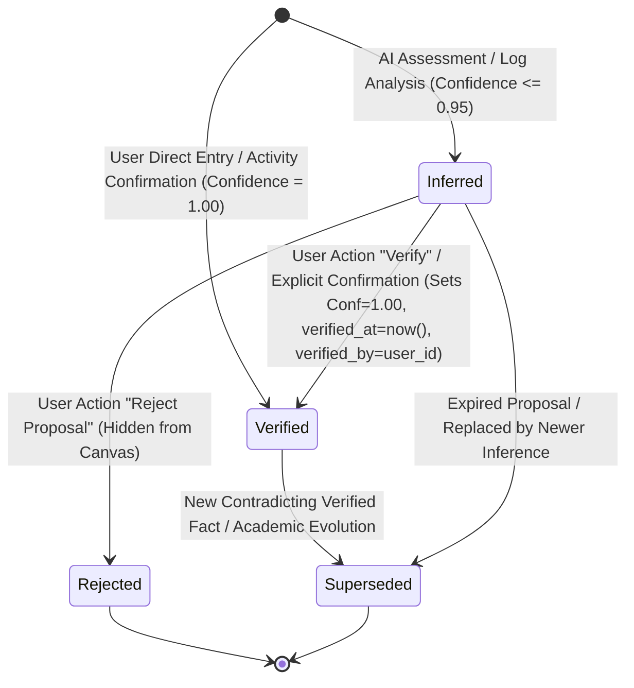

# Stage 6 — Knowledge Map Authority & Provenance Rules

> **Status**: FINAL FROZEN (STAGE 6A ROUND 5 CLOSURE)  
> **Target Milestone**: Stage 6 (Knowledge Map)  
> **Related Rules**: `docs/Design ChatGPT/01_SYSTEM_RULES.md`, `docs/Design ChatGPT/04_MVP_ROADMAP_AND_ACCEPTANCE.md`, `docs/Design ChatGPT/05_AI_GAME_MASTER_CONTRACT.md`, `docs/Design ChatGPT/06_DATABASE_SCHEMA_AND_DATA_DICTIONARY.md`

---

## 1. The Core Authority Invariant

```text
┌────────────────────────────────────────────────────────────────────────────┐
│                           NON-NEGOTIABLE RULE                              │
│                                                                            │
│       AI INFERENCE ALONE MUST NEVER SILENTLY BECOME PERMANENT TRUTH.       │
│                                                                            │
│  LLM produces Knowledge Proposals (Nodes/Edges with status='inferred'      │
│  and confidence <= 0.95).                                                  │
│  Application code commits permanent verified truth (status='verified',     │
│  confidence = 1.00, verified_at = now(), verified_by = user_id)            │
│  ONLY upon explicit user verification or approved authority action.        │
└────────────────────────────────────────────────────────────────────────────┘
```

---

## 2. Knowledge Authority & Lifecycle State Machine

To avoid semantic overloading, **Epistemic Authority** (真值权威状态) is strictly separated from **Lifecycle** (生命周期状态):



### 2.1 Epistemic Authority States (`verification_status`)

| State | 语义与可信度 | 读模型行为 | 可变性与操作权限 |
|:---|:---|:---|:---|
| **`inferred`** | AI 提议的假设性概念/关联；置信度约束在 `0.00 <= confidence <= 0.95` | 在知识图谱中带有**虚线/脉冲视觉+AI徽章**；可被过滤关闭 | 用户可执行 `POST /api/knowledge/[id]/verify` 提升为已验证，或执行 `POST /api/knowledge/[id]/reject` 丢弃 |
| **`verified`** | 经过用户确认或权威行动产出支持的确定性知识；置信度锁定为 `1.00`，强制记录 `verified_at` 与 `verified_by = user_id` | 默认常驻显示，采用**实线+实体徽章**；作为全局认知基石 | 用户可编辑元数据、修改关系或标记为 `superseded` |
| **`rejected`** | 用户明确否决的 AI 错误推论 | 默认在画布中彻底隐藏；保留在审计日志中防止 AI 重复推荐相同错误 | 数据库保留记录以维持推理历史与反模式特征 |
| **`superseded`** | 被更新、更准确的事实或理论取代的旧认知 | 标记为过时，历史回溯时可见，默认高亮最新替代事实 | 允许建立 `supersedes` 关联进行学术演化追踪 |

### 2.2 Node & Edge Verify / Reject State Transition Semantics

| Transition | 前置条件 | 数据库变更 | 响应码 / 语义 |
|:---|:---|:---|:---|
| **`verifyKnowledgeNode(userId, nodeId)`** | `status == 'inferred'` 且属于当前租户 | `verification_status = 'verified'`, `confidence = 1.00`, `verified_at = now()`, `verified_by = user_id` | **`200 OK`**；若非当前租户 $\rightarrow$ **`404`**；若当前非 `inferred` 状态 $\rightarrow$ **`409 Conflict`** |
| **`rejectKnowledgeNode(userId, nodeId)`** | `status == 'inferred'` 且属于当前租户 | `verification_status = 'rejected'` (无静默物理删除，保留审计历史) | **`200 OK`**；若非当前租户 $\rightarrow$ **`404`**；若当前非 `inferred` 状态 $\rightarrow$ **`409 Conflict`** |
| **`verifyKnowledgeEdge(userId, edgeId)`** | `status == 'inferred'` 且属于当前租户 | `verification_status = 'verified'`, `confidence = 1.00`, `verified_at = now()`, `verified_by = user_id` | **`200 OK`**；若非当前租户 $\rightarrow$ **`404`**；若当前非 `inferred` 状态 $\rightarrow$ **`409 Conflict`** |
| **`rejectKnowledgeEdge(userId, edgeId)`** | `status == 'inferred'` 且属于当前租户 | `verification_status = 'rejected'` | **`200 OK`**；若非当前租户 $\rightarrow$ **`404`**；若当前非 `inferred` 状态 $\rightarrow$ **`409 Conflict`** |

### 2.3 Stage 6B Sanctioned Authority Mutation Requirement (P2-2)
- **权威状态变更禁止被客户端泛型 PATCH 随意篡改**：
  知识权威跃迁（`verify`、`reject`、`supersede`）必须通过经过鉴权的专用服务端接口或安全存储过程执行。Stage 6B/6D 必须明确落地并强制执行该授权闭环路径。

---

## 3. Provenance Target Integrity & Identity Immutability (P1-1)

Every permanent or inferred knowledge fact must have an unforgeable, immutable, tenant-safe audit trail:

```text
┌──────────────────────────────────────────────────────────────────────────┐
│                   PROVENANCE IMMUTABILITY & TARGET INTEGRITY             │
├───────────────────┬──────────────────────────────────────────────────────┤
│ source_type       │ activity | artifact | user_created | ai_proposal     │
│                   │ | imported (IMMUTABLE after creation)                │
│ source_id         │ Valid UUID of backing source entity owned by tenant  │
│                   │ (IMMUTABLE after creation)                           │
├───────────────────┼──────────────────────────────────────────────────────┤
│ activity          │ source_id MUST exist in public.activities for user_id│
│ artifact          │ source_id MUST exist in public.artifacts for user_id │
│ ai_proposal       │ source_id MUST exist in public.activities for user_id│
│                   │ MUST initially be inserted as verification_status=   │
│                   │ 'inferred' (bypass attempt rejected with 23514)      │
│ user_created      │ source_id may be NULL (user/verifier identity is auth│
│ imported          │ source_id OR non-empty description/provenance_note   │
└───────────────────┴──────────────────────────────────────────────────────┘
```

### 3.1 Traceability Rules & Provenance Immutability Contract
1. **Provenance Identity is Immutable after INSERT**:
   - `source_type` 和 `source_id` 在创建后不可变更（数据库触发器在 UPDATE 时校验 `NEW.source_type IS NOT DISTINCT FROM OLD.source_type` 与 `NEW.source_id IS NOT DISTINCT FROM OLD.source_id`，违者抛出 `23514`）。
   - 彻底杜绝**重分类攻击**（如创建 user_created 节点后强行 update 为 ai_proposal 假装为提议）与**抹除攻击**（如将 ai_proposal 节点 update 为 user_created 抹除 AI 生成起源）。若创建错误，必须删除该知识实体后重建。
2. **AI Proposal Insertion Invariant**:
   - `source_type = 'ai_proposal'` 在插入期必须具有 `verification_status = 'inferred'`。任何试图直接 INSERT 为 `verified` 的越权操作均会被数据库硬性拦截（`23514`）。
   - 后续合法的用户确认（`inferred -> verified`, `confidence = 1.00`, `verified_at = now()`, `verified_by = user_id`）保持 `source_type` 与 `source_id` 不变，顺利通过并完成永久审计。
3. **Source Delete Guards (Prevent Dangling References)**:
   - 若 Activity 或 Artifact 被任何 `knowledge_nodes` 或 `knowledge_edges` 引用，删除源实体将被数据库抛出 `23503` 拦截，杜绝悬空溯源。

---

## 4. Epistemic Confidence Invariants (Database-Enforced)

Confidence in Stage 6 is strictly **epistemic uncertainty**, enforced via database check constraints:

```sql
CONSTRAINT knowledge_nodes_inferred_confidence_check
    CHECK (verification_status <> 'inferred' OR (confidence >= 0.00 AND confidence <= 0.95)),
CONSTRAINT knowledge_nodes_verified_audit_check
    CHECK (verification_status <> 'verified' OR (confidence = 1.00 AND verified_at IS NOT NULL AND verified_by IS NOT NULL AND verified_by = user_id)),
CONSTRAINT knowledge_nodes_verified_by_tenant_check
    CHECK (verified_by IS NULL OR verified_by = user_id)
```

---

## 5. DAG Active-Status & Mutation Correctness

### 5.1 Active vs Historical DAG Statuses
- **参与 DAG 拓扑检查的状态 (Active)**: `verification_status IN ('inferred', 'verified') AND is_archived = false`
- **排除出 DAG 拓扑检查的状态 (Historical/Inactive)**: `verification_status IN ('rejected', 'superseded') OR is_archived = true`

### 5.2 Correct DAG UPDATE Handling
在执行边更新（例如将 A -> B 更新为 B -> A）时，触发器 `prevent_knowledge_edge_cycle` 在递归遍历中显式排除当前被更新的边行（`id <> NEW.id`），杜绝误报假死循环。
