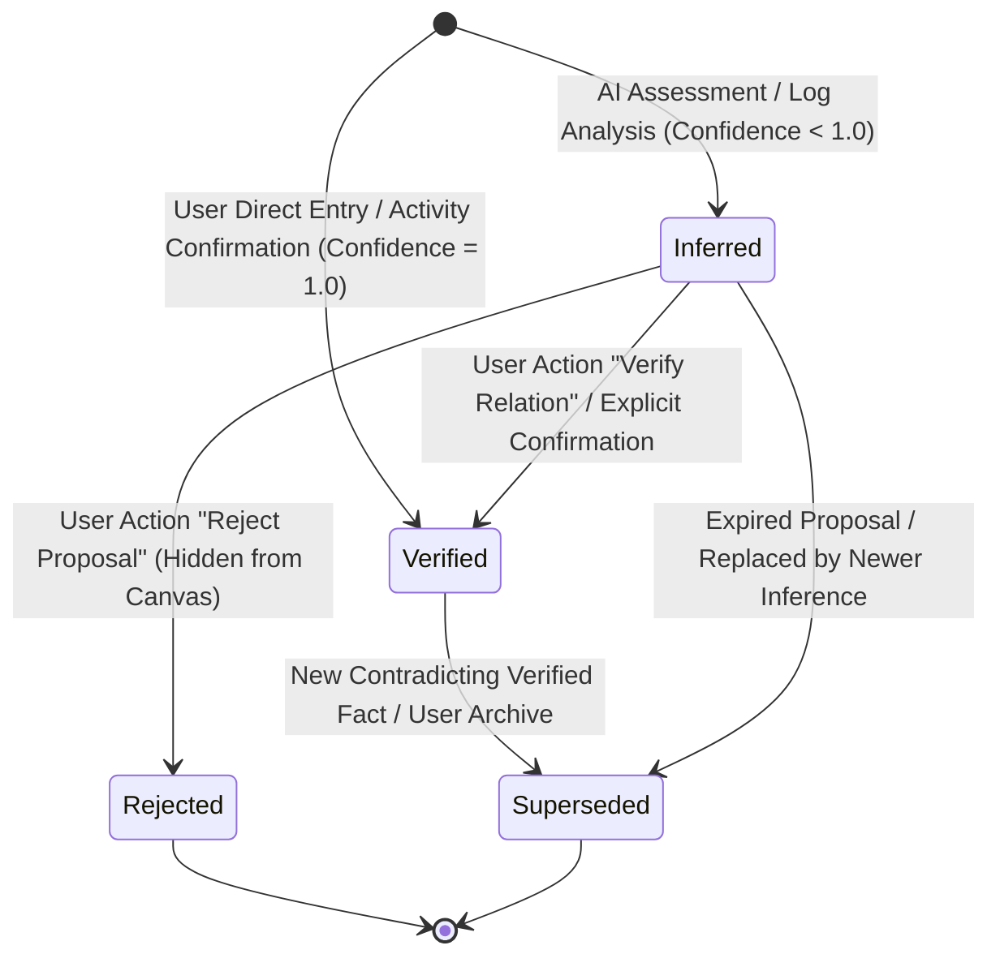

# Stage 6 — Knowledge Map Authority & Provenance Rules

> **Status**: PROPOSED / DESIGN FREEZE (ROUND 1)  
> **Target Milestone**: Stage 6 (Knowledge Map)  
> **Related Rules**: `docs/Design ChatGPT/01_SYSTEM_RULES.md`, `docs/Design ChatGPT/04_MVP_ROADMAP_AND_ACCEPTANCE.md`, `docs/Design ChatGPT/05_AI_GAME_MASTER_CONTRACT.md`, `docs/Design ChatGPT/06_DATABASE_SCHEMA_AND_DATA_DICTIONARY.md`

---

## 1. The Core Authority Invariant

```text
┌────────────────────────────────────────────────────────────────────────────┐
│                           NON-NEGOTIABLE RULE                              │
│                                                                            │
│       AI INFERENCE ALONE MUST NEVER SILENTLY BECOME PERMANENT TRUTH.       │
│                                                                            │
│  LLM produces Knowledge Proposals (Nodes/Edges with status='inferred').    │
│  Application code commits permanent verified truth only upon explicit      │
│  user verification or authoritative evidence confirmation.                 │
└────────────────────────────────────────────────────────────────────────────┘
```

---

## 2. Knowledge Authority State Machine

Both `knowledge_nodes` and `knowledge_edges` follow an explicit 4-state authority model:



### 2.1 State Definitions

| State | 语义与可信度 | 读模型行为 | 可变性与操作权限 |
|:---|:---|:---|:---|
| **`inferred`** | AI 提议的假设性概念/关联；带有置信度（0.0 ~ 0.99） | 在知识图谱中带有**虚线/脉冲视觉+AI徽章**；可被过滤关闭 | 用户可执行 `Verify` 提升为已验证，或执行 `Reject` 丢弃 |
| **`verified`** | 经过用户确认或权威行动产出支持的确定性知识；置信度锁定为 1.0 | 默认常驻显示，采用**实线+实体徽章**；作为全局认知基石 | 用户可编辑元数据、修改关系或标记为 `superseded` |
| **`rejected`** | 用户明确否决的 AI 错误推论 | 默认在画布中彻底隐藏；保留在审计日志中防止 AI 重复推荐相同错误 | 数据库保留记录以维持推理历史与反模式特征 |
| **`superseded`** | 被更新、更准确的事实或理论取代的旧认知 | 标记为过时，历史回溯时可见，默认高亮最新替代事实 | 允许建立 `replaces` / `supersedes` 关联进行学术演化追踪 |

---

## 3. Provenance Model ("Why does the system believe this?")

Every permanent or inferred knowledge fact must have an unforgeable audit trail:

```text
┌──────────────────────────────────────────────────────────────────────────┐
│                         PROVENANCE AUDIT RECORD                          │
├───────────────────┬──────────────────────────────────────────────────────┤
│ source_type       │ activity | artifact | user_created | ai_proposal     │
│ source_id         │ UUID of backing Activity / Artifact / User Session   │
│ evidence_ids      │ UUID[] array of supporting Evidence Records (E0–E6)  │
│ provenance_note   │ Structured or text rationale explaining the link     │
│ verified_at       │ Timestamp of user verification                       │
│ verified_by       │ auth.uid() of the verifying user                     │
└───────────────────┴──────────────────────────────────────────────────────┘
```

### 3.1 Traceability Rules
1. **Activity-Driven Knowledge**:
   - 当用户完成一次学习或研究 Activity（如阅读了一篇关于 "LoRA 适配器" 的论文），AI GM 可在 Proposal 中提议：
     - 新节点：`"LoRA (Low-Rank Adaptation)"` (type=`concept`, status=`inferred`)
     - 新边：`"LoRA" ──supports──► "Efficient LLM Fine-Tuning"` (status=`inferred`)
     - 来源外键：`source_type='activity'`, `source_id=activity.id`
   - 当用户在结算 UI 中 Confirm 时，节点和边被安全持久化为 `inferred` 或经勾选后直接存为 `verified`。
2. **Artifact-Driven Knowledge**:
   - 关联代码、笔记、实验数据（`artifacts` 表），点击知识节点即可一键跳转至原始产出物。
3. **Orphan Evidence Prohibition**:
   - 严禁系统生成没有任何 `source_type` 或 `source_id` 的孤立推论。

---

## 4. Epistemic Confidence Semantics

Confidence in Stage 6 is strictly **epistemic uncertainty**, NOT game mechanics:

```text
┌──────────────────────────────────────────────────────────────────────────┐
│                   WHAT CONFIDENCE IS VS WHAT IT IS NOT                   │
├────────────────────────────────────────┬─────────────────────────────────┤
│ CONFIDENCE IS:                         │ CONFIDENCE IS NOT:              │
├────────────────────────────────────────┼─────────────────────────────────┤
│ ✓ AI 语义理解的置信度 (0.0–0.99)       │ ✗ 玩家的技能熟练度 (Mastery)     │
│ ✓ 证据链的完整度与相关性               │ ✗ 玩家在该领域的 XP 或等级       │
│ ✓ 关系假设的确定性程度                 │ ✗ 任务完成的次数或频率           │
│ ✓ 随用户确认 (Verify) 跃迁为 1.0       │ ✗ 随时间推移自动增加的被动点数   │
└────────────────────────────────────────┴─────────────────────────────────┘
```

### 4.1 Deterministic Rules for Confidence
1. **AI Proposes**: LLM 输出 `0.00 <= confidence <= 0.95`（AI 严禁输出 1.0 置信度）。
2. **User Verifies**: 用户点击 `Verify` 后，`status` 变为 `'verified'`，`confidence` 设为 `1.0`。
3. **No Automatic Inflation**: 知识节点不能仅仅因为被多次查看或练习而自动将 confidence 提升至 1.0；只有明确的验证行动才能改变其权威状态。

---

## 5. Conflict & Contradiction Handling

In scientific research and personal growth, competing theories and conflicting claims are first-class citizens:

```mermaid
graph LR
    C1["Claim A: Transformer requires O(N^2) memory"] -- contradicts --- C2["Claim B: FlashAttention achieves O(N) memory IO"]
    style C1 fill:#1e293b,stroke:#ef4444,stroke-width:2px
    style C2 fill:#1e293b,stroke:#10b981,stroke-width:2px
```



1. **Explicit Contradiction Representation**:
   - 矛盾不是数据库错误，而是通过 `relation_type = 'contradicts'` 显式表达。
   - 允许两个 `verified` 命题之间存在 `contradicts` 关系（例如：牛顿力学与相对论在宏观与微观极限下的适用范围争议）。
2. **Cycle Safety Rules**:
   - `prerequisite` (认知前置) 与 `contains` (概念包含) 关系**绝对不允许循环**（数据库触发器强力拦截）。
   - `supports` (支持)、`contradicts` (矛盾)、`relates_to` (关联) 关系**允许网状拓扑**（但杜绝自环 `source == target`）。

---

## 6. Lifecycle Management & Database Triggers

### 6.1 Database Anti-Cycle Trigger (`check_knowledge_dag_cycle`)
```sql
CREATE OR REPLACE FUNCTION public.check_knowledge_dag_cycle()
RETURNS trigger AS $$
DECLARE
  cycle_exists boolean;
BEGIN
  -- Only prerequisite and contains enforce strict DAG
  IF NEW.relation_type NOT IN ('prerequisite', 'contains') THEN
    RETURN NEW;
  END IF;

  WITH RECURSIVE path AS (
    SELECT NEW.target_node_id AS current_node
    UNION
    SELECT e.target_node_id
    FROM public.knowledge_edges e
    JOIN path p ON e.source_node_id = p.current_node
    WHERE e.user_id = NEW.user_id 
      AND e.relation_type = NEW.relation_type
      AND e.status != 'rejected'
  )
  SELECT EXISTS (
    SELECT 1 FROM path WHERE current_node = NEW.source_node_id
  ) INTO cycle_exists;

  IF cycle_exists THEN
    RAISE EXCEPTION 'Cyclic dependency detected for relation type %: source % to target %', 
      NEW.relation_type, NEW.source_node_id, NEW.target_node_id
      USING ERRCODE = '23514';
  END IF;

  RETURN NEW;
END;
$$ LANGUAGE plpgsql;
```
