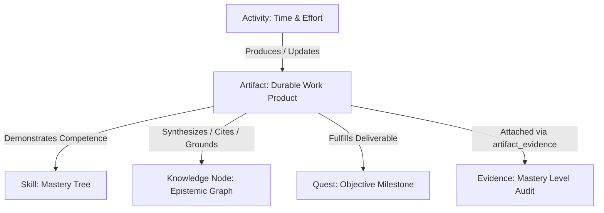
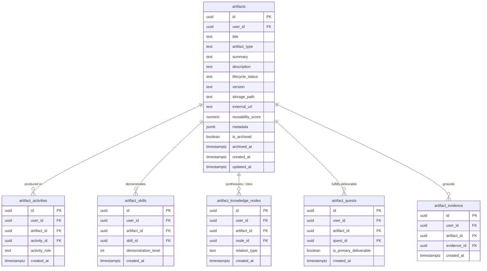

# Stage 7 — Artifact Domain Model & Ontology Specification

> **Status**: DESIGN FREEZE  
> **Milestone**: Stage 7 (Artifact Management & Synthesis System)  
> **Dependencies**: Stage 0–6 (FROZEN)  
> **Related Documents**: `02_ARTIFACT_AUTHORITY_RULES.md`, `03_ARTIFACT_API_AND_STATE.md`, `04_ARTIFACT_UI_SPEC.md`, `05_STAGE7_IMPLEMENTATION_PLAN.md`, `06_STAGE7_ACCEPTANCE_GATES.md`

---

## 1. Core Purpose & Ontological Boundary

### 1.1 The Fundamental Question
The Artifact system answers the core player question:
> **"What durable output, synthesis, or work product have I produced?"**

An **Artifact** is a first-class, tangible, durable deliverable resulting from deliberate practice, creative synthesis, research, or engineering effort. It is the concrete manifestation of skill exertion and knowledge consolidation.

### 1.2 Strict Boundary Separation

| Domain Entity | Primary Question | Ontological Role | Lifecycle & Mutability |
|:---|:---|:---|:---|
| **Activity** | "What action did I perform in time?" | Ephemeral event log (time, focus, raw effort). | Immutable ledger entry upon settlement. |
| **Skill** | "What capability dimension am I developing?" | Competence tree & mastery level (Level 1..5). | State updated via deterministic XP engine. |
| **Knowledge Node** | "What atomic concept/claim is true?" | Epistemic truth graph fact (concept, claim, topic). | CAS state machine (`inferred` $\rightarrow$ `verified` / `rejected`). |
| **Evidence** | "What proves my mastery level?" | Grounding proof point for skill capability tiers. | Immutable historical proof record. |
| **Quest** | "What goal/milestone was I pursuing?" | Structured progression objective / journey. | Progress state machine (`pending` $\rightarrow$ `completed`). |
| **Artifact** | **"What durable deliverable did I create?"** | **Tangible work product, synthesis, or deliverable.** | **Versioned lifecycle (`draft` $\rightarrow$ `active` $\rightarrow$ `archived` / `superseded`).** |

### 1.3 Anti-Patterns & Invariants
1. **Artifact $\ne$ Arbitrary Uploaded File**: An artifact represents intellectual or creative output, not raw unparsed binary dumps.
2. **Artifact Truth $\ne$ Knowledge Truth**: Artifacts do not use `inferred` / `verified` truth states. An artifact is a created object with authoring lifecycle (`draft`, `active`, `archived`, `superseded`).
3. **Artifact Quality $\ne$ Skill Mastery $\ne$ Knowledge Confidence**: An artifact's reusability or completeness is distinct from player skill level or knowledge confidence.

### 1.4 Plural Proposal Cardinality & Resolution Model
- **Multiple Deliverables per Activity**: A single activity session can legitimately produce or touch multiple deliverables (e.g. source code repo, design RFC, slide deck).
- **Proposals vs Canonical Identity**: AI Game Master outputs 0, 1, or N proposals (`artifactProposals: ArtifactProposal[]`). Proposals are purely advisory candidates; canonical identity assignment occurs strictly at confirm time via explicit user/server resolution (`ArtifactResolutionInput`: `CREATE`, `EXISTING`, or `IGNORE`).

---

## 2. Artifact Taxonomy & Types

Artifacts are categorized by a strict, validated taxonomy (`artifact_type`). The 8 canonical types are:

| Type Slug | Display Name | Definition & Examples | Typical Linked Entities |
|:---|:---|:---|:---|
| `document` | Document / Paper | Research paper, essay, technical RFC, book summary, report. | Knowledge Nodes, Skills, Quests |
| `code_repository` | Code Project / Tool | Software project, library, script collection, CLI tool. | Skills, Activities, Quests |
| `design_spec` | Design / Architecture | System architecture spec, UI/UX prototype, database schema. | Skills, Knowledge Nodes |
| `data_analysis` | Data / Analysis | Jupyter notebook, data pipeline, statistical study, evaluation. | Knowledge Nodes, Activities |
| `presentation` | Presentation / Slide Deck | Conference slides, workshop deck, lecture materials. | Skills, Quests |
| `synthesis_note` | Synthesis / MOC | Map of Content, literature synthesis, conceptual essay. | Knowledge Nodes, Skills |
| `creative_work` | Creative / Media | Podcast episode, video essay, illustration, audio piece. | Skills, Quests |
| `other` | Other Work Product | Custom durable deliverable not covered above. | Any |

> [!NOTE]
> `code_repository` is the sole canonical software/code artifact type. Generic `'code'` is not a valid taxonomy slug.

---

## 3. Versioning & Superseded Semantics (MVP Freeze)

### 3.1 Version Semantics
- **`Artifact.id`**: The stable, immutable identity of one durable logical work product.
- **`version` (`text`, default `'1.0'`):** A user-editable revision/display label (e.g. `'v1.0'`, `'v2.1-draft'`) on that same Artifact identity.
- **MVP Invariant**: Stage 7 does NOT maintain immutable historical revision rows. Version evolution is tracked on the single logical artifact record.

### 3.2 Superseded Semantics
- **`lifecycle_status = 'superseded'`**: An inactive historical lifecycle state indicating that this Artifact is no longer the preferred or current work product (e.g., replaced by a newer independent work product).
- **Distinction from Archived**: `superseded` is **NOT** archived (`is_archived = false`, `archived_at = NULL`).
- **Query Visibility**: Default active queries (`status=active`) exclude `superseded` artifacts. They are visible when querying `status=all` or `status=superseded`.
- **Restoration**: A player can freely restore a `superseded` artifact back to `active` or `draft`.
- **MVP Invariant**: No separate `supersedes_artifact_id` graph edge is required in Stage 7 MVP.

---

## 4. Normalized Relational Architecture & Cardinality

To eliminate loose JSON string arrays and guarantee cross-tenant referential integrity, relationships between Artifacts and other domain entities are modeled via explicit, normalized relational join tables with tenant-safe composite foreign keys.

### 4.1 Relationship Cardinality Invariants
1. **`artifact_activities`**: `UNIQUE (user_id, artifact_id, activity_id)` — One role (`produced`, `referenced`, `modified`) per artifact/activity pair.
2. **`artifact_skills`**: `UNIQUE (user_id, artifact_id, skill_id)` — One demonstration level (1..5) per artifact/skill pair.
3. **`artifact_knowledge_nodes`**: `UNIQUE (user_id, artifact_id, node_id)` — **Exactly one semantic relation** (`cites`, `implements`, `synthesizes`, `evaluates`) per artifact/node pair. (To change semantic role, update or replace the link row).
4. **`artifact_quests`**: `UNIQUE (user_id, artifact_id, quest_id)` — One deliverable status per artifact/quest pair.
5. **`artifact_evidence`**: `UNIQUE (user_id, artifact_id, evidence_id)` — Links artifact to `evidence_records`. `evidence_records` does NOT contain `artifact_id` directly.

---

## 5. Entity Attributes & Constraints

### 5.1 `artifacts` Table Specification
- `id` (`uuid`, PK, `default gen_random_uuid()`): Unique immutable artifact identifier.
- `user_id` (`uuid`, FK `auth.users.id`, `on delete cascade`): Tenant owner.
- `title` (`text`, NOT NULL, non-empty): Deliverable title.
- `artifact_type` (`text`, NOT NULL): Must match enum constraint (`document`, `code_repository`, `design_spec`, `data_analysis`, `presentation`, `synthesis_note`, `creative_work`, `other`).
- `summary` (`text`, NULLABLE): High-level executive abstract (1-3 sentences).
- `description` (`text`, NULLABLE): Detailed documentation, methodology, or notes.
- `lifecycle_status` (`text`, NOT NULL, DEFAULT `'active'`): Must match enum constraint (`draft`, `active`, `archived`, `superseded`).
- `version` (`text`, NULLABLE, DEFAULT `'1.0'`): User-editable semantic version or revision label.
- `storage_path` (`text`, NULLABLE): Internal object storage pointer / relative path.
- `external_url` (`text`, NULLABLE): Public URL (e.g. GitHub repo, arXiv link, Figma file).
- `reusability_score` (`numeric(3,2)`, NOT NULL, DEFAULT `0.00`): Range `0.00` to `1.00` representing utility as a building block for future work.
- `metadata` (`jsonb`, NOT NULL, DEFAULT `'{}'::jsonb`): Type-specific metadata.
- `is_archived` (`boolean`, NOT NULL, DEFAULT `false`): Soft archive flag.
- `archived_at` (`timestamptz`, NULLABLE): Timestamp of archival.
- `created_at` (`timestamptz`, NOT NULL, DEFAULT `now()`): Creation timestamp.
- `updated_at` (`timestamptz`, NOT NULL, DEFAULT `now()`): Last modification timestamp.

### 5.2 Composite Foreign Keys & Tenant Safety Invariant
All child relationship tables MUST include `user_id` and use composite foreign keys to guarantee at the PostgreSQL engine level that User A can NEVER link User B's Artifact, Activity, Skill, Knowledge Node, Quest, or Evidence:

1. **`artifact_activities`, `artifact_skills`, `artifact_knowledge_nodes`, `artifact_quests`**:
   - `(user_id, artifact_id)` references `public.artifacts(user_id, id) ON DELETE CASCADE`.
   - When physical deletion of an unreferenced Artifact is permitted, its auxiliary activity, skill, knowledge, and quest link records are cascade cleaned.
2. **`artifact_evidence`**:
   - `(user_id, artifact_id)` references `public.artifacts(user_id, id) ON DELETE RESTRICT`.
   - Mastery evidence records ground long-term player capability; silent cascading erasure of evidence links is strictly forbidden. Attempting to delete an Artifact attached to Evidence fails closed with `PG 23503`, enforced both by the `RESTRICT` constraint and the `prevent_artifact_delete_if_referenced()` trigger.
