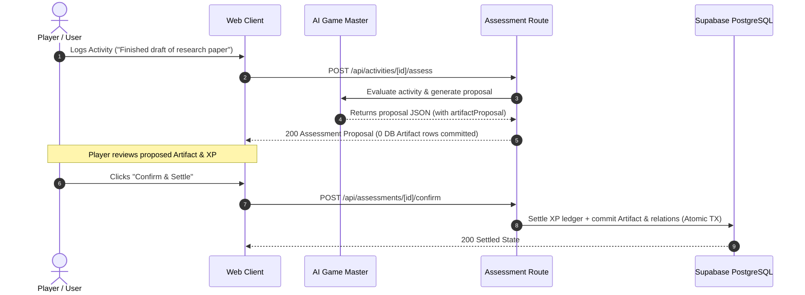

# Stage 7 — Artifact Authority & Provenance Rules

> **Status**: DESIGN FREEZE  
> **Milestone**: Stage 7 (Artifact Management & Synthesis System)  
> **Dependencies**: Stage 0–6 (FROZEN)  
> **Related Documents**: `01_ARTIFACT_DOMAIN_MODEL.md`, `03_ARTIFACT_API_AND_STATE.md`, `04_ARTIFACT_UI_SPEC.md`, `05_STAGE7_IMPLEMENTATION_PLAN.md`, `06_STAGE7_ACCEPTANCE_GATES.md`

---

## 1. Epistemic & Operational Authority Model

### 1.1 Sovereign User Authority & Privilege Boundary
The player is the sovereign creator, curator, and owner of their deliverables:
- **Direct Creation**: Players can manually create Artifacts at any time (e.g. cataloging an existing repository, thesis, or design).
- **Metadata Curation**: Players have write authority over whitelisted canonical columns: `title`, `artifact_type`, `summary`, `description`, `lifecycle_status`, `version`, `storage_path`, `external_url`, `reusability_score`, `is_archived`, and `metadata`.
- **Immutable Identity & Audit Columns**: Ordinary clients are **DENIED** raw UPDATE privileges (`42501`) on `id`, `user_id`, `normalized_title`, `created_at`, `updated_at`, and `archived_at`. System triggers maintain timestamps and normalization.
- **Relationship Curation**: Players have write authority to attach or detach associated Skills, Knowledge Nodes, Quests, Activities, and Evidence records. Child table updates are restricted to semantic columns (`activity_role`, `demonstration_level`, `relation_type`, `is_primary_deliverable`); `artifact_evidence` updates are disallowed (curation via INSERT/DELETE only).
- **Archival & Lifecycle**: Players can transition artifacts between `draft`, `active`, `archived`, and `superseded`.
- **Lifecycle Coherence Invariant**:
  - `lifecycle_status = 'archived'` $\iff$ `is_archived = true` (and `archived_at IS NOT NULL`).
  - `lifecycle_status IN ('draft', 'active', 'superseded')` $\iff$ `is_archived = false` (and `archived_at IS NULL`).
  - Contradictory inputs (e.g. `active + true` or `archived + false`) **fail closed** (`PG 23514`).

---

## 2. AI Artifact Proposal & Settlement Contract (Frozen for Stage 7B)

### 2.1 AI Proposal Authority Boundary
- **Proposals Only**: During Activity Assessment (`/api/activities/[id]/assess`), the AI Game Master may detect that a durable deliverable was created (e.g., "Wrote RFC on Cache Invalidation") and generate an `artifactProposal` object inside the assessment response.
- **Zero Raw Persistence on Assess**: Before confirmation, the `public.artifacts` table and join tables receive **ZERO** rows from the proposal. The proposal exists solely in the assessment proposal JSON payload.
- **Explicit Settlement Confirmation**: Artifacts from proposals are committed to permanent storage ONLY when the player confirms the assessment through `POST /api/assessments/[id]/confirm`.

### 2.2 Settlement Atomicity & Idempotency Rules
1. **Atomic Settlement**: On `POST /api/assessments/[id]/confirm`, the sanctioned settlement transaction commits the settled XP ledger AND creates the Artifact and its relationships (`artifact_activities` with `activity_role = 'produced'`, `artifact_evidence` when Evidence is generated, plus validated Skills/Knowledge/Quest links) within a single atomic database transaction.
2. **Failure Rollback**: If Artifact creation or relationship linking fails, the entire settlement transaction rolls back. It is impossible to produce a state where XP is committed but Artifact failed, or Artifact is created but XP settlement failed.
3. **Idempotency**: Repeat confirmation requests for an already confirmed assessment return the settled state and do NOT create duplicate Artifacts.
4. **Implementation Scope**: This settlement integration is assigned to **Stage 7B** and will be implemented via forward migration `0042_artifact_settlement_integration.sql` without modifying frozen Stage 5/6 migrations.



---

## 3. Provenance Integrity & Delete Protection

### 3.1 The Immutability of Grounding Provenance
In our growth RPG architecture, high skill mastery and verified knowledge facts require concrete evidence and traceable provenance:
- **Knowledge Grounding**: Knowledge Nodes and Edges may use `source_type = 'artifact'` and `source_id = artifact_id` as their authoritative origin.
- **Mastery Grounding**: Skill Evidence records are linked to Artifacts via the normalized `public.artifact_evidence` join table (`artifact_id`, `evidence_id` $\rightarrow$ `public.evidence_records.id`).

### 3.2 Fail-Closed Deletion Guard (PostgreSQL Trigger)
To prevent dangling references and historical erasure attacks:
1. **Blocked Deletion**: If an Artifact is referenced as `source_id` by any `knowledge_nodes` or `knowledge_edges` row, or attached to any `evidence_records` row via `artifact_evidence`, PostgreSQL MUST raise an exception and **ABORT** the `DELETE` statement (`PG 23503` fail-closed).
2. **Safe Archival Alternative**: To decommission an artifact without breaking historical knowledge provenance or mastery evidence, the player must archive the artifact (`is_archived = true`, `lifecycle_status = 'archived'`).
3. **Trigger Implementation**:
```sql
CREATE OR REPLACE FUNCTION public.prevent_artifact_delete_if_referenced()
RETURNS trigger
LANGUAGE plpgsql
SECURITY DEFINER
SET search_path = public, pg_temp
AS $$
BEGIN
  -- 1. Check knowledge_nodes provenance
  IF EXISTS (
    SELECT 1 FROM public.knowledge_nodes
    WHERE user_id = OLD.user_id AND source_type = 'artifact' AND source_id = OLD.id
  ) THEN
    RAISE EXCEPTION 'Cannot delete artifact: referenced by knowledge node provenance records'
      USING ERRCODE = '23503';
  END IF;

  -- 2. Check knowledge_edges provenance
  IF EXISTS (
    SELECT 1 FROM public.knowledge_edges
    WHERE user_id = OLD.user_id AND source_type = 'artifact' AND source_id = OLD.id
  ) THEN
    RAISE EXCEPTION 'Cannot delete artifact: referenced by knowledge edge provenance records'
      USING ERRCODE = '23503';
  END IF;

  -- 3. Check artifact_evidence relationship
  IF EXISTS (
    SELECT 1 FROM public.artifact_evidence
    WHERE user_id = OLD.user_id AND artifact_id = OLD.id
  ) THEN
    RAISE EXCEPTION 'Cannot delete artifact: referenced by evidence records'
      USING ERRCODE = '23503';
  END IF;

  RETURN OLD;
END;
$$;
```

---

## 4. Multi-Tenant Security & RLS Matrix

### 4.1 Strict Tenant Isolation
All tables in the Artifact subsystem (`artifacts`, `artifact_activities`, `artifact_skills`, `artifact_knowledge_nodes`, `artifact_quests`, `artifact_evidence`) enforce Row Level Security (RLS) with `auth.uid() = user_id`.

### 4.2 Hostile-Client & Cross-Tenant Attack Defenses
- **SELECT Isolation**: User B queries for User A's Artifacts return 0 rows.
- **Mutation Isolation**: User B attempts to UPDATE or DELETE User A's Artifact affect 0 rows.
- **Cross-Tenant Attachment Denial**: User A attempting to link User B's Skill, Knowledge Node, Quest, Activity, or Evidence to User A's Artifact is **BLOCKED** by composite foreign keys `(user_id, entity_id)` referencing `(user_id, id)`.
- **Non-Disclosing API 404s**: The application layer returns `404 Not Found` (never `403 Forbidden`) when an entity ID does not belong to the requesting session, preventing tenant reconnaissance.
- **Anonymous Denial**: The PostgreSQL `anon` role is granted zero permissions (`SELECT`, `INSERT`, `UPDATE`, `DELETE` revoked).
